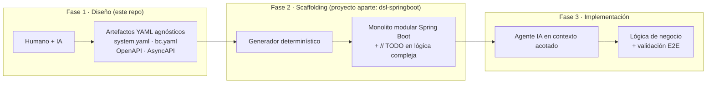

# DSL Design System

> Diseña tu sistema una vez, en artefactos agnósticos de tecnología que condensan
> **todas** las decisiones de dominio y arquitectura. Un generador determinístico los
> convierte en scaffolding para una tecnología concreta, y un agente de IA completa solo
> la lógica de negocio no trivial.

`dsl-design-system` es la **Fase 1** de una metodología de tres fases para construir
software de forma **coherente, trazable y reproducible**. Aquí el humano y los agentes de
IA toman las decisiones de diseño —qué es un Agregado, qué estados tiene, qué invariantes
se cumplen, qué eventos cruzan los bounded contexts, qué contratos expone el sistema— y
las dejan plasmadas en **artefactos canónicos YAML** que declaran **qué** y **para qué**,
nunca **cómo**.

---

## El problema que resuelve

En el desarrollo tradicional, las decisiones de diseño se disuelven en el código: se
vuelven imposibles de reproducir, difíciles de rastrear hasta su origen, y quedan
acopladas a un framework. Diseño y código divergen con el tiempo; regenerar es inviable;
portar el sistema a otro stack implica reescribirlo; y el "cómo" (anotaciones, SQL físico,
detalles de librería) contamina el "qué".

Este sistema invierte la relación: **las decisiones viven en artefactos versionables y el
código se deriva de ellos**, no al revés. El diseño produce artefactos. El generador
consume artefactos. Nunca al revés.

---

## La metodología en tres fases



### Fase 1 — Diseño (Humano + IA)

Es lo que cubre **este repositorio**. Aquí ocurre el *human-in-the-loop*: se identifican
los bounded contexts, sus agregados, eventos, contratos e integraciones, y se producen los
artefactos YAML de `arch/`. Se describe en detalle [más abajo](#la-fase-de-diseño-en-detalle).

### Fase 2 — Scaffolding determinístico

Un **proyecto independiente y separado** que toma los artefactos de diseño y los lleva a
una tecnología concreta. La implementación actual es **`dsl-springboot`**, que consume
todos los artefactos de diseño y genera **todo el scaffolding** de Spring Boot: entidades,
DTOs, mappers, interfaces de repositorio, controladores, configuración de DI, migraciones
de base de datos y wiring de eventos.

Es **100% determinístico**: dado el mismo artefacto YAML produce siempre el mismo código.
El generador no tiene memoria, no toma decisiones de dominio, no "mejora" el diseño. Para
los casos de uso cuya lógica no puede resolverse de forma determinística, emite el
esqueleto del método con `// TODO: implement business logic` en lugar de la implementación
real. Como los artefactos son agnósticos, el mismo diseño puede alimentar otros generadores
(Django, NestJS…) produciendo código idiomático en cada caso **sin cambiar una sola línea
del diseño**.

### Fase 3 — Implementación + validación E2E

Un agente de IA, con contexto **acotado a un único BC** (`{bc}.yaml`, `{bc}-flows.md`,
`{bc}-spec.md`), completa los `// TODO` con la lógica de negocio, ejecuta **validaciones
end-to-end** e **itera hasta que el flujo es correcto**. No toma decisiones de
arquitectura: solo implementa lo que el diseño ya especificó. El `{bc}-flows.md`
(Given/When/Then) es su especificación ejecutable.

---

## La Fase de Diseño en detalle

### Cómo se hace

El diseño es una colaboración humano + agentes, iterativa y revisable:

- **`design-system`** — define el nivel estratégico: bounded contexts, integraciones,
  sagas e infraestructura compartida.
- **`design-bounded-context`** — define el nivel táctico de un BC: agregados, value
  objects, enums, eventos, errores, casos de uso, repositorios y contratos.
- **`dsl validate`** — valida la coherencia cruzada de los artefactos (reglas INT-001..021).
- **`dsl preview`** — genera una mesa de revisión estática en `arch/review/` para que el
  diseñador humano inspeccione las decisiones y vuelva al chat con prompts concretos.

Cuál agente usar y cuándo se detalla en [docs/agent-decision-guide.md](docs/agent-decision-guide.md)
y [docs/workflow-reference.md](docs/workflow-reference.md).

### Qué artefactos se generan

| Nivel | Artefactos |
|---|---|
| **Estratégico** (`arch/system/`) | `system.yaml` · `system-spec.md` · `system-diagram.mmd` |
| **Táctico** (`arch/{bc}/`) | `{bc}.yaml` · `{bc}-spec.md` · `{bc}-flows.md` · `{bc}-open-api.yaml` · `{bc}-internal-api.yaml` · `{bc}-async-api.yaml` · `diagrams/` |

### Artefactos canónicos agnósticos

Esta es la pieza central de la metodología. Los artefactos son **canónicos** (una única
fuente de verdad) y **agnósticos de tecnología**: declaran **qué** y **para qué**, nunca
**cómo**. Condensan **todas** las decisiones de diseño —qué es un Agregado vs una Entidad
subordinada, qué estados tiene un ciclo de vida, qué invariantes se garantizan, qué eventos
cruzan bounded contexts, qué contratos son públicos vs internos— sin una sola referencia a
frameworks, librerías ni patrones de implementación. La tecnología es una **variable de
entrada al generador**, no del diseño.

Cada decisión declarada se traduce a multitud de detalles que el generador decide por sí
solo:

| El artefacto declara | El generador decide |
|---|---|
| `auditable: true` | columnas `created_at`/`updated_at`, anotaciones JPA, triggers SQL |
| `readOnly: true` + `defaultValue: generated` | UUID v4 en factory, autoincrement, secuencia |
| `source: authContext` | inyección desde `SecurityContext`, claim del JWT, middleware |
| `hidden: true` | exclusión del serializador, bcrypt, campo sin getter en DTO |
| `indexed: true` | índice B-Tree, índice compuesto, anotación `@Index` |
| `type: uniqueness` en domain rule | constraint UNIQUE en DB + `findBy{Campo}` en repositorio |
| `relationship: composition` | tabla hija con FK cascade delete, `@OneToMany(orphanRemoval)` |

> Documentación exhaustiva, propiedad por propiedad, de cada artefacto:
> **[docs/artifact-reference.md](docs/artifact-reference.md)**.

### Revisar y afinar antes de generar una sola línea de código

`dsl preview` es la pieza que cierra el bucle de diseño. Genera una **mesa de revisión
estática** en `arch/review/` que le da al diseñador una vista **tabulada y gráfica** de
todo el diseño —**sin producir una sola línea de código**— para analizarlo y afinarlo
**antes** de pasar a la generación:

- **Dashboard** (`index.html`) con un panel "requiere tu atención", la salud de validación,
  las decisiones estratégicas, un banner de "cambios desde la última revisión" y enlaces por
  bounded context.
- **Revisión táctica por BC** (`{bc}-review.html`): resumen ejecutivo, navegación lateral y
  casos de uso **expandibles** que muestran el comportamiento en lenguaje natural
  (Given/When/Then de `{bc}-flows.md` y pre/postcondiciones de `{bc}-spec.md`), no solo
  códigos. Reglas, eventos y pasos de saga son **enlaces clicables** entre sí.
- **Diagramas** (`{bc}-design.html`): máquinas de estado, dominio y secuencias en Mermaid,
  con zoom y desplazamiento.
- **Contratos navegables**: el OpenAPI público/interno en Swagger UI y los canales
  AsyncAPI, tal como los verá un consumidor.
- **Iterar con un clic** (`proposals.html`): las decisiones abiertas, gaps de seguridad y
  diagnósticos se reúnen y priorizan; cada uno incluye alternativas (con la opción actual
  resaltada) y un prompt con botón **Copiar** para pedirle al agente que ajuste el diseño.

El comando **no modifica** los YAML canónicos: solo produce HTML y diagnósticos. Así el
diseñador detecta huecos, inconsistencias y decisiones discutibles —y las corrige en el
diseño— cuando el cambio es barato, en lugar de descubrirlos en el código ya generado.
Esto refuerza el *human-in-the-loop*: la decisión se toma, se ve y se aprueba aquí.

---

## Ventajas de trabajar así

- **Determinismo y reproducibilidad** — el mismo artefacto produce el mismo código en cada
  ejecución. No hay ambigüedad ni decisiones implícitas.
- **Trazabilidad** — cada clase, método, endpoint, tabla, índice o evento generado puede
  rastrearse hasta su origen en el YAML.
- **Agnosticismo y portabilidad** — un diseño puede alimentar múltiples stacks; cambiar de
  tecnología no obliga a reescribir las decisiones de dominio.
- **Velocidad sin deuda** — el scaffolding (lo repetitivo y mecánico) es gratis; el humano
  y la IA solo invierten esfuerzo donde aporta valor: las decisiones de dominio y la lógica
  de negocio compleja.
- **Control humano en el punto correcto** — las decisiones importantes se toman y se
  revisan en la fase de diseño, no quedan enterradas en el código.
- **Afinar barato, antes de generar** — `dsl preview` da una vista tabulada y gráfica del
  diseño sin escribir código, así los errores se corrigen en el YAML y no en el sistema ya
  generado.
- **Coherencia** — no existe código sin origen trazable en el diseño: ni clases, ni
  endpoints, ni eventos.

---

## Del monolito modular al microservicio

El código que genera la Fase 2 es un **monolito modular** (`deployment.strategy:
modular-monolith`, `database.isolationStrategy: schema-per-bc`, estilo hexagonal): un único
despliegue con fronteras de bounded context estrictas. Esto **acelera la fase de
desarrollo** —sin el overhead de infraestructura distribuida, con debugging local y
transacciones simples— sin sacrificar la modularidad del dominio.

Como cada BC ya está aislado por diseño, llegada la **fase de producción** cada bounded
context puede **extraerse a un microservicio** cambiando las decisiones de infraestructura
en el diseño (p. ej. `database.isolationStrategy: db-per-bc`, `deployment.strategy:
microservices`) y **regenerando** — sin reescribir el dominio.

---

## Quick Start

```bash
# 1. Instala el sistema en tu workspace de proyecto (arch/, agentes, skills, tools/)
dsl init

# 2. Diseña con los agentes (design-system / design-bounded-context),
#    luego valida la coherencia de los artefactos
dsl validate

# 3. Genera una mesa de revisión visual en arch/review/
dsl preview --no-open --format all --locale es
```

Para verlo funcionando sobre un caso realista, explora el ejemplo
[`examples/canasta-familiar/`](examples/README.md) (una plataforma B2C de ecommerce con los
BCs `catalog` y `orders`):

```bash
cd examples/canasta-familiar
node ../../bin/dsl.js validate
node ../../bin/dsl.js preview --no-open --format all --locale es
```

---

## Documentación

| Documento | Contenido |
|---|---|
| [docs/artifact-reference.md](docs/artifact-reference.md) | **Referencia exhaustiva** de los artefactos `system.yaml` y `{bc}.yaml`, propiedad por propiedad. |
| [VISION.md](VISION.md) | Principios y criterios de diseño de la metodología. |
| [docs/workflow-reference.md](docs/workflow-reference.md) | Secuencias operativas: proyecto nuevo, primer BC, iteración, handoff a Fase 2. |
| [docs/agent-decision-guide.md](docs/agent-decision-guide.md) | Qué agente usar y cuándo. |
| [docs/system-yaml-guide.md](docs/system-yaml-guide.md) · [docs/bc-yaml-guide.md](docs/bc-yaml-guide.md) | Guías por artefacto. |
| [examples/README.md](examples/README.md) | Ejemplo de referencia `canasta-familiar`. |

---

## Alcance de este repositorio

Este repositorio cubre **únicamente la Fase 1**: produce y valida los artefactos YAML de
`arch/`. La Fase 2 (`dsl-springboot`) y la Fase 3 son proyectos y procesos aparte. **No se
versiona código generado aquí** — la generación pertenece a la Fase 2.
