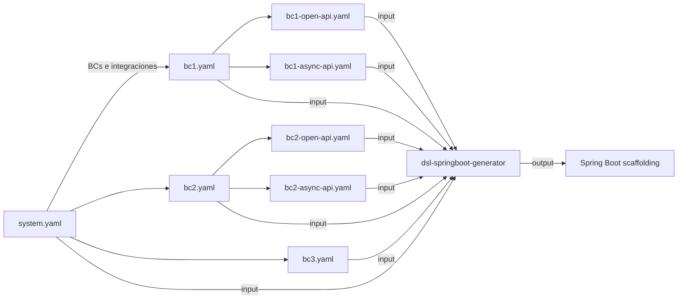

# DSL Design System — Referencia de Artefactos

> Documentación exhaustiva, propiedad-por-propiedad, de los dos artefactos canónicos
> que produce este sistema de diseño: **`system.yaml`** (Paso 1, diseño estratégico)
> y **`{bc}.yaml`** (Paso 2, diseño táctico). Este documento está pensado para
> desarrolladores que escriben, leen, validan o consumen estos archivos.

---

## Índice

- [1. Introducción](#1-introducción)
  - [1.1 Posicionamiento de las tres fases](#11-posicionamiento-de-las-tres-fases)
  - [1.2 Qué es un artefacto canónico](#12-qué-es-un-artefacto-canónico)
  - [1.3 Diagrama de flujo de información](#13-diagrama-de-flujo-de-información)
- [2. Cómo leer este documento](#2-cómo-leer-este-documento)
- [3. Glosario rápido](#3-glosario-rápido)
- [4. `system.yaml` — Diseño estratégico](#4-systemyaml--diseño-estratégico)
  - [4.1 `system` — Identidad](#41-system--identidad)
  - [4.2 `boundedContexts[]` — Contextos delimitados](#42-boundedcontexts--contextos-delimitados)
  - [4.3 `externalSystems[]` — Sistemas externos](#43-externalsystems--sistemas-externos)
  - [4.4 `integrations[]` — Mapa de comunicación](#44-integrations--mapa-de-comunicación)
  - [4.5 `sagas[]` — Procesos de negocio transversales](#45-sagas--procesos-de-negocio-transversales)
  - [4.6 `infrastructure` — Restricciones técnicas](#46-infrastructure--restricciones-técnicas)
  - [4.7 Reglas de validación INT-001 .. INT-015](#47-reglas-de-validación-int-001--int-015)
  - [4.8 Ejemplo completo end-to-end](#48-ejemplo-completo-end-to-end)
- [5. `{bc}.yaml` — Diseño táctico](#5-bcyaml--diseño-táctico)
  - [5.1 Metadatos del BC](#51-metadatos-del-bc)
  - [5.2 `enums[]`](#52-enums)
  - [5.3 `valueObjects[]`](#53-valueobjects)
  - [5.4 `aggregates[]`](#54-aggregates)
  - [5.5 Aggregates de tipo Read Model](#55-aggregates-de-tipo-read-model)
  - [5.6 `domainEvents` — Eventos publicados y consumidos](#56-domainevents--eventos-publicados-y-consumidos)
  - [5.7 `errors[]`](#57-errors)
  - [5.8 `useCases[]`](#58-usecases)
  - [5.9 `repositories[]`](#59-repositories)
  - [5.10 `projections[]`](#510-projections)
  - [5.11 `integrations` (outbound)](#511-integrations-outbound)
  - [5.12 Convenciones de nombres y códigos de error](#512-convenciones-de-nombres-y-códigos-de-error)
  - [5.13 Relación con otros artefactos del Paso 2](#513-relación-con-otros-artefactos-del-paso-2)
- [6. Tipos canónicos](#6-tipos-canónicos)
- [7. Whitelists consolidadas (apéndice)](#7-whitelists-consolidadas-apéndice)
- [8. FAQ de diseño](#8-faq-de-diseño)

---

## 1. Introducción

### 1.1 Posicionamiento de las tres fases

```
Fase 1 — Diseño            Fase 2 — Generación        Fase 3 — Implementación
──────────────────         ─────────────────────       ───────────────────────
Humano + IA                 dsl-springboot-generator   IA completa lógica
Produce artefactos YAML  →  consume YAML, produce   →  en métodos // TODO
en arch/                    scaffolding Java
```

Este repositorio (`dsl-design-system`) cubre **únicamente la Fase 1**: produce los
YAML que viven en `arch/`. El generador (`dsl-springboot-generator`) los consume
en Fase 2.

### 1.2 Qué es un artefacto canónico

Un artefacto canónico es un YAML técnicamente agnóstico que declara **qué** y **para
qué**, nunca **cómo**. Los dos artefactos canónicos son:

| Artefacto | Granularidad | Genera |
|---|---|---|
| `arch/system/system.yaml` | Sistema completo | Estructura de paquetes, integraciones, sagas, infraestructura compartida |
| `arch/{bc}/{bc}.yaml` | Un Bounded Context | Agregados, casos de uso, repositorios, eventos, errores, projections |

### 1.3 Diagrama de flujo de información



`system.yaml` es la **fuente de verdad estructural** del sistema. Cada `{bc}.yaml`
profundiza un único BC declarado allí, sin contradecir nunca a `system.yaml`.

---

## 2. Cómo leer este documento

Cada propiedad documentada sigue una **plantilla uniforme**:

> **Tipo** — primitivo o estructura.
> **Obligatoriedad** — `requerido` / `opcional` / `condicional` (con la condición).
> **Valores permitidos** — whitelist exacta cuando exista.
> **Default** — el valor que aplica el generador si se omite.
> **Qué resuelve** — el problema de diseño que la propiedad atiende.
> **Restricciones cruzadas** — relaciones con otras propiedades.
> **Ejemplo mínimo** — bloque YAML aislado.

**Convenciones de notación:**

| Símbolo | Significado |
|---|---|
| `kebab-case` | minúsculas con guiones (`payment-gateway`) |
| `PascalCase` | iniciales mayúsculas (`OrderConfirmed`) |
| `camelCase` | primer término en minúscula (`createOrder`) |
| `SCREAMING_SNAKE_CASE` | mayúsculas con guion bajo (`PRODUCT_NOT_FOUND`) |
| `T[]`, `T?` | lista de T, opcional T |
| `<placeholder>` | sustituir por valor concreto |

**Códigos de severidad** usados en validaciones cruzadas:
- 🔴 ERROR — el generador detiene la generación.
- 🟡 ALERTA — el generador continúa pero advierte; el diseño merece revisión.
- 🔵 SUGERENCIA — recomendación de mejora; no bloquea.

---

## 3. Glosario rápido

| Término | Definición operativa |
|---|---|
| **Bounded Context (BC)** | Frontera con lenguaje y modelo propios. Un `{bc}.yaml` por BC. |
| **Aggregate** | Cluster transaccional de entidades con un único punto de entrada (la raíz). |
| **Aggregate Root** | Entidad pública del agregado; única que puede referenciarse desde fuera. |
| **Value Object (VO)** | Tipo inmutable definido por sus atributos, sin identidad propia. |
| **Domain Event** | Hecho ocurrido en el dominio que otros componentes pueden consumir. |
| **Use Case** | Operación de aplicación: command (muta) o query (lee). |
| **Repository** | Puerto de salida que abstrae la persistencia de un agregado. |
| **Projection** | Vista de lectura derivada (DTO de proyección). |
| **Local Read Model (LRM)** | Projection persistida actualizada por consumo de eventos. |
| **ACL** (Anti-Corruption Layer) | Adaptador que aísla el dominio de un sistema externo. |
| **Saga** | Proceso transversal multi-BC con compensación en caso de fallo. |
| **Outbox** | Patrón que garantiza publicación at-least-once de eventos. |

---

## 4. `system.yaml` — Diseño estratégico

`system.yaml` declara el sistema completo: BCs, sus agregados estratégicos, los
sistemas externos, el mapa de integraciones, los sagas y la infraestructura
compartida. Vive en `arch/system/system.yaml`.

**Estructura general** (orden fijo):

```yaml
system:           # § 4.1
boundedContexts:  # § 4.2
externalSystems:  # § 4.3
integrations:     # § 4.4
sagas:            # § 4.5  (opcional)
infrastructure:   # § 4.6
```

---

### 4.1 `system` — Identidad

Sección que identifica el sistema completo.

```yaml
system:
  name: ecommerce-platform
  description: >
    Multi-tenant B2C ecommerce platform for physical product sales.
  domainType: core
```

#### 4.1.1 `system.name`

- **Tipo:** string `kebab-case`.
- **Obligatoriedad:** requerido.
- **Default:** —
- **Qué resuelve:** identifica el sistema. Se usa como prefijo en rutas, configuraciones
  y nombres de paquetes Java.
- **Restricciones cruzadas:** debe ser único entre todos los `system.yaml` que coexistan
  en el repositorio del usuario.
- **Ejemplo:** `name: catalog-service`.

#### 4.1.2 `system.description`

- **Tipo:** string libre, multilínea (preferentemente en inglés, 2-4 oraciones).
- **Obligatoriedad:** requerido.
- **Qué resuelve:** comunica el propósito del sistema a cualquier desarrollador o
  agente IA que lo consulte.
- **Ejemplo:**
  ```yaml
  description: >
    Catalog system for B2C ecommerce. Manages product and category lifecycle.
  ```

#### 4.1.3 `system.domainType`

- **Tipo:** enum.
- **Obligatoriedad:** requerido.
- **Valores permitidos:** `core` · `supporting` · `generic`.
- **Default:** —
- **Qué resuelve:** clasifica DDD del sistema. Define cuánta inversión de diseño merece.
  - `core` — ventaja competitiva del negocio.
  - `supporting` — necesario, sin diferenciación.
  - `generic` — commodity reemplazable por SaaS.
- **Ejemplo:** `domainType: core`.

---

### 4.2 `boundedContexts[]` — Contextos delimitados

Lista de BCs del sistema. Cada elemento captura el nivel **estratégico**: propósito y
agregados raíz. Los detalles tácticos (entidades, value objects, casos de uso) viven
en cada `{bc}.yaml`.

```yaml
boundedContexts:
  - name: catalog
    type: core
    purpose: >
      Manages the lifecycle of products and categories.
    aggregates:
      - name: Product
        root: Product
        entities: [ProductImage, PriceHistory]
      - name: Category
        root: Category
        entities: []
```

#### 4.2.1 `boundedContexts[].name`

- **Tipo:** string `kebab-case`.
- **Obligatoriedad:** requerido.
- **Qué resuelve:** identifica el BC. Se usa como nombre de carpeta en `arch/{name}/`
  y como módulo Java.
- **Restricciones cruzadas:** debe ser único en el sistema. Se referencia en
  `integrations[].from`/`to`, `sagas[].steps[].bc` y `aggregates[].sourceBC` (LRM).
- **Ejemplo:** `name: orders`.

#### 4.2.2 `boundedContexts[].type`

- **Tipo:** enum.
- **Obligatoriedad:** requerido.
- **Valores permitidos:** `core` · `supporting` · `generic`.
- **Qué resuelve:** clasifica DDD del BC.
  - `core` — ventaja competitiva (`catalog`, `orders`, `dispatch`).
  - `supporting` — habilitador (`inventory`, `notifications`).
  - `generic` — resoluble con 3rd party (`auth`, `payments` con pasarela).
- **Restricciones cruzadas:** todos los BCs `core` y `supporting` requieren un
  `{bc}.yaml`. Los `generic` también, pero típicamente más delgados.
- **Ejemplo:** `type: core`.

#### 4.2.3 `boundedContexts[].purpose`

- **Tipo:** texto libre, una oración.
- **Obligatoriedad:** requerido.
- **Qué resuelve:** declara qué hace este BC y por qué existe. Se reutiliza en el
  `system-spec.md` y en la documentación generada.
- **Ejemplo:** `purpose: Manages order lifecycle from confirmation to delivery.`.

#### 4.2.4 `boundedContexts[].aggregates[]`

- **Tipo:** lista de objetos `{name, root, entities}`.
- **Obligatoriedad:** requerido (al menos un agregado por BC, salvo BCs `generic`
  que solo orquestan).
- **Qué resuelve:** enumera los agregados estratégicos. **No es la lista final
  exhaustiva** del Paso 2 — es el punto de partida.
- **Señal de sobre-diseño:** > 5 agregados → probablemente esconde dos BCs.
- **Señal de sub-diseño:** 0 agregados → probablemente es una entidad de otro BC.

##### 4.2.4.1 `aggregates[].name`

- **Tipo:** `PascalCase`.
- **Obligatoriedad:** requerido.
- **Qué resuelve:** nombre del agregado. Casi siempre coincide con `root`.
- **Ejemplo:** `name: Product`.

##### 4.2.4.2 `aggregates[].root`

- **Tipo:** `PascalCase`.
- **Obligatoriedad:** requerido.
- **Qué resuelve:** entidad raíz del agregado. Es la única referenciable desde fuera.
- **Ejemplo:** `root: Product`.

##### 4.2.4.3 `aggregates[].entities[]`

- **Tipo:** lista de strings `PascalCase`.
- **Obligatoriedad:** opcional (lista vacía permitida).
- **Restricciones:** máximo 4 entidades internas en este nivel (estratégico). Sin
  Value Objects ni domain events aquí — eso es Paso 2.
- **Qué resuelve:** anticipa las entidades internas relevantes para dimensionar el BC.
- **Ejemplo:** `entities: [ProductImage, PriceHistory]`.

---

### 4.3 `externalSystems[]` — Sistemas externos

Sistemas que **no son parte de nuestro código** pero participan en alguna integración.
Solo se declaran los efectivamente referenciados por `integrations[]`.

```yaml
externalSystems:
  - name: payment-gateway
    description: Third-party payment processor for card charging and refunds.
    type: payment-gateway
    operations:
      - name: chargePayment
        description: Charge a credit card and return authorization code
        direction: outbound
      - name: webhookPaymentEvent
        description: Receive async notification of payment status changes
        direction: inbound
```

#### 4.3.1 `externalSystems[].name`

- **Tipo:** string `kebab-case`.
- **Obligatoriedad:** requerido.
- **Qué resuelve:** identifica el sistema externo. Debe coincidir literalmente con
  los valores en `integrations[].from`/`to`.
- **Ejemplo:** `name: sms-provider`.

#### 4.3.2 `externalSystems[].description`

- **Tipo:** texto libre.
- **Obligatoriedad:** requerido.
- **Qué resuelve:** explica qué hace el sistema externo, sin entrar en detalles de
  protocolo.

#### 4.3.3 `externalSystems[].type`

- **Tipo:** enum.
- **Obligatoriedad:** requerido.
- **Valores permitidos:** `payment-gateway` · `notification-provider` ·
  `identity-provider` · `erp` · `logistics` · `tax-authority` · `crm` · `analytics`
  · `storage` · `other`.
- **Qué resuelve:** clasifica el tipo de sistema externo para que el generador pueda
  aplicar plantillas de ACL específicas (autenticación esperada, formato típico, etc.).
- **Ejemplo:** `type: payment-gateway`.

#### 4.3.4 `externalSystems[].operations[]`

- **Tipo:** lista de objetos `{name, description, direction}`.
- **Obligatoriedad:** **requerida si el sistema externo aparece en `integrations[]`**
  como `from` o `to` (validador **INT-014**). Sin esto el generador no puede crear
  el ACL adapter.
- **Qué resuelve:** enumera explícitamente las operaciones que el ACL expondrá.

##### 4.3.4.1 `operations[].name`

- **Tipo:** `camelCase`.
- **Obligatoriedad:** requerido.
- **Qué resuelve:** identifica la operación.
- **Ejemplo:** `name: chargePayment`.

##### 4.3.4.2 `operations[].description`

- **Tipo:** texto libre.
- **Obligatoriedad:** requerido.
- **Qué resuelve:** propósito funcional de la operación.

##### 4.3.4.3 `operations[].direction`

- **Tipo:** enum.
- **Obligatoriedad:** requerido.
- **Valores permitidos:**
  - `outbound` — nuestra app llama al externo.
  - `inbound` — el externo nos llama (webhooks, callbacks).
- **Qué resuelve:** determina si el generador produce un cliente HTTP saliente o un
  endpoint receptor.
- **Ejemplo:** `direction: outbound`.

---

### 4.4 `integrations[]` — Mapa de comunicación

Cada entrada describe **una dirección** de comunicación entre dos partes. Es la
sección más importante del Paso 1.

```yaml
integrations:
  - from: orders
    to: catalog
    pattern: customer-supplier
    channel: http
    contracts:
      - validateProductsAndPrices
    notes: orders snapshots prices from catalog at order placement.
    auth:
      type: bearer
      valueProperty: integration.catalog.token
    resilience:
      timeoutMs: 3000
      retries: { maxAttempts: 2, waitDurationMs: 200 }
```

#### 4.4.1 `integrations[].from`

- **Tipo:** string.
- **Obligatoriedad:** requerido.
- **Valores permitidos:** un `boundedContexts[].name` o un `externalSystems[].name`.
- **Qué resuelve:** identifica al **emisor / llamante** de la integración.
- **Ejemplo:** `from: orders`.

#### 4.4.2 `integrations[].to`

- **Tipo:** string.
- **Obligatoriedad:** requerido.
- **Valores permitidos:** un `boundedContexts[].name` o un `externalSystems[].name`.
- **Qué resuelve:** identifica al **receptor / proveedor** de la integración.
- **Ejemplo:** `to: catalog`.

#### 4.4.3 `integrations[].pattern`

- **Tipo:** enum.
- **Obligatoriedad:** requerido.
- **Valores permitidos:**
  | Patrón | Cuándo usar |
  |---|---|
  | `customer-supplier` | Un BC depende del modelo de otro; el supplier dicta el contrato. |
  | `event` | Comunicación asíncrona vía eventos de dominio. |
  | `acl` | Siempre en integraciones con sistemas externos. Aísla del modelo externo. |
  | `shared-kernel` | Dos BCs comparten código (raro; usar con precaución). |
  | `open-host` | Un BC expone una API estable que otros consumen libremente. |
- **Qué resuelve:** declara el patrón de relación entre los dos lados.
- **Ejemplo:** `pattern: acl`.

#### 4.4.4 `integrations[].channel`

- **Tipo:** enum.
- **Obligatoriedad:** requerido.
- **Valores permitidos:**
  | Canal | Significado |
  |---|---|
  | `http` | Petición REST síncrona. Canal más común entre BCs internos. |
  | `grpc` | Protocol Buffers síncrono. Para volumen o latencia crítica. |
  | `websocket` | Stream en tiempo real desde el proveedor al llamante. |
  | `message-broker` | Asíncrono. El emisor publica y no espera respuesta. |
- **Qué resuelve:** decide el mecanismo de transporte.
- **Restricciones cruzadas:** si algún `channel: message-broker` está presente,
  `infrastructure.messageBroker` debe ser `true`.
- **Ejemplo:** `channel: http`.

#### 4.4.5 `integrations[].contracts[]`

La forma de cada elemento depende de `channel`.

##### 4.4.5.1 Forma con `channel: http | grpc | websocket`

- **Tipo:** lista de strings `camelCase`.
- **Qué resuelve:** identifica los **endpoints del BC `to`** (proveedor) que el
  BC `from` (llamante) consumirá. El nombre coincidirá con el `operationId` del
  `{to}-open-api.yaml`.
- **Restricciones cruzadas:** cada string debe existir como `operationId` en el
  OpenAPI del BC `to` durante el Paso 2.
- **Ejemplo:**
  ```yaml
  contracts:
    - validateProductsAndPrices
    - getProductById
  ```

##### 4.4.5.2 Forma con `channel: message-broker`

- **Tipo:** lista de objetos `{name, channel}`.
- **`name`:** `PascalCase`. Nombre del evento.
- **`channel`:** kebab-case con puntos. Nombre exacto del canal en el AsyncAPI.
- **Qué resuelve:** identifica los eventos asíncronos que cruzan la frontera.
- **Restricciones cruzadas:** `channel` debe coincidir literalmente con el canal
  declarado en el `{from}-async-api.yaml`.
- **Ejemplo:**
  ```yaml
  contracts:
    - name: OrderConfirmed
      channel: orders.order.confirmed
    - name: OrderCancelled
      channel: orders.order.cancelled
  ```

##### 4.4.5.3 Resumen visual

| `channel` | Forma de `contracts[]` | Tipo elemento | Ejemplo |
|---|---|---|---|
| `http` | nombre operación | `camelCase` | `validateProductsAndPrices` |
| `grpc` | nombre RPC | `camelCase` | `getCustomerProfile` |
| `websocket` | nombre stream | `camelCase` | `subscribeToOrderUpdates` |
| `message-broker` | objeto evento | `{name, channel}` | `{OrderConfirmed, orders.order.confirmed}` |

#### 4.4.6 `integrations[].notes`

- **Tipo:** texto libre.
- **Obligatoriedad:** opcional (recomendado).
- **Qué resuelve:** explica el porqué de la integración y decisiones relevantes.

#### 4.4.7 `integrations[].auth`

Bloque que define cómo se autentica la integración. Override de
`infrastructure.integrations.defaults.auth` (§ 4.6.5).

##### 4.4.7.1 `auth.type`

- **Tipo:** enum.
- **Obligatoriedad:** requerido (si se declara `auth`).
- **Valores permitidos:**
  | Valor | Cómo se inyecta | Configuración requerida |
  |---|---|---|
  | `none` | sin interceptor | — |
  | `api-key` | header configurable | `valueProperty`, opcional `header` |
  | `bearer` | `Authorization: Bearer <token>` | `valueProperty` |
  | `oauth2-cc` | `OAuth2AuthorizedClientManager` (Spring) | `tokenEndpoint`, `credentialKey` |
  | `mTLS` | configuración externa (truststore/keystore) | — |
- **Qué resuelve:** decide la estrategia de autenticación contra el destino.
- **Restricciones cruzadas:** **INT-015** — si `type: oauth2-cc`, los campos
  `tokenEndpoint` y `credentialKey` son obligatorios.
- **Ejemplo:**
  ```yaml
  auth:
    type: api-key
    valueProperty: integration.catalog.api-key
    header: X-Api-Key
  ```

##### 4.4.7.2 `auth.valueProperty`

- **Tipo:** string (clave de propiedad de configuración).
- **Obligatoriedad:** requerido en `api-key` y `bearer`.
- **Qué resuelve:** apunta al valor secreto en `application-{env}.yaml`.

##### 4.4.7.3 `auth.header`

- **Tipo:** string.
- **Obligatoriedad:** opcional.
- **Default:** `X-Api-Key` (api-key) · `Authorization` (bearer).
- **Qué resuelve:** override del nombre del header.

##### 4.4.7.4 `auth.tokenEndpoint`

- **Tipo:** URL absoluta.
- **Obligatoriedad:** requerido si `type: oauth2-cc`.
- **Qué resuelve:** endpoint del Identity Provider donde se obtiene el access token.

##### 4.4.7.5 `auth.credentialKey`

- **Tipo:** string.
- **Obligatoriedad:** requerido si `type: oauth2-cc`.
- **Qué resuelve:** identificador del registro `client-id` / `client-secret` en
  Spring Security (`registrationId`).

#### 4.4.8 `integrations[].resilience`

Bloque que define timeouts, retries y circuit breaker del cliente saliente.

```yaml
resilience:
  timeoutMs: 3000
  connectTimeoutMs: 1000
  retries: { maxAttempts: 3, waitDurationMs: 500 }
  circuitBreaker: { failureRateThreshold: 50 }
```

##### 4.4.8.1 `resilience.timeoutMs`

- **Tipo:** entero positivo.
- **Obligatoriedad:** opcional.
- **Qué resuelve:** timeout total de la llamada (incluye conexión + lectura).

##### 4.4.8.2 `resilience.connectTimeoutMs`

- **Tipo:** entero positivo.
- **Obligatoriedad:** opcional.
- **Qué resuelve:** timeout de establecimiento de conexión.
- **Restricciones cruzadas:** debe ser ≤ `timeoutMs`.

##### 4.4.8.3 `resilience.retries`

- **Tipo:** objeto `{maxAttempts, waitDurationMs}`.
- **`retries.maxAttempts`:** entero ≥ 1. Número de intentos totales (incluyendo el
  primero).
- **`retries.waitDurationMs`:** entero ≥ 0. Espera entre intentos.

##### 4.4.8.4 `resilience.circuitBreaker`

- **Tipo:** objeto `{failureRateThreshold}`.
- **`failureRateThreshold`:** entero 0..100. Porcentaje de fallos en la ventana que
  abre el circuit breaker.

---

### 4.5 `sagas[]` — Procesos de negocio transversales

Se declara cuando una cadena de **3 o más BCs** conectados por eventos forma una
unidad de trabajo con nombre en el negocio, donde un fallo en cualquier paso debe
compensar los pasos anteriores.

```yaml
sagas:
  - name: CheckoutSaga
    description: >
      Coordinates order confirmation, payment capture, and stock reservation.
    trigger:
      event: OrderPlaced
      bc: orders
    steps:
      - order: 1
        bc: payments
        triggeredBy: OrderPlaced
        onSuccess: PaymentCaptured
        onFailure: PaymentFailed
        compensation: PaymentRefunded
      - order: 2
        bc: inventory
        triggeredBy: PaymentCaptured
        onSuccess: StockReserved
        onFailure: StockReservationFailed
        compensation: StockReleased
```

#### 4.5.1 `sagas[].name`

- **Tipo:** `PascalCase`, sufijo `Saga`.
- **Obligatoriedad:** requerido.
- **Qué resuelve:** identifica el proceso de negocio.

#### 4.5.2 `sagas[].description`

- **Tipo:** texto.
- **Obligatoriedad:** requerido.
- **Qué resuelve:** explica qué coordina el saga y cuándo se activa la compensación.

#### 4.5.3 `sagas[].trigger`

- **Tipo:** objeto `{event, bc}`.
- **`trigger.event`:** `PascalCase`. Evento que inicia el saga.
- **`trigger.bc`:** kebab-case. BC que publica el evento disparador.
- **Restricciones cruzadas:** `event` debe existir como contrato en una integración
  `pattern: event` con `from: <trigger.bc>`.

#### 4.5.4 `sagas[].steps[]`

Lista ordenada de pasos del saga.

| Campo | Tipo | Obligatoriedad | Descripción |
|---|---|---|---|
| `order` | entero ≥ 1 | requerido | Posición en la cadena. |
| `bc` | kebab-case | requerido | BC que ejecuta el paso. |
| `triggeredBy` | `PascalCase` | requerido | Evento que activa el paso. |
| `onSuccess` | `PascalCase` | requerido | Evento emitido si el paso tiene éxito. |
| `onFailure` | `PascalCase` | opcional | Evento emitido si el paso falla. Omitir si el paso no puede fallar. |
| `compensation` | `PascalCase` | opcional | Evento que deshace el paso si un paso posterior falla. |

**Restricciones cruzadas:** cada evento en `onSuccess`, `onFailure` y `compensation`
debe existir como contrato `pattern: event` con `from: <step.bc>`. Si existen sagas,
se recomienda activar `infrastructure.reliability.outbox` y `consumerIdempotency`.

---

### 4.6 `infrastructure` — Restricciones técnicas

Decisiones estructurales que afectan a todos los BCs. La tecnología concreta (motor
de DB, broker específico) la elige el generador en Fase 2.

```yaml
infrastructure:
  deployment:
    strategy: modular-monolith
    architectureStyle: hexagonal
    notes: Default applied.
  messageBroker: true
  database:
    type: relational
    isolationStrategy: schema-per-bc
    notes: Default applied.
  reliability:
    outbox: true
    consumerIdempotency: true
  integrations:
    defaults:
      auth: { type: bearer, valueProperty: integration.default.token }
      resilience:
        timeoutMs: 5000
        retries: { maxAttempts: 3, waitDurationMs: 500 }
        circuitBreaker: { failureRateThreshold: 50 }
```

#### 4.6.1 `infrastructure.deployment`

##### 4.6.1.1 `deployment.strategy`

- **Tipo:** enum.
- **Valores permitidos:** `modular-monolith` · `microservices` · `serverless`.
- **Default:** `modular-monolith`.
- **Qué resuelve:** decide cómo se despliegan los BCs.

##### 4.6.1.2 `deployment.architectureStyle`

- **Tipo:** enum.
- **Valores permitidos:** `hexagonal` · `layered` · `clean`.
- **Default:** `hexagonal`.
- **Qué resuelve:** patrón de organización interna de cada BC.

##### 4.6.1.3 `deployment.notes`

- **Tipo:** texto.
- **Obligatoriedad:** opcional.
- **Qué resuelve:** justificación de la decisión (default explícito o motivada).

#### 4.6.2 `infrastructure.messageBroker`

- **Tipo:** boolean.
- **Obligatoriedad:** **requerido** (como `true`) cuando exista al menos una
  integración `channel: message-broker`. Omitir si no la hay.
- **Qué resuelve:** señaliza al generador que debe emitir wiring de broker. La
  tecnología concreta (RabbitMQ, Kafka, …) la elige el generador.

#### 4.6.3 `infrastructure.database`

##### 4.6.3.1 `database.type`

- **Tipo:** enum.
- **Valores permitidos:** `relational` · `document` · `key-value` · `graph`.
- **Default:** `relational`.

##### 4.6.3.2 `database.isolationStrategy`

- **Tipo:** enum.
- **Valores permitidos:**
  | Estrategia | Cuándo usarla |
  |---|---|
  | `schema-per-bc` | Monolito modular. Un schema SQL por BC. Recomendado V1. |
  | `db-per-bc` | Microservicios. DB completamente separada por BC. |
  | `prefix-per-bc` | Monolito simple. Tablas con prefijo en una sola DB. |
- **Default:** `schema-per-bc`.

##### 4.6.3.3 `database.notes`

- **Tipo:** texto.
- **Obligatoriedad:** opcional.

#### 4.6.4 `infrastructure.reliability`

Patrones de robustez para publicación y consumo de eventos.

##### 4.6.4.1 `reliability.outbox`

- **Tipo:** boolean.
- **Obligatoriedad:** opcional.
- **Default:** `false`.
- **Qué resuelve:** activa el patrón outbox para publicación at-least-once de eventos.
  Sin él, una falla entre commit de DB y publish puede perder un evento.
- **Cuándo activar:**
  - Hay alguna integración `channel: message-broker` y se requiere garantía
    at-least-once.
  - **Activar siempre que existan `sagas[]`**.

##### 4.6.4.2 `reliability.consumerIdempotency`

- **Tipo:** boolean.
- **Obligatoriedad:** opcional.
- **Default:** `false`.
- **Qué resuelve:** instala detección automática de mensajes duplicados en
  consumidores. Sin él, un redelivery del mismo evento ejecuta el handler dos veces.
- **Cuándo activar:**
  - Hay UCs disparados por evento (`trigger.kind: event` en algún BC).
  - **Activar siempre que existan `sagas[]`**.

#### 4.6.5 `infrastructure.integrations.defaults`

Defaults globales de `auth` y `resilience` que aplican a toda integración que no
declare los suyos localmente.

```yaml
infrastructure:
  integrations:
    defaults:
      auth: { type: bearer, valueProperty: integration.default.token }
      resilience:
        timeoutMs: 5000
        retries: { maxAttempts: 3, waitDurationMs: 500 }
```

- **Precedencia:** valores locales en `integrations[].auth` / `.resilience` >
  `infrastructure.integrations.defaults`.
- **Qué resuelve:** evita repetir auth y resilience en cada integración cuando hay
  una política común.

---

### 4.7 Reglas de validación INT-001 .. INT-015

Reglas que el agente `ddd-step1-refine` (y el generador) verifican.

| ID | Severidad | Regla |
|---|---|---|
| INT-001 | 🔴 ERROR | Todo `from`/`to` en `integrations` existe en `boundedContexts` o `externalSystems`. |
| INT-002 | 🔴 ERROR | Si hay `channel: message-broker`, `infrastructure.messageBroker: true`. |
| INT-003 | 🔴 ERROR | Contratos de `message-broker` son objetos `{name, channel}`. |
| INT-004 | 🔴 ERROR | Contratos de `http`/`grpc`/`websocket` son strings `camelCase`. |
| INT-005 | 🟡 ALERTA | Sistema en `externalSystems` sin integración → posible huérfano. |
| INT-006 | 🔴 ERROR | Cada evento en `sagas[].steps[].onSuccess/onFailure/compensation` existe como contrato `pattern: event`. |
| INT-014 | 🔴 ERROR | `externalSystem` referenciado en `integrations` declara `operations[]` no vacío. |
| INT-015 | 🔴 ERROR | `auth.type: oauth2-cc` declara `tokenEndpoint` y `credentialKey`. |
| — | 🟡 ALERTA | Existen `sagas[]` y `reliability.outbox` está `false` o ausente. |
| — | 🟡 ALERTA | Existen `sagas[]` y `reliability.consumerIdempotency` está `false` o ausente. |

---

### 4.8 Ejemplo completo end-to-end

```yaml
system:
  name: ecommerce-platform
  description: >
    B2C ecommerce platform supporting catalog management, order lifecycle,
    and third-party payment processing.
  domainType: core

boundedContexts:
  - name: catalog
    type: core
    purpose: Manages product and category lifecycle.
    aggregates:
      - { name: Product, root: Product, entities: [ProductImage, PriceHistory] }
      - { name: Category, root: Category, entities: [] }

  - name: orders
    type: core
    purpose: Orchestrates the order lifecycle from placement to delivery.
    aggregates:
      - { name: Order, root: Order, entities: [OrderLine] }

  - name: inventory
    type: supporting
    purpose: Tracks stock availability per active product.
    aggregates:
      - { name: StockItem, root: StockItem, entities: [] }

  - name: payments
    type: generic
    purpose: Captures payments through a third-party processor.
    aggregates:
      - { name: PaymentIntent, root: PaymentIntent, entities: [] }

externalSystems:
  - name: payment-gateway
    description: Third-party payment processor.
    type: payment-gateway
    operations:
      - { name: chargePayment, description: Charge a card, direction: outbound }
      - { name: refundPayment, description: Refund a charge, direction: outbound }
      - { name: webhookPaymentEvent, description: Async status callback, direction: inbound }

integrations:
  - from: orders
    to: catalog
    pattern: customer-supplier
    channel: http
    contracts: [validateProductsAndPrices]
    notes: orders snapshots prices from catalog at order placement.

  - from: orders
    to: inventory
    pattern: event
    channel: message-broker
    contracts:
      - { name: OrderConfirmed, channel: orders.order.confirmed }

  - from: payments
    to: payment-gateway
    pattern: acl
    channel: http
    contracts: [chargePayment, refundPayment]
    auth:
      type: oauth2-cc
      tokenEndpoint: https://idp.example.com/oauth2/token
      credentialKey: payment-gateway
    resilience:
      timeoutMs: 5000
      connectTimeoutMs: 1000
      retries: { maxAttempts: 2, waitDurationMs: 300 }
      circuitBreaker: { failureRateThreshold: 50 }

sagas:
  - name: CheckoutSaga
    description: Coordinates payment capture and stock reservation.
    trigger: { event: OrderConfirmed, bc: orders }
    steps:
      - order: 1
        bc: payments
        triggeredBy: OrderConfirmed
        onSuccess: PaymentCaptured
        onFailure: PaymentFailed
        compensation: PaymentRefunded
      - order: 2
        bc: inventory
        triggeredBy: PaymentCaptured
        onSuccess: StockReserved
        onFailure: StockReservationFailed
        compensation: StockReleased

infrastructure:
  deployment: { strategy: modular-monolith, architectureStyle: hexagonal, notes: Default. }
  messageBroker: true
  database: { type: relational, isolationStrategy: schema-per-bc, notes: Default. }
  reliability: { outbox: true, consumerIdempotency: true }
  integrations:
    defaults:
      resilience:
        timeoutMs: 5000
        retries: { maxAttempts: 3, waitDurationMs: 500 }
        circuitBreaker: { failureRateThreshold: 50 }
```

---

## 5. `{bc}.yaml` — Diseño táctico

Vive en `arch/{bc-name}/{bc-name}.yaml`. Define la **anatomía interna** del BC: tipos
de dominio, agregados, eventos, errores, casos de uso, repositorios y projections.

**Estructura general:**

```yaml
bc: <kebab-case>             # § 5.1
type: <core|supporting|generic>
description: <texto>
enums: []                    # § 5.2
valueObjects: []             # § 5.3
aggregates: []               # § 5.4
domainEvents: { published: [], consumed: [] }   # § 5.6
errors: []                   # § 5.7
useCases: []                 # § 5.8
repositories: []             # § 5.9
projections: []              # § 5.10
integrations: { outbound: [] }                  # § 5.11
```

---

### 5.1 Metadatos del BC

#### 5.1.1 `bc`

- **Tipo:** `kebab-case`.
- **Obligatoriedad:** requerido.
- **Qué resuelve:** identifica el BC. Debe coincidir con un
  `system.yaml.boundedContexts[].name`.

#### 5.1.2 `type`

- **Tipo:** enum.
- **Valores permitidos:** `core` · `supporting` · `generic`.
- **Restricciones cruzadas:** debe coincidir con `boundedContexts[].type` en
  `system.yaml`.

#### 5.1.3 `description`

- **Tipo:** texto.
- **Qué resuelve:** propósito del BC. Mismo contenido (en general) que
  `boundedContexts[].purpose`.

---

### 5.2 `enums[]`

Enumeraciones cerradas usadas en el dominio (estados, categorías, modos).

```yaml
enums:
  - name: ProductStatus
    description: Lifecycle of a product.
    values: [DRAFT, ACTIVE, DISCONTINUED]
```

| Campo | Tipo | Obligatoriedad | Descripción |
|---|---|---|---|
| `name` | `PascalCase` | requerido | Identificador. |
| `description` | texto | requerido | Qué representa. |
| `values` | lista de `SCREAMING_SNAKE_CASE` | requerido | Valores admitidos. |

**Qué resuelve:** materializa estados o categorías como tipo cerrado en el dominio.
Se usa luego en `properties.type`, en `domainRules.terminalState.state` y en
transiciones (`states[].transitions[]`).

---

### 5.3 `valueObjects[]`

Objetos inmutables sin identidad propia, definidos por sus atributos.

```yaml
valueObjects:
  - name: Money
    description: Monetary amount with currency.
    properties:
      - name: amount
        type: Decimal
        precision: 19
        scale: 4
        required: true
        validations:
          - positive: true
      - name: currency
        type: String(3)
        required: true
        validations:
          - pattern: "^[A-Z]{3}$"
```

#### 5.3.1 `valueObjects[].name`

- **Tipo:** `PascalCase`.
- **Obligatoriedad:** requerido.

#### 5.3.2 `valueObjects[].description`

- **Tipo:** texto.
- **Obligatoriedad:** requerido.

#### 5.3.3 `valueObjects[].properties[]`

Mismo schema que `aggregates[].properties[]` (§ 5.4.2). Las `validations` declaradas
aquí **se propagan automáticamente** a cualquier propiedad de un agregado o entidad
que use este VO como `type`. **No repetir las constraints en el agregado**.

---

### 5.4 `aggregates[]`

Cluster transaccional. Cada agregado tiene una raíz, propiedades, opcionalmente
entidades hijas, máquina de estados y reglas de dominio.

```yaml
aggregates:
  - name: Product
    root: Product
    auditable: true
    concurrencyControl: optimistic
    softDelete: true
    properties: [...]
    entities: [...]
    states: [...]
    domainRules: [...]
```

#### 5.4.1 Identidad y configuración

##### 5.4.1.1 `aggregates[].name`

- **Tipo:** `PascalCase`.
- **Obligatoriedad:** requerido.

##### 5.4.1.2 `aggregates[].root`

- **Tipo:** `PascalCase`.
- **Obligatoriedad:** requerido.
- **Qué resuelve:** entidad raíz. Casi siempre coincide con `name`.

##### 5.4.1.3 `aggregates[].auditable`

- **Tipo:** boolean.
- **Obligatoriedad:** opcional.
- **Default:** `true` (agregados de negocio).
- **Qué resuelve:** instruye al generador a inyectar `createdAt` y `updatedAt`
  automáticamente. **No declarar manualmente** estos campos.

##### 5.4.1.4 `aggregates[].concurrencyControl`

- **Tipo:** enum.
- **Valores permitidos:** `optimistic` (único valor admitido).
- **Obligatoriedad:** opcional.
- **Qué resuelve:** activa control de concurrencia optimista (columna `version` +
  `@Version`). Recomendado en agregados con muchas escrituras concurrentes.

##### 5.4.1.5 `aggregates[].softDelete`

- **Tipo:** boolean.
- **Obligatoriedad:** opcional.
- **Default:** `false`.
- **Qué resuelve:** activa borrado lógico. El generador inyecta `deletedAt`
  (nullable), filtra automáticamente todos los `findAll`/`findById` por
  `deletedAt IS NULL`, y mapea el endpoint DELETE a `softDelete(id)`.
- **Restricciones cruzadas:** **no declarar manualmente** `deletedAt`. Para
  repositorios que necesiten contar/buscar registros activos, declarar el qualifier
  `softDelete: true` en el método (§ 5.9).

#### 5.4.2 `aggregates[].properties[]`

Cada propiedad declara un atributo del agregado (o de una entidad hija).

```yaml
properties:
  - name: sku
    type: String(100)
    required: true
    unique: true
    indexed: true
    validations:
      - notEmpty: true
      - minLength: 3
      - pattern: "^[A-Z0-9-]+$"
```

##### 5.4.2.1 `properties[].name`

- **Tipo:** `camelCase`.
- **Obligatoriedad:** requerido.

##### 5.4.2.2 `properties[].type`

- **Tipo:** referencia a tipo canónico (§ 6), enum, VO o `List[T]`.
- **Obligatoriedad:** requerido.
- **Restricciones:** no usar tipos primitivos de lenguaje (`string`, `int`).
  Genéricos con corchetes (`List[X]`, no `List<X>`).

##### 5.4.2.3 `properties[].required`

- **Tipo:** boolean.
- **Default:** `false`.
- **Qué resuelve:** marca la propiedad como no nullable.

##### 5.4.2.4 `properties[].unique`

- **Tipo:** boolean.
- **Default:** `false`.
- **Qué resuelve:** declara constraint UNIQUE a nivel de DB. Combina con un
  `domainRule.type: uniqueness` con el mismo `field`.

##### 5.4.2.5 `properties[].indexed`

- **Tipo:** boolean.
- **Default:** `false`.
- **Qué resuelve:** crea índice no-único en DB para acelerar búsquedas.

##### 5.4.2.6 `properties[].readOnly`

- **Tipo:** boolean.
- **Default:** `false`.
- **Qué resuelve:** la propiedad solo puede setearse en la creación. Los commands de
  update no la incluyen.

##### 5.4.2.7 `properties[].hidden`

- **Tipo:** boolean.
- **Default:** `false`.
- **Qué resuelve:** la propiedad no se expone en respuestas REST ni en eventos
  `scope: integration` o `both` (a menos que el evento declare `allowHiddenLeak: true`).

##### 5.4.2.8 `properties[].internal`

- **Tipo:** boolean.
- **Default:** `false`.
- **Qué resuelve:** la propiedad no aparece nunca fuera del dominio (ni en eventos,
  ni en projections, ni en respuestas).

##### 5.4.2.9 `properties[].defaultValue`

- **Tipo:** literal compatible con `type`.
- **Obligatoriedad:** opcional.
- **Qué resuelve:** valor inicial cuando la propiedad no llega en el command.

##### 5.4.2.10 `properties[].source`

- **Tipo:** enum.
- **Valores permitidos:** `authContext`.
- **Qué resuelve:** indica que el valor proviene del contexto de autenticación (claim
  del JWT) en vez del request body. Útil para `tenantId`, `createdBy`, etc.

##### 5.4.2.11 `properties[].validations[]` (whitelist)

Vocabulario soportado por el generador (validaciones declarativas):

| Constraint | Aplica a | Significado |
|---|---|---|
| `notEmpty: true` | String, List | no nulo y no vacío |
| `minLength: N` | String | longitud ≥ N |
| `maxLength: N` | String | longitud ≤ N (preferir `String(N)` que ya implica esto) |
| `pattern: "regex"` | String | el valor debe coincidir con la regex |
| `min: N` | Integer, Long, Decimal | valor ≥ N (inclusive) |
| `max: N` | Integer, Long, Decimal | valor ≤ N (inclusive) |
| `positive: true` | numéricos | > 0 |
| `positiveOrZero: true` | numéricos | ≥ 0 |
| `minSize: N` | List | tamaño ≥ N |
| `maxSize: N` | List | tamaño ≤ N |

**Importante:** este es el conjunto que el **generador SpringBoot procesa hoy**. Para
semánticas como email, URL, fecha futura/pasada: **usar tipos canónicos** (`Email`,
`Url`, `Date`, `DateTime`) — el constructor del VO/tipo canónico valida en sí mismo.

**Constraints implícitas — NO declarar:**
- `String(n)` ya implica `maxLength: n`.
- `Email` ya valida formato de email.
- `Url` ya valida formato de URL.
- `Uuid` ya valida formato UUID.
- `required: true` ya implica no-nulo (y no-blanco para Strings).

#### 5.4.3 `aggregates[].entities[]`

Entidades hijas con identidad dentro del agregado.

```yaml
entities:
  - name: ProductImage
    relationship: composition
    cardinality: oneToMany
    properties:
      - { name: id, type: Uuid, required: true }
      - { name: url, type: Url, required: true }
      - { name: sortOrder, type: Integer, required: true }
```

##### 5.4.3.1 `entities[].relationship`

- **Tipo:** enum.
- **Valores permitidos:** `composition` · `aggregation`.
  - `composition` — el hijo no existe sin el padre. Cascade delete.
  - `aggregation` — el hijo puede existir independientemente. No cascade.
- **Obligatoriedad:** requerido.

##### 5.4.3.2 `entities[].cardinality`

- **Tipo:** enum.
- **Valores permitidos:** `oneToOne` · `oneToMany`.
- **`manyToMany` NO está soportado** por el generador. 🔴 ERROR si se declara.
- **Obligatoriedad:** requerido.

##### 5.4.3.3 `entities[].properties[]`

Mismo schema que § 5.4.2. **Restricción adicional:** `id` debe ser `Uuid` (otros
tipos de id no soportados).

#### 5.4.4 `aggregates[].states[]`

Máquina de estados explícita. Útil cuando un campo de status conduce el ciclo de vida.

```yaml
states:
  - name: DRAFT
    transitions:
      - event: ProductActivated
        to: ACTIVE
        useCase: activateProduct
        rules: [PRD-001, PRD-002]
  - name: ACTIVE
    transitions:
      - event: ProductDiscontinued
        to: DISCONTINUED
        useCase: discontinueProduct
        rules: [PRD-003]
  - name: DISCONTINUED
    transitions: []
```

| Campo | Tipo | Descripción |
|---|---|---|
| `states[].name` | enum value | Nombre del estado (debe ser un valor del enum de estados). |
| `transitions[].event` | `PascalCase` | Domain event emitido al transicionar. |
| `transitions[].to` | enum value | Estado destino. |
| `transitions[].useCase` | `camelCase` | UC que ejecuta la transición. |
| `transitions[].rules` | lista de `RULE-ID` | Todas las reglas evaluadas durante la transición. |

#### 5.4.5 `aggregates[].domainRules[]` (whitelist de tipos)

Reglas de invariantes del agregado. Cada regla tiene un `id`, un `type` y campos
específicos por tipo.

##### 5.4.5.1 `domainRules[].id`

- **Tipo:** `<ABREV>-<NNN>` (p. ej. `PRD-001`).
- **Obligatoriedad:** requerido.
- **Qué resuelve:** identificador estable usado en `transitions[].rules`,
  `repositories[].methods[].derivedFrom` y trazas.

##### 5.4.5.2 `domainRules[].type` y campos por tipo

| `type` | Campos requeridos | Campos opcionales | Qué resuelve |
|---|---|---|---|
| `uniqueness` | `field`, `errorCode` | `constraintName` | Constraint UNIQUE + `findBy{Field}`. `constraintName` controla el nombre del índice (`snake_case`). |
| `statePrecondition` | `condition`, `errorCode` | — | Guard en el método de dominio antes de transicionar. |
| `terminalState` | `state`, `errorCode` | — | Documenta estado sin salidas. `errorCode` traduce a `InvalidStateTransitionException`. |
| `sideEffect` | `description` | — | Lógica adicional sin error visible al cliente (ej. registrar historial). **Sin `errorCode`.** |
| `deleteGuard` | `targetAggregate`, `targetRepositoryMethod`, `errorCode` | — | Bloquea el delete si el agregado está referenciado en otro. |
| `crossAggregateConstraint` | `targetAggregate`, `field`, `expectedStatus`, `errorCode` | — | Verifica el estado de un agregado de otro BC/agregado antes de continuar. |

```yaml
domainRules:
  - id: PRD-001
    type: uniqueness
    field: sku
    errorCode: PRODUCT_SKU_DUPLICATED
    constraintName: idx_product_sku
  - id: PRD-002
    type: statePrecondition
    condition: "status == ProductStatus.DRAFT"
    errorCode: PRODUCT_NOT_DRAFT
  - id: PRD-003
    type: terminalState
    state: DISCONTINUED
    errorCode: PRODUCT_DISCONTINUED
  - id: PRD-004
    type: sideEffect
    description: Append entry to PriceHistory when price changes
  - id: PRD-005
    type: deleteGuard
    targetAggregate: OrderLine
    targetRepositoryMethod: existsByProductId
    errorCode: PRODUCT_HAS_ORDERS
  - id: ORD-001
    type: crossAggregateConstraint
    targetAggregate: Product
    field: status
    expectedStatus: ACTIVE
    errorCode: PRODUCT_NOT_ACTIVE
```

**Restricciones cruzadas:** todo `errorCode` (excepto en `sideEffect`) debe existir
en `errors[]` (§ 5.7).

---

### 5.5 Aggregates de tipo Read Model

Un agregado puede declarar `readModel: true` para indicar que su contenido se
sincroniza desde otro BC vía consumo de eventos (Local Read Model — LRM).

```yaml
aggregates:
  - name: ProductSnapshot
    root: ProductSnapshot
    readModel: true
    sourceBC: catalog
    sourceEvents: [ProductActivated, ProductDiscontinued]
    properties:
      - { name: id, type: Uuid, required: true }
      - { name: name, type: String(200), required: true }
      - { name: priceAmount, type: Decimal, precision: 19, scale: 4 }
      - { name: status, type: ProductStatus }
```

| Campo | Tipo | Obligatoriedad | Descripción |
|---|---|---|---|
| `readModel` | boolean | requerido (=`true`) | Marca el agregado como LRM. |
| `sourceBC` | kebab-case | requerido | BC que publica los eventos fuente. |
| `sourceEvents[]` | lista `PascalCase` | requerido | Eventos consumidos para mantener sincronizado el LRM. |

**Restricciones del repositorio:** un repositorio asociado a un agregado `readModel:
true` solo admite `findById`, `findBy{unique}` y `upsert`. **Nunca `save` ni `delete`**.

---

### 5.6 `domainEvents` — Eventos publicados y consumidos

```yaml
domainEvents:
  published: [...]
  consumed: [...]
```

#### 5.6.1 `domainEvents.published[]`

##### 5.6.1.1 Campos básicos

| Campo | Tipo | Obligatoriedad | Descripción |
|---|---|---|---|
| `name` | `PascalCase` | requerido | Nombre del evento. |
| `version` | entero ≥ 1 | opcional (default `1`) | Versión del schema del evento. |
| `description` | texto | opcional | Significado del evento. |

##### 5.6.1.2 `published[].scope`

- **Tipo:** enum.
- **Valores permitidos:** `internal` · `integration` · `both`.
- **Default:** `both`.
- **Qué resuelve:**
  - `internal` — solo se publica por el bus interno (`ApplicationEventPublisher`);
    no cruza fronteras del BC.
  - `integration` — solo se publica al broker; no se emite por bus interno.
  - `both` — ambos. Útil cuando otros componentes del BC necesitan reaccionar antes
    del commit y otros BCs deben enterarse después del commit.

##### 5.6.1.3 `published[].payload[]`

Lista de campos del payload. Cada campo declara `name`, `type` y un `source` que
indica de dónde proviene el valor.

| `source` | Campos auxiliares | Significado |
|---|---|---|
| `aggregate` | `field` | Valor de una propiedad del agregado (puede ser ruta: `total.amount`). |
| `param` | `param` | Parámetro de entrada del UC que emite el evento. |
| `timestamp` | — | `Instant.now()` en el momento de emisión. |
| `constant` | `value` | Literal estático. |
| `auth-context` | `claim` | Claim del JWT (`sub`, `email`, …). |
| `derived` | `derivedFrom[]` + `expression` | Expresión Java sobre otros campos. |

```yaml
payload:
  - { name: orderId, type: Uuid, source: aggregate, field: id }
  - { name: occurredOn, type: DateTime, source: timestamp }
  - { name: source, type: String, source: constant, value: "orders-bc" }
  - { name: triggeredBy, type: String, source: auth-context, claim: sub }
  - name: discount
    type: Decimal
    source: derived
    derivedFrom: [total.amount, total.discountRate]
    expression: "amount * discountRate"
```

##### 5.6.1.4 `published[].broker`

Configuración de transporte (aplica si `scope` ≠ `internal`).

| Campo | Tipo | Descripción |
|---|---|---|
| `partitionKey` | string | Campo del payload usado como key del mensaje. |
| `headers` | mapa `<header,valor>` | Headers fijos del mensaje. |
| `retry.maxAttempts` | entero ≥ 1 | Reintentos en caso de fallo de publicación. |
| `retry.backoff` | enum `fixed` \| `exponential` | Estrategia. |
| `retry.initialMs` | entero | Espera inicial. |
| `retry.maxMs` | entero | Tope superior (solo `exponential`). |
| `dlq.afterAttempts` | entero | Tras N intentos enviar a DLQ. |
| `dlq.target` | string | Nombre del topic DLQ. |

##### 5.6.1.5 `published[].allowHiddenLeak`

- **Tipo:** boolean.
- **Default:** `false`.
- **Qué resuelve:** opt-in que permite que un campo `hidden: true` del agregado
  aparezca en el payload de un evento `scope: integration` o `both`. Sin este flag,
  el generador rechaza la publicación (protege fugas accidentales de datos sensibles).

##### 5.6.1.6 `EventMetadata` canónica (auto-inyectada)

El generador inyecta automáticamente estos campos en todo evento. **No declararlos
manualmente** en `payload[]`:

| Campo | Tipo | Significado |
|---|---|---|
| `eventId` | Uuid | Id único del evento. |
| `occurredAt` | DateTime | Momento de emisión. |
| `eventType` | String | `<bc>.<aggregate>.<verb>`. |
| `sourceBC` | String | BC emisor. |
| `correlationId` | Uuid | Trazabilidad de saga / request. |

#### 5.6.2 `domainEvents.consumed[]`

```yaml
consumed:
  - name: PaymentCaptured
    fromBc: payments
    retry: { maxAttempts: 3, backoff: fixed, initialMs: 500 }
    dlq: { afterAttempts: 3, target: orders.dlq.payment.captured }

  - name: AuditOrderEvent
    fromBc: audit
    acknowledgeOnly: true
```

| Campo | Tipo | Obligatoriedad | Descripción |
|---|---|---|---|
| `name` | `PascalCase` | requerido | Evento consumido. |
| `fromBc` | kebab-case | requerido | BC emisor. |
| `retry` | objeto | opcional | Mismas keys que `published[].broker.retry`. |
| `dlq` | objeto | opcional | Mismas keys que `published[].broker.dlq`. |
| `acknowledgeOnly` | boolean | opcional (default `false`) | Si `true`, el listener solo confirma recepción sin lógica de dominio (útil para warm-up u observabilidad). |

---

### 5.7 `errors[]`

Catálogo de errores del BC.

```yaml
errors:
  - code: PRODUCT_NOT_FOUND
    httpStatus: 404
    message: "Product not found"

  - code: PRICE_OUT_OF_RANGE
    httpStatus: 422
    messageTemplate: "Price {value} is out of allowed range [{min}, {max}]"
    args:
      - { name: value, type: Decimal }
      - { name: min, type: Decimal }
      - { name: max, type: Decimal }

  - code: PAYMENT_GATEWAY_FAILED
    httpStatus: 503
    message: "Payment gateway unreachable"
    chainable: true
    kind: infrastructure
    triggeredBy: feign.RetryableException
```

#### 5.7.1 `errors[].code`

- **Tipo:** `SCREAMING_SNAKE_CASE`.
- **Obligatoriedad:** requerido.
- **Qué resuelve:** identificador único usado por `domainRules[].errorCode`,
  `useCases[].validations[].errorCode`, `lookups[].errorCode`, `notFoundError`,
  `fkValidations[].errorCode`.

#### 5.7.2 `errors[].httpStatus` (whitelist)

- **Tipo:** entero.
- **Obligatoriedad:** opcional.
- **Default:** `422`.
- **Valores permitidos** (whitelist exacta):
  `400` · `401` · `402` · `403` · `404` · `408` · `409` · `412` · `415` · `422` ·
  `423` · `429` · `503` · `504`.
- **Qué resuelve:** mapea el error a un status HTTP en el `@ExceptionHandler` del
  generador. Los nuevos statuses (`402`, `408`, `412`, `415`, `423`, `429`, `503`,
  `504`) extienden directamente `DomainException` y se manejan por handler genérico.

#### 5.7.3 `errors[].message` y `messageTemplate` + `args[]`

- `message` — string fijo.
- `messageTemplate` — string con placeholders `{nombre}`. Cada placeholder debe
  tener una entrada correspondiente en `args[]` con el mismo `name`.
- `args[]` — lista de `{name, type}`. El generador produce un constructor
  parametrizado.

#### 5.7.4 `errors[].errorType`

- **Tipo:** `PascalCase`, sufijo `Error`.
- **Obligatoriedad:** opcional.
- **Qué resuelve:** override del nombre de la clase Java generada.

#### 5.7.5 `errors[].chainable`

- **Tipo:** boolean.
- **Default:** `false`.
- **Qué resuelve:** habilita constructor `(message, cause)` para encadenar la causa
  raíz al wrapping del error.

#### 5.7.6 `errors[].kind` y `triggeredBy`

- **`kind`** — enum `business` (default) · `infrastructure`.
- **`triggeredBy`** — FQN de la clase Java original (`feign.RetryableException`).
  **Solo válido si `kind: infrastructure`**.

#### 5.7.7 `errors[].constraintName`

- **Tipo:** `snake_case`.
- **Obligatoriedad:** opcional.
- **Qué resuelve:** vincula el error a un constraint UNIQUE de DB. **Solo válido en
  errores asociados a un `domainRule.type: uniqueness`** con el mismo `constraintName`.

#### 5.7.8 `errors[].usedFor`

- **Tipo:** enum.
- **Valores permitidos:** `auto` (default) · `manual`.
- **Qué resuelve:** `manual` indica que el error se lanza manualmente y no debe ser
  auto-mapeado desde `domainRules`.

---

### 5.8 `useCases[]`

Operación de aplicación. Hay dos tipos: `command` (muta estado) y `query` (lee).

```yaml
useCases:
  - name: confirmOrder
    type: command
    derived_from: confirmOrder      # operationId del OpenAPI
    description: Confirms a draft order, capturing payment and reserving stock.
    aggregate: Order
    trigger: { kind: http, operationId: confirmOrder }
    input:
      - { name: orderId, type: Uuid, required: true, source: path }
    returns: Optional[Order]
    validations: [...]
    lookups: [...]
    fkValidations: [...]
    pagination: ...
    idempotency: ...
    authorization: ...
```

#### 5.8.1 Identidad

##### 5.8.1.1 `useCases[].name`

- **Tipo:** `camelCase`.
- **Obligatoriedad:** requerido.

##### 5.8.1.2 `useCases[].type`

- **Tipo:** enum.
- **Valores permitidos:** `command` · `query`.
- **Qué resuelve:** distingue mutadores de lectores (CQRS).

##### 5.8.1.3 `useCases[].derived_from`

- **Tipo:** string.
- **Obligatoriedad:** requerido.
- **Valores permitidos:** un `operationId` del `{bc}-open-api.yaml` o un `name` de
  evento del `{bc}-async-api.yaml`.
- **Qué resuelve:** trazabilidad obligatoria entre el contrato y la implementación.

##### 5.8.1.4 `useCases[].returns` (whitelist)

Whitelist según `type`:

| Tipo de UC | `returns` permitidos |
|---|---|
| `command` | `Void` · `Optional[X]` · `<VO>` · `<projection>` |
| `query` | `<VO>` · `<projection>` · `Page[X]` · `Slice[X]` · `List[X]` · `BinaryStream` |

`X` es un agregado, VO o projection del mismo BC.

#### 5.8.2 `useCases[].trigger`

##### 5.8.2.1 `trigger.kind`

- **Tipo:** enum.
- **Valores permitidos:** `http` (default) · `event`.
- **Qué resuelve:** decide quién dispara el UC.

##### 5.8.2.2 `trigger` con `kind: http`

```yaml
trigger:
  kind: http
  operationId: confirmOrder
```

| Campo | Descripción |
|---|---|
| `operationId` | Endpoint del OpenAPI que dispara el UC. |

##### 5.8.2.3 `trigger` con `kind: event`

```yaml
trigger:
  kind: event
  consumes: PaymentCaptured
  fromBc: payments
  filter: "amount.compareTo(BigDecimal.valueOf(1000)) > 0"
```

| Campo | Tipo | Obligatoriedad | Descripción |
|---|---|---|---|
| `consumes` | `PascalCase` | requerido | Evento que dispara el UC. |
| `fromBc` | kebab-case | requerido | BC emisor del evento. |
| `filter` | expresión booleana Java | opcional | Filtro previo al handler. |

#### 5.8.3 `useCases[].input[]`

Cada parámetro de entrada del UC.

```yaml
input:
  - { name: orderId, type: Uuid, required: true, source: path }
  - { name: limit, type: Integer, default: 50, max: 100 }
  - { name: tenantId, type: String, source: header, headerName: X-Tenant-Id }
  - { name: invoice, type: File, source: multipart, partName: invoice,
      maxSize: 5MB, contentTypes: [application/pdf, image/png] }
```

| Campo | Tipo | Descripción |
|---|---|---|
| `name` | `camelCase` | Identificador. |
| `type` | tipo canónico, VO, enum, `Range[T]`, `SearchText`, `File` | Tipo del parámetro. |
| `required` | boolean | Default `true`. |
| `source` | enum | `body` (default) · `query` · `path` · `header` · `multipart`. |
| `headerName` | string | Nombre del header (si `source: header`). |
| `default` | literal | Valor por defecto. |
| `max` | número | Cap superior numérico. |
| `partName` | string | Nombre del part (si `source: multipart`). |
| `maxSize` | string `<n>MB`/`<n>KB` | Tamaño máximo del archivo (multipart). |
| `contentTypes` | lista | MIME types aceptados (multipart). |
| `fields` | lista | Solo para `type: SearchText`: campos donde aplicar `LIKE_CONTAINS`. |

#### 5.8.4 `useCases[].validations[]`

Pre-condiciones declarativas evaluadas al inicio del `execute()`.

```yaml
validations:
  - id: VAL-001
    expression: "order.getTotal().compareTo(BigDecimal.ZERO) > 0"
    errorCode: ORDER_AMOUNT_INVALID
    description: "Total must be positive"
```

| Campo | Tipo | Descripción |
|---|---|---|
| `id` | `<ABREV>-<NNN>` | Identificador. |
| `expression` | Java boolean | Expresión sobre el agregado/comando. |
| `errorCode` | `SCREAMING_SNAKE_CASE` | Debe existir en `errors[]`. |
| `description` | texto | Documentación. |

#### 5.8.5 `useCases[].lookups[]`

Resolución de entidades antes de ejecutar.

```yaml
lookups:
  - param: orderId
    aggregate: Order
    errorCode: ORDER_NOT_FOUND
  - param: lineId
    nestedIn: Order.lines
    errorCode: ORDER_LINE_NOT_FOUND
```

- `aggregate` y `nestedIn` son **mutuamente excluyentes**.
- Mutuamente excluyente con el `notFoundError` legacy.

#### 5.8.6 `useCases[].fkValidations[]`

Validación de foreign keys (locales o cross-BC).

```yaml
fkValidations:
  - field: customerId
    bc: customers                # cross-BC requiere integrations.outbound[]
    aggregate: Customer
    errorCode: CUSTOMER_NOT_FOUND
```

| Campo | Tipo | Obligatoriedad | Descripción |
|---|---|---|---|
| `field` | `camelCase` | requerido | Campo del agregado/comando. |
| `aggregate` | `PascalCase` | requerido | Agregado referenciado. |
| `bc` | kebab-case | opcional | BC del agregado (cross-BC). |
| `errorCode` | string | requerido | Error si no existe. |

#### 5.8.7 `useCases[].pagination` (queries)

```yaml
pagination:
  defaultSize: 20
  maxSize: 100
  sortable: [createdAt, total]
  defaultSort: { field: createdAt, direction: DESC }
```

| Campo | Tipo | Descripción |
|---|---|---|
| `defaultSize` | entero | Tamaño de página por defecto. |
| `maxSize` | entero | Tope superior. |
| `sortable[]` | lista de campos | Campos por los que se permite ordenar. |
| `defaultSort.field` | campo | Campo por defecto. |
| `defaultSort.direction` | enum | `ASC` · `DESC`. |

#### 5.8.8 `useCases[].idempotency` (commands)

```yaml
idempotency:
  header: Idempotency-Key
  ttl: PT24H              # ISO-8601 duration
  storage: redis          # database | redis
```

| Campo | Tipo | Descripción |
|---|---|---|
| `header` | string | Nombre del header del cliente. |
| `ttl` | duración ISO-8601 | Vida del registro de idempotencia. |
| `storage` | enum | `database` · `redis`. |

#### 5.8.9 `useCases[].authorization`

```yaml
authorization:
  rolesAnyOf: [ADMIN, MANAGER]
  ownership:
    field: customerId
    claim: sub
    allowRoleBypass: true
```

| Campo | Tipo | Descripción |
|---|---|---|
| `rolesAnyOf[]` | lista de strings | El usuario debe tener al menos uno de los roles. |
| `ownership.field` | campo | Campo del agregado/comando. |
| `ownership.claim` | string | Claim del JWT. |
| `ownership.allowRoleBypass` | boolean | Si `true`, los roles en `rolesAnyOf` saltan el check de ownership. |

#### 5.8.10 Multi-aggregate

Para UCs que coordinan más de un agregado.

```yaml
aggregates: [Order, Invoice]
steps:
  - aggregate: Order
    method: confirm
  - aggregate: Invoice
    method: emit
    onFailure:
      compensate: Order.revertConfirmation
```

#### 5.8.11 `useCases[].bulk`

```yaml
bulk:
  itemType: ConfirmOrderItem
  maxItems: 1000
  onItemError: continue          # continue | abort
```

#### 5.8.12 `useCases[].async`

```yaml
async:
  mode: jobTracking              # jobTracking | fireAndForget
  statusEndpoint: /api/orders/jobs/{jobId}
```

#### 5.8.13 Tipos especiales

- **`File`** — archivo subido vía multipart.
- **`BinaryStream`** — descarga binaria. **Solo válido en queries** y como `returns`.
- **`Range[T]`** — genera dos parámetros `<name>From` y `<name>To`.
- **`SearchText`** — string que se matcha vía `LIKE_CONTAINS` sobre los campos
  declarados en `fields`.

---

### 5.9 `repositories[]`

Puertos de salida que abstraen la persistencia.

```yaml
repositories:
  - aggregate: Product
    autoDerive: true                # default
    methods:
      - name: findBySku
        derivedFrom: domainRule:PRD-001
        params: [{ name: sku, type: String, required: true }]
        returns: Optional[Product]
      - name: searchProducts
        params:
          - { name: query, type: String, required: false, filterOn: [name, sku] }
          - { name: priceFrom, type: Decimal, required: false, operator: GTE }
          - { name: priceTo, type: Decimal, required: false, operator: LTE }
          - { name: statuses, type: List[ProductStatus], required: false, operator: IN }
        returns: Page[Product]
        defaultSort: { field: createdAt, direction: DESC }
      - name: existsBySku
        params: [{ name: sku, type: String, required: true }]
        returns: Boolean
      - name: countNonDeletedByStatus
        params: [{ name: status, type: ProductStatus, required: true }]
        returns: Long
        softDelete: true
      - name: findByIdForUpdate
        params: [{ name: id, type: Uuid, required: true }]
        returns: Optional[Product]
        transactional: true
```

#### 5.9.1 `repositories[].aggregate`

- **Tipo:** `PascalCase`.
- **Obligatoriedad:** requerido.
- **Qué resuelve:** el agregado al que pertenece este repositorio.

#### 5.9.2 `repositories[].autoDerive`

- **Tipo:** boolean.
- **Default:** `true`.
- **Qué resuelve:** activa derivación automática de `findBy{Field}` desde
  `domainRules` de tipo `uniqueness`. Setear `false` si el repositorio se gestiona
  manualmente.

#### 5.9.3 `repositories[].readModel`

- **Tipo:** boolean.
- **Default:** `false`.
- **Qué resuelve:** marca el repositorio como Read Model. **Restricción:** solo
  `findById`, `findBy{unique}` y `upsert`. Nunca `save` ni `delete`.

#### 5.9.4 `repositories[].methods[].name`

- **Tipo:** `camelCase`.
- **Obligatoriedad:** requerido.
- **Convención:** `findBy{X}AndY`, `existsByX`, `deleteByX`, `countByX`, `bulkX`.

#### 5.9.5 `repositories[].methods[].params[]`

| Campo | Tipo | Obligatoriedad | Descripción |
|---|---|---|---|
| `name` | `camelCase` | requerido | Nombre del parámetro. |
| `type` | tipo canónico | requerido | Tipo. |
| `required` | boolean | opcional | Default `true`. |
| `filterOn` | lista de campos | opcional | Multi-columna `LIKE_CONTAINS`. |
| `operator` | enum (whitelist) | opcional | Ver abajo. |

##### 5.9.5.1 `params[].operator` (whitelist)

| Operador | SQL generado |
|---|---|
| `EQ` (default) | `a.f = :p` |
| `LIKE_CONTAINS` | `LOWER(a.f) LIKE LOWER(CONCAT('%', :p, '%'))` |
| `LIKE_STARTS` | `LOWER(a.f) LIKE LOWER(CONCAT(:p, '%'))` |
| `LIKE_ENDS` | `LOWER(a.f) LIKE LOWER(CONCAT('%', :p))` |
| `GTE` | `a.f >= :p` |
| `LTE` | `a.f <= :p` |
| `IN` | `a.f IN :p` (param es `List[T]`) |

**Inferencia segura cuando `operator` se omite:**
- Param con `filterOn: [a, b]` → `LIKE_CONTAINS` sobre las columnas listadas.
- Resto → `EQ`.

#### 5.9.6 `repositories[].methods[].returns` (whitelist)

`void` · `Boolean` · `Int` · `Long` · `T` · `T?` · `List[T]` · `Page[T]` · `Slice[T]`
· `Stream[T]`. Donde `T` es el agregado del repositorio.

`Optional[T]` se admite como sinónimo de `T?`.

#### 5.9.7 `repositories[].methods[].derivedFrom`

- **Tipo:** string con prefijo.
- **Valores permitidos:**
  - `domainRule:<RULE-ID>` — método derivado de un domainRule (típicamente uniqueness).
  - `openapi:<operationId>` — método requerido por un endpoint del OpenAPI.
  - `implicit` — auto-derivado por análisis del UC.
- **Qué resuelve:** trazabilidad obligatoria del método.

#### 5.9.8 Opt-ins de fase 3

| Flag | Tipo | Descripción |
|---|---|---|
| `transactional` | boolean | Marca el método con `@Transactional` (útil con `findByIdForUpdate`). |
| `bulkOperations` | boolean | Habilita operaciones en lote (batch SQL). |
| `softDelete` | boolean | Excluye filas con `deletedAt != null` (qualifier sobre métodos `count*` / `findAll*`). |

Métodos especiales soportados (sin declarar manualmente la query):
- `existsBy{Field}` → `Boolean`.
- `deleteBy{Field}` → `Long` (filas afectadas).
- `findByIdForUpdate` → `SELECT ... FOR UPDATE`.

---

### 5.10 `projections[]`

DTOs de proyección — vistas de lectura.

```yaml
projections:
  - name: ProductSummary
    description: Compact view of a product for list endpoints.
    properties:
      - { name: id, type: Uuid, required: true }
      - { name: name, type: String(200), required: true }
      - { name: priceAmount, type: Decimal }
      - { name: status, type: ProductStatus }
```

#### 5.10.1 Whitelist de claves de propiedad

`name` · `type` · `required` · `description` · `example` · `serializedName`
· `derivedFrom`.

Cualquier otra clave es ignorada/rechazada.

#### 5.10.2 Restricciones

- **Sufijos prohibidos en `name`:** `Dto`, `Response`, `Request`, `Payload`. Estos
  ya son responsabilidad del generador.
- Aggregates **NO** pueden ser `type` en una projection (usar `Uuid` con composición).
- Projections vacías (`properties: []`) **prohibidas**.
- Inline `returns:` en un UC sintetiza automáticamente `${UC}Result`.

#### 5.10.3 `projections[].source`

- **Tipo:** string con prefijo `aggregate:<Name>` o `readModel:<Name>`.
- **Obligatoriedad:** opcional.
- **Qué resuelve:** traza la procedencia de la projection.

#### 5.10.4 Persistent projections (Local Read Model)

Una projection puede declararse persistida — el generador crea una tabla y un
listener que la mantiene sincronizada por consumo de eventos.

```yaml
projections:
  - name: ProductSummary
    persistent: true
    source:
      kind: event
      event: ProductActivated
      from: catalog
    keyBy: productId
    upsertStrategy: lastWriteWins
    properties:
      - { name: productId, type: Uuid }
      - { name: name, type: String }
      - { name: priceAmount, type: Decimal }
```

| Campo | Tipo | Obligatoriedad | Descripción |
|---|---|---|---|
| `persistent` | boolean | requerido (=`true`) | Marca el LRM. |
| `source.kind` | enum | requerido | Único valor: `event`. |
| `source.event` | `PascalCase` | requerido | Evento consumido. |
| `source.from` | kebab-case | requerido | BC emisor. |
| `keyBy` | campo | requerido | Campo que actúa como id de la fila. |
| `upsertStrategy` | enum | requerido | `lastWriteWins` · `versionGuarded`. |

- `lastWriteWins` — el último evento procesado siempre gana.
- `versionGuarded` — solo aplica el upsert si la `version` del evento es ≥ la
  almacenada. Evita race conditions por reordering.

---

### 5.11 `integrations` (outbound)

Override por integración (espejo del bloque global de `system.yaml`). Aplica solo a
las integraciones que el BC inicia (`outbound`).

```yaml
integrations:
  outbound:
    - bc: payments
      auth:
        type: bearer
        valueProperty: integration.payments.token
      resilience:
        timeoutMs: 3000
        retries: { maxAttempts: 2, waitDurationMs: 200 }

    - bc: payment-gateway
      auth:
        type: oauth2-cc
        tokenEndpoint: https://idp.example.com/oauth2/token
        credentialKey: payment-gateway
```

**Precedencia:** valores aquí > `system.yaml.infrastructure.integrations.defaults`.

**Restricciones cruzadas:** **INT-015** (oauth2-cc requiere `tokenEndpoint` +
`credentialKey`) aplica también aquí.

---

### 5.12 Convenciones de nombres y códigos de error

| Elemento | Convención | Ejemplo |
|---|---|---|
| `bc` | kebab-case | `orders` |
| Aggregate / VO / Enum / Projection / Event | PascalCase | `Order`, `Money`, `OrderStatus` |
| Property / UC / Method | camelCase | `customerId`, `confirmOrder`, `findBySku` |
| Enum value | SCREAMING_SNAKE | `DRAFT`, `ACTIVE` |
| Domain rule id | `<ABREV>-<NNN>` | `PRD-001`, `ORD-007` |
| Error code | SCREAMING_SNAKE | `PRODUCT_NOT_FOUND` |

**Abreviaturas estándar de error codes:**

| BC | Abreviatura |
|---|---|
| `catalog` | `CAT` / `PRD` |
| `orders` | `ORD` |
| `inventory` | `INV` |
| `payments` | `PAY` |
| `customers` | `CUS` |
| `notifications` | `NOT` |
| `dispatch` | `DSP` |

---

### 5.13 Relación con otros artefactos del Paso 2

| Artefacto | Relación con `{bc}.yaml` |
|---|---|
| `{bc}-open-api.yaml` | `useCases[].trigger.operationId` y `useCases[].derived_from` deben coincidir con `operationId` del OpenAPI. |
| `{bc}-async-api.yaml` | Cada evento en `domainEvents.published` y `consumed` tiene su canal en el AsyncAPI. |
| `{bc}-spec.md` | Narrativa de los mismos use cases. |
| `{bc}-flows.md` | Flujos Given/When/Then derivan de `domainRules` y `useCases`. |
| `system.yaml` | `bc`, `type` y eventos consistentes con `boundedContexts` e `integrations`. |

---

## 6. Tipos canónicos

Vocabulario de tipos válidos en `properties.type`, `input[].type`, `params[].type`,
`returns`, `payload[].type`. Siempre **PascalCase**, nunca primitivos de lenguaje.

### 6.1 Tipos primitivos

| Tipo | Descripción | Java | Validación implícita |
|---|---|---|---|
| `Uuid` | Identificador único universal | `java.util.UUID` | formato UUID |
| `String` | Texto sin límite | `String` | — |
| `String(n)` | Texto con longitud máxima n | `String` | `maxLength: n` |
| `Text` | Texto largo | `String` | — |
| `Integer` | Entero 32 bits | `int` / `Integer` | — |
| `Long` | Entero 64 bits | `long` / `Long` | — |
| `Decimal` | Decimal de precisión exacta | `BigDecimal` | requiere `precision` y `scale` |
| `BigInt` | Entero arbitrario | `BigInteger` | — |
| `Boolean` | true/false | `boolean` | — |

### 6.2 Tipos temporales

| Tipo | Descripción | Java |
|---|---|---|
| `Date` | Fecha sin hora | `LocalDate` |
| `DateTime` | Fecha y hora UTC | `Instant` |
| `Duration` | Duración ISO-8601 | `Duration` |

### 6.3 Tipos semánticos

| Tipo | Significado | Validación implícita |
|---|---|---|
| `Email` | Correo electrónico | formato email |
| `Url` | URL absoluta | formato URL |
| `Money` | VO compuesto `{amount, currency}` | ver § 5.3 |
| `Json` | Estructura JSON arbitraria | — |

### 6.4 Tipos contenedores

| Tipo | Descripción |
|---|---|
| `List[T]` | Lista ordenada de T. |
| `Optional[T]` | Equivalente a `T?` (nullable). |
| `Page[T]` | Resultado paginado (solo en `returns`). |
| `Slice[T]` | Slice paginado sin contar total. |
| `Stream[T]` | Stream perezoso (solo en repositorios). |
| `Map[K,V]` | Mapa clave-valor. |

### 6.5 Tipos especiales de UC

| Tipo | Dónde | Descripción |
|---|---|---|
| `File` | `input[].type` con `source: multipart` | Archivo subido. |
| `BinaryStream` | `returns` (queries) | Descarga binaria. |
| `Range[T]` | `input[].type` | Genera `<name>From` y `<name>To`. |
| `SearchText` | `input[].type` con `fields[]` | Texto que se matcha con `LIKE_CONTAINS`. |
| `Void` | `returns` (commands) | El UC no retorna valor. |

### 6.6 Tipos prohibidos

Nunca usar primitivos de lenguaje: `string`, `int`, `number`, `bool`, `date`,
`varchar(n)`, `bigint`, `Page<X>` (ángulos), `any`, `object`, `Enum<X>`.

---

## 7. Whitelists consolidadas (apéndice)

Referencia rápida para validación.

### 7.1 `errors[].httpStatus`

`400` · `401` · `402` · `403` · `404` · `408` · `409` · `412` · `415` · `422` ·
`423` · `429` · `503` · `504`.

### 7.2 `properties[].validations[]` (claves)

`notEmpty` · `minLength` · `maxLength` · `pattern` · `min` · `max` · `positive` ·
`positiveOrZero` · `minSize` · `maxSize`.

### 7.3 `domainRules[].type`

`uniqueness` · `statePrecondition` · `terminalState` · `sideEffect` · `deleteGuard`
· `crossAggregateConstraint`.

### 7.4 `useCases[].returns`

| `type` | `returns` |
|---|---|
| `command` | `Void`, `Optional[X]`, `<VO>`, `<projection>` |
| `query` | `<VO>`, `<projection>`, `Page[X]`, `Slice[X]`, `List[X]`, `BinaryStream` |

### 7.5 `repositories[].methods[].returns`

`void` · `Boolean` · `Int` · `Long` · `T` · `T?` · `Optional[T]` · `List[T]` ·
`Page[T]` · `Slice[T]` · `Stream[T]`.

### 7.6 `repositories[].methods[].params[].operator`

`EQ` · `LIKE_CONTAINS` · `LIKE_STARTS` · `LIKE_ENDS` · `GTE` · `LTE` · `IN`.

### 7.7 `auth.type`

`none` · `api-key` · `bearer` · `oauth2-cc` · `mTLS`.

### 7.8 `domainEvents.published[].scope`

`internal` · `integration` · `both` (default `both`).

### 7.9 `domainEvents.published[].payload[].source`

`aggregate` · `param` · `timestamp` · `constant` · `auth-context` · `derived`.

### 7.10 `domainEvents.published[].broker.retry.backoff`

`fixed` · `exponential`.

### 7.11 `entities[].relationship` y `cardinality`

- `relationship`: `composition` · `aggregation`.
- `cardinality`: `oneToOne` · `oneToMany`. (`manyToMany` prohibido).

### 7.12 `integrations[].channel`

`http` · `grpc` · `websocket` · `message-broker`.

### 7.13 `integrations[].pattern`

`customer-supplier` · `event` · `acl` · `shared-kernel` · `open-host`.

### 7.14 `infrastructure.deployment.strategy`

`modular-monolith` · `microservices` · `serverless`.

### 7.15 `infrastructure.database.isolationStrategy`

`schema-per-bc` · `db-per-bc` · `prefix-per-bc`.

### 7.16 `projections[].upsertStrategy` (LRM)

`lastWriteWins` · `versionGuarded`.

### 7.17 `useCases[].input[].source`

`body` (default) · `query` · `path` · `header` · `multipart`.

### 7.18 `useCases[].bulk.onItemError`

`continue` · `abort`.

### 7.19 `useCases[].async.mode`

`jobTracking` · `fireAndForget`.

### 7.20 `errors[].kind`

`business` (default) · `infrastructure`.

### 7.21 `errors[].usedFor`

`auto` (default) · `manual`.

---

## 8. FAQ de diseño

### 8.1 ¿Cuándo usar `softDelete: true` vs hard delete?

Usar `softDelete` cuando:
- El registro debe ser recuperable o auditable después de "borrarse".
- Otros agregados pueden seguir referenciándolo aunque esté inactivo.
- El borrado es una operación reversible en el negocio.

Usar hard delete cuando el dato es realmente desechable (logs temporales,
borradores nunca confirmados) o cuando hay obligaciones de privacidad (GDPR
right-to-be-forgotten).

### 8.2 ¿Cuándo `concurrencyControl: optimistic`?

Cuando el agregado:
- Recibe muchas escrituras concurrentes (carrito, inventario, orden en edición).
- Tiene invariantes que pueden corromperse con last-write-wins.

No es necesario en agregados solo de lectura ni en aquellos cuya unicidad de escritor
está garantizada por diseño.

### 8.3 ¿Cuándo Local Read Model (LRM) vs HTTP síncrono cross-BC?

Usar **LRM (`projections[].persistent: true` + `source.kind: event`)** cuando:
- La consulta cross-BC es muy frecuente.
- La latencia importa.
- Tolerar eventual consistency es aceptable.

Usar **HTTP síncrono** (`integrations[].channel: http`) cuando:
- La consulta es esporádica.
- Necesitas datos estrictamente actuales.
- Asumes que la indisponibilidad del BC remoto detiene tu flujo (es deseado).

### 8.4 ¿`scope: internal` vs `integration` vs `both`?

- `internal` — el evento es relevante solo dentro del BC (acoplamiento entre módulos
  internos). Ningún otro BC se entera.
- `integration` — el evento cruza fronteras. Los listeners externos lo consumen.
- `both` — ambos. Útil cuando hay listeners internos que reaccionan antes del commit
  + listeners externos.

Por defecto `both`. Usar `internal` cuando el evento expone detalles que no quieres
publicar al broker.

### 8.5 ¿Cuándo `idempotency` en un command?

Activar idempotency cuando:
- El cliente puede reintentar (timeouts, reintentos automáticos).
- La operación no es naturalmente idempotente (creación de pedido, cobro).
- Las consecuencias de una doble ejecución son severas (cobros duplicados).

### 8.6 ¿Cuándo `outbox: true`?

Activar siempre que:
- Hay integración `channel: message-broker`.
- Hay sagas (obligatorio).
- Una pérdida de evento publicado tiene impacto de negocio.

### 8.7 ¿Cuándo `consumerIdempotency: true`?

Activar siempre que:
- Hay UCs disparados por evento.
- Hay sagas (obligatorio).
- El broker no garantiza exactly-once (la mayoría no lo hace).

### 8.8 ¿Cuándo declarar un `domainRule` vs validación de propiedad?

- `validations[]` — restricciones del **valor** del campo (formato, rango, longitud).
- `domainRules[]` — restricciones del **agregado o cross-agregado** (unicidad, estado,
  preconditions, side-effects, guards).

Si la regla puede chequearse mirando solo el campo en aislamiento → `validations[]`.
Si requiere consultar la base de datos o el estado del agregado → `domainRules[]`.

### 8.9 ¿Cuándo `acknowledgeOnly: true` en un consumed event?

Cuando el BC necesita estar suscrito al evento por razones operativas (tracing,
métricas, prefetch) pero sin lógica de dominio. El listener confirma recepción y
descarta el mensaje.

### 8.10 ¿`api-key`, `bearer` o `oauth2-cc`?

- `api-key` — sistemas externos simples con clave estática.
- `bearer` — el caller ya posee el token (típicamente otro BC del mismo sistema).
- `oauth2-cc` — sistemas externos que implementan client-credentials y exigen tokens
  rotativos. **Requiere `tokenEndpoint` + `credentialKey` (INT-015)**.

### 8.11 ¿Cuándo multi-aggregate UC vs saga?

- **Multi-aggregate UC** — la operación coordina 2-3 agregados del **mismo BC** y
  toda la transacción cabe en un único commit.
- **Saga** — la operación cruza **3+ BCs** y cada paso es una transacción
  independiente con compensación.

Si un único BC: multi-aggregate. Si fronteras de BC: saga.

### 8.12 ¿Cuándo `bulk` vs `async`?

- `bulk` — el cliente envía una colección de N items en un solo request. La respuesta
  es síncrona y reporta éxitos/fallos por item.
- `async` (`jobTracking`) — el cliente dispara un trabajo y consulta su estado vía
  endpoint. Usar cuando la duración esperada > 30s o cuando el cliente no debe
  bloquearse.

Pueden combinarse: un `bulk` con `async: { mode: jobTracking }` procesa N items en
background y expone el estado por jobId.

---

> **Mantenimiento:** este README es la fuente de verdad de cara al desarrollador.
> Si una propiedad o whitelist cambia en el generador (`dsl-springboot-generator`),
> actualizar `docs/system-yaml-guide.md` y `docs/bc-yaml-guide.md` en este repo, y
> reflejarlo aquí en la sección correspondiente y en el apéndice § 7.
