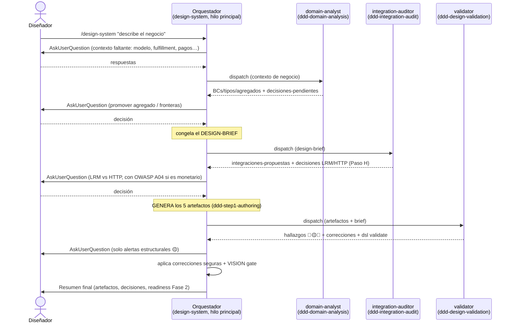
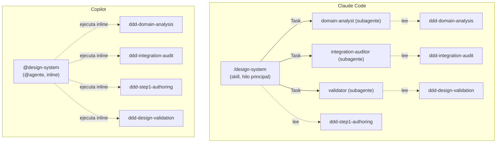

# Cómo funciona el Paso 1 (Diseño Estratégico) — proceso multi-agente

> Guía detallada del flujo del agente `design-system`: **cuándo y cómo interactúan** el
> orquestador, los workers (subagentes) y los skills de proceso. Para la filosofía del
> framework ver [VISION.md](VISION.md); para el inventario de agentes y skills ver
> [AGENTS.md](AGENTS.md). Este documento describe la **mecánica de orquestación**, no la repite.

---

## 1. Qué es el Paso 1 y dónde encaja

El framework tiene tres fases (ver [VISION.md](VISION.md)):

```
Fase 1: Diseño          →   Fase 2: Generación        →   Fase 3: Implementación
Humano + IA                 Generador determinístico       IA en contexto acotado
Artefactos YAML             Scaffolding + // TODO          Lógica de negocio
```

El **Paso 1 (Diseño Estratégico)** es la primera mitad de la Fase 1. Su agente es
`design-system`, y produce cinco artefactos **agnósticos de tecnología**:

```
arch/system/system.yaml          ← fuente de verdad estructurada (BCs, integraciones, infra)
arch/system/system-spec.md       ← narrativa por Bounded Context
arch/system/system-diagram.mmd   ← diagrama C4 Contenedores
AGENTS.md  +  CLAUDE.md           ← contexto del sistema (en la raíz del proyecto usuario)
```

**Aquí no se genera código.** Las decisiones de dominio (qué BCs existen, qué es un agregado,
qué integraciones hay, qué sagas, HTTP vs Local Read Model) se toman con el humano en el bucle.

---

## 2. Los actores

El Paso 1 ya no es un único agente monolítico: es un **orquestador** que coordina **workers**
especializados de solo lectura, cada uno respaldado por un **skill** enfocado.

| Pieza | Tipo | Rol | Corre en |
|---|---|---|---|
| `design-system` | **Orquestador** (skill de entrada) | Único que habla con el diseñador (`AskUserQuestion`), toma decisiones y **escribe** artefactos. Coordina a los workers y congela el *design-brief*. | Hilo principal |
| `domain-analyst` | **Worker** (subagente read-only) | Event storming, clasificación de BCs, agregados, dependencias por ciclo de vida. | Subagente (Claude) / inline (Copilot) |
| `integration-auditor` | **Worker** (subagente read-only) | Identificación de sagas + Auditoría de Integraciones A–H; devuelve las decisiones LRM vs HTTP **sin tomarlas**. | Subagente / inline |
| `validator` | **Worker** (subagente read-only) | Refinamiento + `dsl validate` + VISION gate; devuelve hallazgos 🔴🟡🔵. | Subagente / inline |

Y los **cuatro skills de proceso** que contienen las reglas (sin lógica duplicada):

| Skill | Contenido | Lo ejecuta |
|---|---|---|
| `ddd-domain-analysis` | event storming, clasificación BC (Core/Supporting/Generic), agregados, ciclo de vida | `domain-analyst` |
| `ddd-integration-audit` | sagas por coreografía + Auditoría A–H (snapshot-at-write-time, decisión LRM/HTTP del Paso H con OWASP A04) | `integration-auditor` |
| `ddd-step1-authoring` | recolección de contexto (Fase 1) + **generación de los 5 artefactos** (Fase 3) + `references/` (schema y guía del `system.yaml`) | el **orquestador** directamente |
| `ddd-design-validation` | checklists de refinamiento (consistencia cross-artefactos, integraciones, sagas, naming, infra, VISION) | `validator` |

> Cada worker **lee su skill** para aplicar las reglas; no las copia. El orquestador lee
> `ddd-step1-authoring` porque la generación de artefactos es su responsabilidad directa.

---

## 3. Mapa worker ↔ skill ↔ salida

| Worker | Skill | Qué devuelve al orquestador |
|---|---|---|
| `domain-analyst` | `ddd-domain-analysis` | `bounded-contexts` (tipo + agregados), `eventos-de-negocio`, `decisiones-pendientes` (promover agregado / fusionar-dividir BC) |
| `integration-auditor` | `ddd-integration-audit` | `integraciones-propuestas`, `decisiones-pendientes` (LRM vs HTTP, Paso H), `huérfanos-y-gaps` |
| `validator` | `ddd-design-validation` (+ `dsl validate`) | `hallazgos` 🔴🟡🔵, `correcciones-propuestas`, `decisiones-pendientes` (alertas estructurales) |

Ningún worker escribe artefactos ni llama a `AskUserQuestion`: **siempre devuelven**; el
orquestador decide y aplica.

---

## 4. El invariante: por qué esta topología

La restricción que define todo el diseño:

> **`AskUserQuestion` (la pausa interactiva) solo funciona en el hilo principal. Los
> subagentes no pueden pausar para preguntar al diseñador.**

Como el Paso 1 está **saturado de decisiones humanas** (fronteras de BC, LRM vs HTTP, sagas,
alertas estructurales) y `VISION.md` eleva el control humano a principio no negociable:

- El **orquestador** corre en el hilo principal → es el **único** que pregunta, decide y escribe.
- Los **workers** son **read-only**: analizan en su propio contexto (más pequeño y enfocado) y
  **devuelven** las decisiones como `decisiones-pendientes`. El orquestador las resuelve con el
  diseñador antes de actuar.

Esto da lo mejor de ambos mundos: contexto reducido y especializado por worker, sin perder el
control humano sobre las decisiones de dominio.

---

## 5. Flujo end-to-end (cuándo interactúa cada uno)



Secuencia en palabras:

1. **Invocación + recolección de contexto** — el diseñador invoca `design-system`. El orquestador
   resuelve las ambigüedades bloqueantes con `AskUserQuestion` (modelo de negocio, segmento,
   fulfillment, medios de pago, funcionalidades core). *(Skill: `ddd-step1-authoring`, Fase 1.)*
2. **Análisis de dominio** — dispatch a `domain-analyst` (`ddd-domain-analysis`). Devuelve BCs,
   tipos y agregados candidatos + decisiones de frontera. El orquestador resuelve esas decisiones
   y **congela el *design-brief*** (resumen de doble voz + BCs/agregados acordados).
3. **Auditoría de integraciones** — dispatch a `integration-auditor` (`ddd-integration-audit`) con
   el brief. Devuelve `integrations[]` propuestas y, por cada integración de solo lectura, la
   **decisión LRM vs HTTP (Paso H)**. El orquestador la presenta con `AskUserQuestion` (con la
   advertencia OWASP A04 si el dato es monetario) y completa `integrations[]`.
4. **Generación de artefactos** — el orquestador escribe los 5 artefactos siguiendo
   `ddd-step1-authoring` (Fase 3) y sus `references/` (`system-yaml-schema.md`, `system-yaml-guide.md`).
5. **Validación** — dispatch a `validator` (`ddd-design-validation`) + `dsl validate` + **VISION
   gate**. El orquestador aplica las correcciones seguras (🔴 inequívocas, 🔵) y consulta las
   alertas estructurales (🟡) con el diseñador.
6. **Resumen final** — artefactos generados, decisiones tomadas, *readiness* para la Fase 2.

---

## 6. Diferencias por runtime

El mismo proceso se materializa distinto según el runtime, porque sus capacidades son opuestas.



| | Claude Code | Copilot |
|---|---|---|
| Orquestador | **skill** `/design-system` en `.claude/skills/` | **@agente** `@design-system` en `.github/agents/` |
| Workers | **subagentes** `Task` en `.claude/agents/`; los read-only independientes pueden ir en **paralelo** | **no se materializan** — el `@agente` ejecuta los 4 skills **inline** |
| HITL (`AskUserQuestion`) | en el orquestador (hilo principal) | tool interactiva nativa del `@agente` |
| Ganancia del multi-agente | contexto reducido por worker + paralelismo | modularidad (mismo proceso, sin paralelismo) |

En ambos casos el invariante se respeta: el orquestador es el único que decide y escribe.

---

## 7. Cómo se instala (`dsl init`)

`dsl init` materializa cada fuente en su destino por runtime (router en
`src/commands/init.js`):

| Fuente (`src/`) | Es… | Claude Code | Copilot |
|---|---|---|---|
| `skills/design-system/SKILL.md` | orquestador | `.claude/skills/design-system/SKILL.md` (skill) | `.github/agents/design-system.agent.md` (@agente) |
| `skills/ddd-*` (proceso) | skill DDD | `.claude/skills/ddd-*` | `.agents/skills/ddd-*` |
| `agents/{domain-analyst,integration-auditor,validator}.md` | subagente | `.claude/agents/*.md` | — (sin spawn) |

Los skills de orquestador conservan en su fuente un frontmatter superset (`tools`,
`argument-hint`) que solo se usa para derivar el `@agente` de Copilot; el transform de Claude
los elimina. Las `references/` viajan con `ddd-step1-authoring` (las usa la generación).

---

## 8. Manejo de decisiones (HITL) y el *design-brief*

**Qué pausa al diseñador** (vía `AskUserQuestion`, siempre en el orquestador):

- Ambigüedades de contexto que cambiarían la estructura de BCs (Fase 1).
- Promover una entidad a agregado propio / fusionar o dividir un BC.
- **Local Read Model vs HTTP síncrono** (Paso H): el agente nunca lo decide solo; para datos
  monetarios se presenta la advertencia **OWASP A04** explícita.
- Sagas y su cadena de compensación.
- Alertas estructurales 🟡 detectadas por `validator`.

**Qué NO pausa** (el orquestador actúa y deja nota): correcciones de naming/convenciones,
consistencia interna, defaults de infraestructura documentados.

**El *design-brief*** es el contrato de handoff: un resumen compartido (doble voz + BCs/tipos/
agregados acordados + decisiones ya resueltas) que el orquestador pasa a cada worker para que
**no arranquen en frío** y razonen con coherencia transversal. Cada worker devuelve bloques
estructurados; el orquestador integra, decide y escribe.

---

## 9. Ventajas frente al agente monolítico anterior

Antes, un único agente cargaba todo el proceso (~2300 líneas de skills) en una sola sesión y lo
ejecutaba de forma secuencial. El mecanismo orquestador + workers + skills segmentados aporta:

| # | Ventaja | Por qué |
|---|---------|---------|
| 1 | **Contexto más pequeño y enfocado por worker** | Cada subagente lee solo su skill (`domain-analyst` ~120 líneas, `integration-auditor` ~440, `validator` ~870) en vez de las ~2300 completas → mejor adherencia a su checklist, menos errores y menor coste de tokens por análisis. |
| 2 | **Paralelismo (Claude Code)** | Los workers read-only independientes (auditoría + validación) corren como subagentes `Task` en paralelo → menor latencia. El monolito era estrictamente secuencial. |
| 3 | **Control humano preservado** | El orquestador sigue siendo el único que pausa con `AskUserQuestion`, decide y escribe. Cumple el principio no negociable de `VISION.md` **sin** sacrificar la descomposición. |
| 4 | **Separación de responsabilidades → mantenibilidad** | Correspondencia skill ↔ worker 1:1 con nombres semánticos. Cada unidad se entiende, prueba e itera aislada; `integration-auditor` / `validator` son reutilizables. |
| 5 | **Entry point como skill (recomendado)** | `design-system` es skill auto-invocable por su `description`, alineado con la guía actual de Claude Code. |
| 6 | **Paridad de runtime con una sola fuente** | Lo mismo en `src/` materializa Claude (skill + subagentes) y Copilot (`@agente` inline); `dsl init` enruta sin duplicar contenido. |
| 7 | **Extensibilidad aditiva** | Añadir un worker/skill es agregar un archivo en `src/agents` o `src/skills`, sin tocar el resto — el monolito obligaba a editar un archivo gigante para cualquier cambio. |

**Trade-offs honestos:**

- Más piezas y un **contrato de handoff** (el *design-brief*) que mantener.
- **Arranque en frío** de los subagentes (re-leen su contexto) — mitigado pasándoles el brief.
- En **Copilot no hay paralelismo** (sin spawn): allí la ganancia es solo modularidad, no velocidad.

En una frase: **ganas foco, velocidad (en Claude), mantenibilidad y extensibilidad, sin perder el
control humano** que es el corazón del framework — a cambio de algo más de estructura y un contrato
de coordinación explícito.

---

## 10. Continuación: el Paso 2 (Diseño Táctico)

Cuando el Paso 1 está validado, el diseño táctico de cada BC lo realiza el agente
`design-bounded-context`, que lee `ddd-tactical-design` + `ddd-tactical-validation` + el
`system.yaml`. **El Paso 2 sigue el mismo modelo orquestador + workers read-only** que el Paso 1:
el orquestador delega el análisis táctico previo al worker `tactical-analyst` y la validación al
worker `tactical-validator` (en Claude Code), pero retiene toda la interacción con el diseñador y
la escritura de los artefactos del BC (`{bc}.yaml`, contratos OpenAPI/AsyncAPI, flujos, diagramas).
A diferencia del Paso 1, el flujo es secuencial (`tactical-analyst` → el orquestador escribe →
`tactical-validator`). En Copilot el orquestador ejecuta análisis y validación inline.

Sus artefactos alimentan la **Fase 2** (generación determinística de scaffolding) y la **Fase 3**
(la IA completa la lógica de negocio en los `// TODO`). Ver [VISION.md](VISION.md) y
[AGENTS.md](AGENTS.md).
