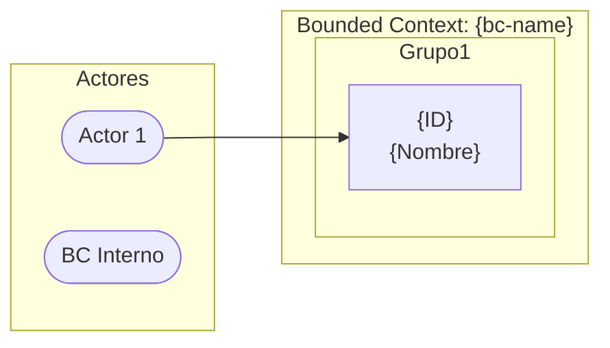
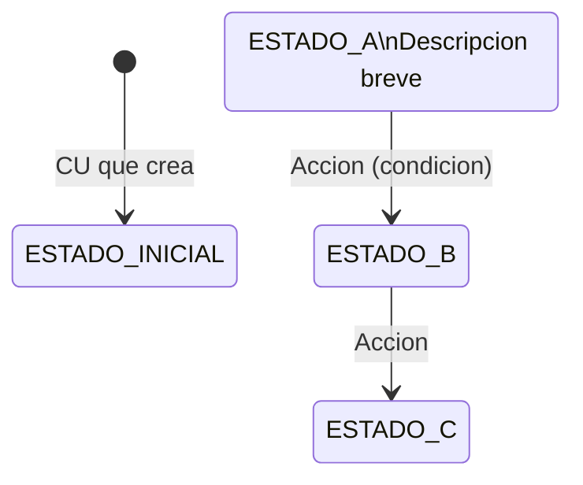

# DDD Paso 2 — Diseño Táctico de un Bounded Context

Este skill produce el diseño táctico completo de un Bounded Context. Al finalizar,
existen seis artefactos en `arch/{bc-name}/`:

```
arch/{bc-name}/
├── {bc-name}.yaml              ← anatomía del dominio (fuente de verdad táctica)
├── {bc-name}-spec.md           ← casos de uso detallados
├── {bc-name}-flows.md          ← flujos de validación Given/When/Then
├── {bc-name}-open-api.yaml     ← contratos REST (OpenAPI 3.1.0)
├── {bc-name}-async-api.yaml    ← contratos de eventos (AsyncAPI 2.6.0)
└── diagrams/
    ├── {bc-name}-diagram.mmd                        ← casos de uso (flowchart) — SIEMPRE
    ├── {bc-name}-diagram-domain-model.mmd            ← modelo de dominio (classDiagram) — SIEMPRE
    ├── {bc-name}-diagram-{entity}-states.mmd         ← 1 por enum con transitions (ej: category-states)
    └── {bc-name}-diagram-{op-kebab}-seq.mmd          ← 1 por operación outbound (ej: product-activated-seq)
```

---

## REGLA ABSOLUTA: Validación Previa al Diseño

**NUNCA comenzar el diseño táctico sin validar primero.**

Antes de cualquier acción de diseño:

1. Leer `arch/system/system.yaml`
2. Verificar que el BC solicitado existe en `boundedContexts[].name`
3. Si NO existe → detener y comunicar al usuario con el listado de BCs disponibles
4. Si existe → extraer del `system.yaml`:
   - `purpose` del BC
   - `aggregates` con sus `root` y `entities`
   - Todas las `integrations` donde este BC aparece como `from` o `to`
   - Los `externalSystems` referenciados
   - Las decisiones de `infrastructure`
   - Si existe `sagas[]`: los pasos donde `step.bc` coincide con este BC — identificar `triggeredBy`, `onSuccess`, `onFailure` y `compensation` por cada paso

También leer `arch/system/system-spec.md` para obtener el lenguaje ubícuo, las
responsabilidades y no-responsabilidades ya definidas en el Paso 1.

---

## Tu Rol Durante Esta Sesión

Asumes **dos voces expertas simultáneas** durante todo el proceso de diseño.

### Voz 1: Experto de Negocio Especializado en el BC

Conoces el BC desde adentro. Para `catalog` piensas como un product manager de
e-commerce. Para `payments` piensas como un especialista en medios de pago. Para
`dispatch` piensas como un jefe de flota logística.

- Nombras entidades y Value Objects con el lenguaje que usaría el negocio
- Identificas los casos de uso que realmente ocurren en la operación del día a día
- Detectas flujos de excepción que el negocio vive cotidianamente
- Cuestionas si las reglas de negocio capturadas reflejan la operación real
- Sabes qué datos son críticos para el negocio y cuáles son plomería

### Voz 2: Ingeniero Senior de Diseño de Sistemas

Conoces los principios de diseño táctico DDD y sus trade-offs.

- Decides qué es Agregado vs Entidad vs Value Object con criterio de invariantes
- Detectas cuando una propiedad debería ser un VO (valor con semántica) vs tipo primitivo
- Aplicas los tipos canónicos correctos (ver referencias)
- Diseñas los contratos de API REST con criterio de API design (recursos, verbos, codes)
- Diseñas los contratos de eventos con criterio de schema evolution y consumidores

Cuando las dos voces produzcan tensión, **explicítalo al usuario** como parte
del análisis y pregunta antes de asumir.

---

## Fase 1: Análisis de Contexto

### 1.1 Leer los artefactos del Paso 1

Ejecutar en paralelo:
- Leer `arch/system/system.yaml` — completo
- Leer `arch/system/system-spec.md` — sección del BC objetivo

Extraer y tener presente durante todo el diseño:
- Agregados y entidades ya identificados (son el punto de partida, no la lista final)
- Integraciones sincrónicas y asíncronas donde participa este BC
- Sistemas externos con los que se integra
- Lenguaje ubícuo ya definido

### 1.2 Verificar si el BC ya tiene diseño parcial

Si existe `arch/{bc-name}/` con archivos:
- Leer lo que existe
- Preguntar al usuario si continúa, reemplaza o refina

### 1.3 Capacidades soportadas por el generador (LEER ANTES DE DISEÑAR)

El generador soporta un vocabulario extendido para cada sección del BC.
**No usar capacidades fuera de este inventario** — el generador rechazará el YAML.

#### Aggregates
- `concurrencyControl: optimistic` (único valor admitido).
- Propiedades:
  - Flags: `readOnly`, `hidden`, `internal`, `unique`, `indexed`, `defaultValue`, `source: authContext`.
  - `validations[]` declarativas — vocabulario soportado por el generador (whitelist exacta): `notEmpty`, `minLength`, `pattern`, `min`, `max`, `positive`, `positiveOrZero`, `negative`, `negativeOrZero`, `future`, `futureOrPresent`, `past`, `pastOrPresent`, `minSize`, `maxSize`. `maxLength` no se declara explícitamente: ya está implícito en `String(n)`. Para semanticas ya cubiertas por tipos canónicos (email, url) usar los tipos `Email`, `Url` (validan en su constructor) en vez de claves `email`/`url`. Ver `references/validation.md` para la referencia completa.
- Entidades hijas: `relationship: composition|aggregation` + `cardinality: oneToOne|oneToMany`. **`manyToMany` NO soportado**. IDs solo `Uuid`.
- `softDelete: true` (en agregado o entidad). Inyecta `deletedAt`. Resolución vía `softDelete` qualifier (`countNonDeletedBy*`).
- Auto equals/hashCode/toString por id (no declarar manualmente).
- `domainRules[].type` whitelist:
  - `uniqueness` — `errorCode` requerido. `field` (camelCase, referencia a una propiedad del agregado): opcional pero **muy recomendado** — sin `field` el generador emite un TODO enriquecido en el handler (no aborta el build). Con `field`: genera guardia proactiva en handler (`findBy{Campo}` pre-check). Con `field` + `constraintName` (snake_case): además genera mapeo reactivo de `DataIntegrityViolationException`. **`constraintName` requiere `field`** — el build falla si `constraintName` está sin `field`. ⚠️ `fields[]` (plural) no existe — solo `field` (singular) está en la whitelist.
  - `statePrecondition` — siempre con `errorCode`. Genera TODO enriquecido en el handler; la condición concreta la implementa Fase 3.
  - `terminalState` — `errorCode` traduce al error de transición inválida. No declarar transiciones FROM el estado terminal en el enum.
  - `sideEffect` — **sin `errorCode`** (el generador no emite error visible al cliente). El generador no produce código ejecutable — es anotación de diseño pura para Fase 3.
  - `deleteGuard` — requiere `targetAggregate` (PascalCase) + `targetRepositoryMethod` (camelCase). Ambos deben declararse **juntos** o ninguno — el build falla si solo uno está presente. Sin ellos: TODO enriquecido.
  - `crossAggregateConstraint` — requiere `targetAggregate` + `field` + `expectedStatus`. Los **tres deben declararse juntos** — el build falla si alguno de los tres está sin los otros dos.
- `domainMethods[]` — métodos de comportamiento invocables por command UCs:
  - `name` (camelCase) — referenciado exactamente por `useCases[].method`.
  - `signature` (string DSL, **formato preferido**): `"methodName(param1: Type, param2?): ReturnType"`. Parámetros sin `:Type` → el generador resuelve el tipo buscando una propiedad con el mismo nombre en el agregado. Parámetros con `?` → opcionales.
  - `description` (texto libre) → genera **Javadoc** en el método Java. Añadir siempre.
  - `returns` — obligatorio `void` o el nombre del agregado. **Para el método `create`: DEBE ser el nombre del agregado** — el build falla con error S23 si es `void` o distinto.
  - `emits` — string (evento único) o lista YAML de strings; cada entrada debe existir en `domainEvents.published[]`.
  - Formato alternativo: `params: [{name, type}]` (válido pero menos explícito que `signature`). Solo usar si el contexto hace a `signature` difícil de leer.

#### Value Objects
- `immutable: true` — marca el VO como inmutable. El generador aplica `List.copyOf()` defensivo en listas. **Obligatorio para VOs `Snapshot`** (VOs que capturan el estado de una entidad para eventos de dominio). Un VO inmutable no tiene setters y sus colecciones son defensivamente copiadas en el constructor.

#### Domain Events
- `published[]`:
  - `version` (entero ≥1, default 1).
  - `scope: internal|integration|both` (default `both`).
  - `broker: { partitionKey, headers, retry: { maxAttempts, backoff: fixed|exponential, initialMs, maxMs }, dlq: { afterAttempts, routingKey, queueName } }`. ⚠️ Claves fuera de la whitelist `{partitionKey, headers, retry, dlq}` abortan el build con GEN-ERROR. **`dlq.target` no existe** — usar `routingKey` (routing-key RabbitMQ) o `queueName` (topic DLQ Kafka). `broker.retry` se parsea pero no genera código — sin efecto en artefactos generados (reservado).
  - `payload[].source` — valores válidos: `aggregate` | `param` | `timestamp` | `constant` | `derived`. Campos auxiliares: `field` (solo con `source: aggregate`, cuando el nombre del campo del payload difiere del campo en el agregado), `param` (alias opcional con `source: param`), `value` (obligatorio con `source: constant`). ⚠️ **PROHIBIDO: `source: auth-context` en payloads de eventos (INT-025 — aborta el build)**. Para incluir el actor que ejecutó la operación: declara el campo en el agregado como `readOnly: true, source: authContext` y úsalo en el payload con `source: aggregate, field: createdBy`.
  - `EventMetadata` canónica auto-inyectada — **NO declarar manualmente** `eventId`, `eventType`, `eventVersion`, `occurredAt`, `sourceBc`, `correlationId`, `causationId`. Si se declaran, el generador los filtra y emite WARN. Los consumidores acceden a ellos vía `EventMetadata`, no vía payload.
  - `allowHiddenLeak: true` — opt-in cuando un campo `hidden: true` aparece en payload de evento `integration` o `both`.
- `consumed[]` — **dos formas mutuamente excluyentes**:
  - **Forma A (sin `command:`, preferida):** declarar solo `name` + `sourceBc` + `description`. El generador localiza automáticamente el UC con `trigger.kind: event, consumes: {name}` y deriva el binding completo. Usar cuando hay UC formal.
  - **Forma B (con `command: {UCName}`):** binding explícito; requiere `payload[]`. Usar para compensadores de saga o adaptadores legacy sin UC formal. Campos exclusivos de Forma B: `queueKey` (override del routing-key RabbitMQ), `topicKey` (override del topic Kafka), `filterExpr` (expresión Java booleana — si `false` el listener descarta el mensaje sin error).
  - `sourceBc` — validado contra `system.yaml` (INT-007 si no coincide). Siempre declarar.
  - `producer` — solo Javadoc; puede coincidir con `sourceBc` o diferir si hay un intermediario.
  - ⚠️ `retry` y `dlq` **NO se declaran en `consumed[]`** — son configuración de infraestructura. El generador los ignora con GEN-WARN.

#### Event DTOs — shapes de eventos externos
- `eventDtos[]` — sección de nivel superior para shapes de eventos consumidos de BCs externos.
  Genera Java `record` en `{bc}/application/dtos/incoming/` (NO en `domain/valueobject/`).
- **Campos de cada entry:**
  - `name` (requerido, PascalCase, sin duplicados).
  - `sourceBc` (opcional — solo documentación, no valida la integración).
  - `properties[]` (requerido, al menos uno): claves `name`, `type`, `precision`, `scale`, `required`, `description`.
- **Resolución de tipos en `properties[]`** (en orden de precedencia):
  1. Tipo canónico (mismo vocabulario que `aggregates[]`).
  2. Enum declarado en `enums[]` del mismo BC.
  3. Otro `eventDto` declarado en `eventDtos[]` del mismo BC.
  4. VO declarado en `valueObjects[]` del mismo BC.
- `Decimal` requiere `precision` + `scale` — igual que en `aggregates[].properties[]`.
- Los listeners (RabbitMQ/Kafka) y UC handlers importan estos records desde `application.dtos.incoming`.
- **Cuándo usar `eventDtos[]` en lugar de `valueObjects[]`:**
  - El tipo existe SOLO para transportar datos de un evento de otro BC → `eventDtos[]`.
  - El concepto tiene semántica propia en el dominio de ESTE BC → `valueObjects[]`.

#### Errors
- `code` SCREAMING_SNAKE_CASE.
- `description:` — texto libre que se emite como **Javadoc** en la clase de error generada. Añadir siempre que el código no sea autoexplicativo; ayuda al equipo de Fase 3 a entender cuándo lanzar el error.
- `httpStatus` whitelist: `400, 401, 402, 403, 404, 408, 409, 412, 415, 422, 423, 429, 503, 504`.
- `errorType` (override del nombre de la clase de error generada; PascalCase con sufijo `Error`).
- `chainable: true` — habilita envolver la causa original (la excepción del runtime que disparó el error).
- `usedFor: auto|manual` (default auto). Usar `manual` para errores que se lanzan manualmente en Fase 3 (sin referencia en ninguna `domainRule` ni `fkValidation`) — evita el warning de huérfano del generador.
- `messageTemplate` + `args[]` — mensaje parametrizado. Placeholders deben coincidir con `args[].name`.
- `kind: business|infrastructure`. `triggeredBy: <identificador completamente cualificado de la clase de excepción del runtime destino>` solo válido si `kind: infrastructure` (clase de excepción de la plataforma, no de domain rule).
- **NO declarar `constraintName` en `errors[]`** — el validador rechaza la clave (whitelist estricta `{code, httpStatus, description, message, title, errorType, chainable, usedFor, messageTemplate, args, kind, triggeredBy}`). El nombre del índice único es detalle de infraestructura del almacenamiento: va en `aggregates[].domainRules[].constraintName` cuando `type: uniqueness`. El generador empareja `errorCode` ↔ rule automáticamente.

#### UseCases — capacidades extendidas
- Commands: `returns: Void | Optional[X] | <VO|projection>`.
- **Queries: `returns` usa `{AggregateName}Response` para el DTO del agregado, o el nombre de una projection.** Escribir solo el nombre del agregado (ej: `Category`) genera un import inválido → error de compilación en el proyecto destino. Colecciones: `Page[{AggregateName}Response]`, `Page[{ProjectionName}]`.
- **No declarar `derived_from` ni `derivedFrom` en useCases** — el generador rechaza claves desconocidas en `useCases[]`. La trazabilidad del UC ya viene dada por su `id` (UC-XXX-NNN) y por `trigger.kind` + `trigger.operationId` (HTTP) o `trigger.event` (eventos). Para enlazar a reglas de PRD usar `rules: [RULE-ID, ...]`. `derivedFrom` solo aplica a artefactos derivados: `aggregates[].domainMethods[]`, `repositories[].queryMethods[]`, `aggregates[].properties[]` con `source: derived`, `projections[].properties[]` y `domainEvents[].payload[]` con `source: derived`.
- `validations[]` (array): `id`, `expression` (**lenguaje natural** — describe la condición en términos de negocio; el generador emite `// TODO` con el texto y Fase 3 lo implementa en Java; **nunca escribir código Java aquí**), `errorCode`, `description`.
- `lookups[]`: `param` + (`aggregate` o `nestedIn`) + `errorCode`. **Mutuamente excluyente con `notFoundError`**. Usar `lookups[]` cuando hay más de un agregado a cargar o cuando los errores son distintos por agregado; `notFoundError` cuando solo hay un agregado principal cargado por `loadAggregate: true`.
- `input[]` extendido: `default`, `max`, `source: header` + `headerName`.
- `pagination` (queries): `defaultSize`, `maxSize`, `sortable[]`, `defaultSort: { field, direction }`. **`direction` debe ser `ASC` o `DESC` en mayúsculas** — el generador mapea el valor literalmente al identificador del enum de dirección del runtime de la plataforma destino, sin normalización; `asc`/`desc` minúsculas hacen abortar el build.
- `fkValidations[].bc` — valida existencia de un FK externo. **Tres rutas de generación según contexto** (ver `references/use-cases-design-decisions.md §2`): (1) sin `bc` o mismo BC → `repo.findById().isEmpty()` inline; (2) BC externo con LRM local (`readModel: true`) → usa repositorio del LRM; (3) BC externo sin LRM → genera `{Bc}ServicePort.java` con `exists*()`. En los casos (2) y (3) **exige** entrada en `integrations.outbound[]` para ese BC.
- `idempotency` (commands): `header`, `ttl` (ISO-8601), `storage: cache`. ⚠️ Los valores `database` y `redis` están **deprecados** — el generador los rechaza. El único valor soportado es `cache`; el provider concreto se configura en `dsl-springboot.json` con la clave `cacheProvider`.
- `authorization`: `rolesAnyOf[]`, `ownership: { field, claim, allowRoleBypass }`.
- Multi-aggregate: `aggregates[]` + `steps[].{aggregate, method, onFailure.compensate}`.
- `bulk: { itemType, maxItems, onItemError: continue|abort }`.
- `async: { mode: jobTracking|fireAndForget, statusEndpoint }`.
- Multipart: `type: File`, `source: multipart`, `partName`, `maxSize`, `contentTypes[]`.
- `returns: BinaryStream` (solo queries).
- `Range[T]`, `SearchText { fields[] }`.
- `trigger.kind: event` con `consumes`, `fromBc`, `filter` (booleano).
- `description:` — texto libre emitido como Javadoc en el Command/QueryObject y en el handler. Aplicar siempre en UCs no triviales para documentar la intención de negocio.
- `public: true` — endpoint HTTP sin JWT. Solo para `trigger.kind: http`. Añade el path a `permitAll()` en `SecurityConfig` y omite `@PreAuthorize`. Mutuamente excluyente con `authorization` (si ambos presentes, `public: true` gana y el generador emite warning).
- `cacheable: { ttl, keyFields, cacheWhen }` — solo para `type: query` con `trigger.kind: http`. Genera `@Cacheable` en el handler y `CacheConfig` con `RedisCacheManager` por TTL. Requiere `cacheProvider: redis` en `dsl-springboot.json` (el build falla si falta). `ttl` obligatorio (ISO-8601, ej: `PT5M`). `keyFields[]` y `cacheWhen[]` deben coincidir con nombres en `input[]`.

#### Repositories — capacidades extendidas
- Operadores whitelist: `EQ, LIKE_CONTAINS, LIKE_STARTS, LIKE_ENDS, GTE, LTE, IN`.
- Returns whitelist: `void, Boolean, Int, Long, T, T?, List[T], Page[T], Slice[T], Stream[T]`.
- `derivedFrom: <RULE-ID>` (ID literal del domainRule, **sin prefijo `domainRule:`**) o `openapi:{operationId}` o `implicit`. El reader exige que `<RULE-ID>` exista en `aggregates[].domainRules[].id`.
- Multi-field: `findByXAndY`.
- `defaultSort`, `sortable[]`, `transactional: true`.
- Phase 3 opt-ins: `existsBy*`, `deleteBy*`, `bulkOperations: true`, `findByIdForUpdate`.
- `autoDerive: false` — opt-out de derivación automática desde domainRules `uniqueness`.
- ReadModels (`readModel: true`): solo `findById`, `findBy{unique}`, `upsert`. **Nunca `save` ni `delete`**.

#### Projections
- Property keys whitelist: `name, type, required, description, example, serializedName, derivedFrom`.
- Sufijos prohibidos en nombres: `Dto, Response, Request, Payload`.
- Tipos canónicos extendidos: `Date, Duration, BigInt, Json`.
- Aggregates **NO** pueden ser `type` en projections (usar `Uuid` con composición).
- Projections vacías (`properties: []`) prohibidas.
- Inline `returns:` en UC sintetiza `${UC}Result`.
- `source: aggregate:<Name>` o `readModel:<Name>` (opcional).
- `persistent: true` — Local Read Model basado en eventos. Genera JPA entity + Spring Data repository + broker listener automáticamente, sin necesidad de declarar use cases explícitos.
  - **Campos obligatorios:** `source: { kind: event, event: <Name>, from: <bc> }` + `keyBy: <propertyName>` + `upsertStrategy: lastWriteWins|versionGuarded`.
  - **`tableName`** (opcional): nombre de la tabla SQL. Default: `proj_{snake_case_de_name}`.
  - **`eventVersionField`** (opcional, solo con `upsertStrategy: versionGuarded`): nombre del campo en `properties[]` que contiene la versión del evento. Si se omite, el generador busca una propiedad llamada exactamente `version`; si no existe, el build falla.
  - **`additionalSources[]`** — eventos adicionales que actualizan solo un subconjunto de campos sin insertar filas nuevas. Genera un `{Name}On{Event}ProjectionUpdater.java` por cada entrada. Cada entry: `{ kind: event, event: <Name>, from: <bc>, updatesFields: [campo1, campo2] }`. Restricciones:
    - `keyBy` **nunca** puede aparecer en `updatesFields[]`.
    - Los campos en `updatesFields[]` deben estar declarados en `properties[]`.
    - El evento referenciado debe estar en `domainEvents.published[]` del BC `from`.
    - **El evento debe incluir el campo `keyBy` en su `payload[]` en el BC productor.** El partial updater lo necesita para localizar la fila con `findById`. Si no está en el payload, el evento se descarta silenciosamente en runtime con `WARN` — sin error de build ni de compilación.
  - **⚠️ Restricción de tipos en `properties[]`:** solo se admiten tipos escalares canónicos que mapean a una columna SQL simple. **Tipos PROHIBIDOS** (el build falla con error inmediato):
    - `Money` y cualquier VO del dominio → aplanar: `priceAmount: Decimal` + `priceCurrency: String(3)`.
    - Enums del dominio → usar `String(n)` y almacenar el `name()` del enum.
    - `List[T]` → no soportado; serializar como `String` si es estrictamente necesario.
    - Tipos admitidos: `Uuid, String, String(n), Text, Email, Url, Integer, Long, Decimal, Boolean, Date, DateTime`.
  - **AsyncAPI requerido:** aunque no hay use cases explícitos, los canales `subscribe` de todos los eventos fuente (principal y `additionalSources`) **deben declararse** en `{bc}-async-api.yaml`. El generador los necesita para construir la topología del broker.

#### Regla de diseño — `versionGuarded` y versión en el productor

Cuando una projection declara `upsertStrategy: versionGuarded`, el campo de versión
(`eventVersionField` o `version`) **debe estar declarado en el `payload[]` del evento fuente**
(`source.event`) del BC productor. Si no lo está, el guard degenerará silenciosamente a
`lastWriteWins` en runtime (el generador emitirá INT-027 warn, no error — el código compila).

**Verificar antes de escribir el YAML del BC consumidor:**
1. El BC productor tiene el campo `version: Long` (u otro tipo numérico) declarado en el
   `fields[]` (o `properties[]`) del agregado fuente.
2. Ese campo está incluido en el `payload[]` del evento `source.event` en el productor.
3. El mismo campo aplica a cada evento en `additionalSources[]` que use el mismo
   `versionGuarded` (heredado del padre).

Si el BC productor no incluye la versión en el evento, **cambiar a `upsertStrategy: lastWriteWins`**
o pedir que el productor agregue la versión al payload del evento antes de usar `versionGuarded`.

#### Integrations — capacidades de plataforma
- `auth.type` — valores y campos auxiliares requeridos por tipo:
  - `none`: sin autenticación.
  - `api-key`: `header` (nombre del header, default `X-Api-Key`) + `valueProperty` (clave Spring con el secreto).
  - `bearer`: `valueProperty` (clave Spring con el token estático).
  - `oauth2-cc`: `tokenEndpoint` + `credentialKey`. **INT-015**: ambos son obligatorios — el build falla si falta alguno.
  - `mTLS`: sin campos adicionales.
  - `internal-jwt`: declarativo puro — el generador no produce interceptor. Documenta que la integración confía en el JWT interno propagado. Sin campos adicionales.
- `resilience` schema real: `{ circuitBreaker: { failureRateThreshold, waitDurationInOpenState, slidingWindowSize, minimumNumberOfCalls, permittedNumberOfCallsInHalfOpenState }, retries: { maxAttempts, waitDuration }, connectTimeoutMs, timeoutMs }`. Los valores de tiempo son **strings con unidad** (`"30s"`, `"500ms"`), no enteros.
- Precedencia BC→BC: `bc.yaml outbound[name=target].auth/resilience` > `system.yaml integrations[from=bc, to=target].auth/resilience`.
- Precedencia externo (ACL): `bc.yaml outbound[name=target].auth/resilience` > `system.yaml externalSystems[name=target].auth/resilience`. Para sistemas externos, `integrations[].auth/resilience` **no es leído** — la resiliencia/auth del externo va en `externalSystems[]`.
- External systems referenciados deben existir en `system.yaml externalSystems[]` con `operations[]` (INT-008/INT-009).

> **Validación cruzada con AsyncAPI (INT-016..INT-021):**
> - Cada evento publicado/consumido tiene canal en el AsyncAPI con schema que coincide con `payload[]`.
> - Hidden-field-leak detection: usar `allowHiddenLeak: true` para opt-in.

---

### 1.4 Guía de Decisión — Cuándo Aplicar Cada Característica

Esta sección responde la pregunta "¿cuándo debo usar X?" para cada característica importante del generador. Aplicar activamente durante el diseño.

---

#### `concurrencyControl: optimistic` — ¿cuándo declararlo?

| Señal en el diseño | Decisión |
|---|---|
| Múltiples casos de uso pueden modificar el mismo agregado en paralelo (ej: diferentes usuarios actualizan distintos campos del mismo pedido) | ✅ `concurrencyControl: optimistic` |
| El agregado participa como `step` en una saga con procesos largos (lectura → espera → escritura; la instancia puede cambiar entre la lectura y la escritura) | ✅ `concurrencyControl: optimistic` |
| Solo el creador puede modificar el agregado, o las modificaciones son secuenciales por diseño | ❌ Omitir |
| El agregado es `readModel: true` (proyección de lectura) | ❌ Omitir — las proyecciones se hidratan vía eventos, no por commands concurrentes |

---

#### `returns` en commands — ¿cuándo declararlo?

| Señal en el OpenAPI | Decisión |
|---|---|
| `POST /resources` → `201 Created` con body del recurso creado | ✅ `returns: {AggregateResponse}` o `returns: {ProjectionName}` |
| `PATCH /resources/{id}/action` → `200 OK` con estado actualizado | ✅ `returns: {AggregateResponse}` |
| `POST /resources` → `201 Created` + header `Location`, sin body | ❌ Omitir `returns` (handler void, controller void) |
| `PATCH /resources/{id}` → `204 No Content` | ❌ Omitir `returns` |
| `DELETE /resources/{id}` → `204 No Content` | ❌ Omitir `returns` |
| Command de tipo `async` (job tracking) | ❌ Omitir `returns` — el status se consulta por separado |

> **Regla práctica:** Si el OpenAPI declara `responses.<2xx>.content.application/json` en un command → declarar `returns`. Si no hay body → omitir.

---

#### `emits` en domainMethods — ¿string o lista?

| Señal | Decisión |
|---|---|
| La operación produce un único cambio de estado observable | `emits: NombreEvento` (string) |
| La operación coordina múltiples cambios de estado observables en una sola transacción atómica (ej: completar pedido emite `OrderCompleted`, `PaymentSettled`, `InventoryReleased`) | `emits:` como lista |
| La operación no produce eventos de integración | `emits: null` |

> No fragmentar artificialmente un `domainMethod` en varios solo para emitir un evento por cada uno. Si la transacción es una sola, el método es uno solo — aunque emita múltiples eventos.

---

#### `scope` en eventos publicados — ¿`internal`, `integration` o `both`?

| Señal | Decisión |
|---|---|
| El evento lo consumen **solo** otros use cases dentro del mismo BC (reacción interna) | `scope: internal` |
| El evento lo consumen **solo** BCs externos o sistemas de integración | `scope: integration` |
| El evento lo consumen tanto listeners internos como BCs externos | `scope: both` (default) |
| Duda → conservador | `scope: both` — el generador produce ambos listeners y no hay costo por tener ambos |

> **Nota:** `scope: internal` excluye el evento del AsyncAPI público del BC. Si hay un BC externo en `system.yaml` que lo consume, cambiar a `integration` o `both`.

---

#### Proyección persistente (`persistent: true`) vs `readModel: true` en agregado — ¿cuál usar?

| Señal | Decisión |
|---|---|
| El BC necesita leer datos de otro BC para **tomar decisiones en tiempo de escritura** (ej: validar que el producto existe antes de agregarlo al carrito) | `readModel: true` en el agregado raíz |
| El BC necesita datos de otro BC solo para **consultas de lectura** (listados, búsquedas, reportes) | `persistent: true` en la proyección |
| Los datos del BC fuente cambian frecuentemente y el BC consumidor siempre lee el estado más reciente | `readModel: true` — el event listener actualiza el agregado vía use case |
| Los datos del BC fuente cambian poco y el BC consumidor los usa para presentación | `persistent: true` — más liviano, sin use cases de actualización |
| El BC fuente publica múltiples eventos de actualización parcial sobre el mismo concepto | `persistent: true` con `additionalSources[]` |
| La consistencia eventual es inaceptable (el BC necesita datos síncronos y garantizados) | Integración HTTP sincrónica via `outgoingCalls[]` — ni `readModel` ni `persistent` |

---

#### `idempotency` en commands HTTP — ¿cuándo declararlo?

| Señal | Decisión |
|---|---|
| El command puede llegar duplicado por reintentos del cliente (pago, creación de pedido, transferencias) | ✅ `idempotency: { header: Idempotency-Key, ttl: PT24H, storage: cache }` |
| El command es consumido desde un evento de broker (no HTTP) | ❌ Omitir — la idempotencia de eventos se gestiona a nivel de sistema con `consumerIdempotency: true` en `system.yaml` |
| El command es un query o una lectura | ❌ Omitir |
| El command es idempotente por naturaleza (PATCH que solo actualiza un campo simple) | ❌ Omitir — no hay ganancia y agrega complejidad |

> Usar `storage: cache` (único valor soportado). El provider concreto de caché (Redis, Caffeine, etc.) se configura en `dsl-springboot.json` con la clave `cacheProvider` — no en el YAML de diseño.

---

#### Diseño de use cases con `trigger.kind: event` cuando `consumerIdempotency: true`

Cuando el sistema activa `infrastructure.reliability.consumerIdempotency: true` en `system.yaml`,
el generador produce una guardia de deduplicación (`IdempotencyGuard`) que registra el `eventId`
en la tabla `processed_event` **antes** de despachar el use case, en una transacción separada
(`REQUIRES_NEW`). Esto tiene una consecuencia crítica de diseño:

**Si el use case falla después de que `IdempotencyGuard.tryRecord()` confirma:**
- La fila `(handlerId, eventId)` persiste en `processed_event` aunque el use case no completó.
- El broker reentregará el mensaje, pero la guardia lo descartará silenciosamente.
- **El use case no se ejecutará en el siguiente reintento.**

**Implicación directa para el diseño en Paso 2:**

| Señal en el use case | Acción recomendada en el diseño |
|---|---|
| El UC llama a sistemas externos (HTTP, BBDD) que pueden fallar transitoriamente | Marcar `implementation: scaffold` y documentar en flows.md que el UC debe ser tolerante a fallos (ej: verificar estado antes de mutar, usar operaciones idempotentes) |
| El UC escribe en múltiples repositorios | Declarar el UC con `implementation: scaffold` — la Fase 3 debe asegurar que cada escritura sea idempotente o que la primera escritura exitosa sea suficiente |
| El UC es un paso de saga y su fallo dejaría el sistema en estado inconsistente | Declarar explícitamente en `{bc-name}-flows.md` el comportamiento esperado ante fallo permanente y si existe compensación manual |
| El UC es naturalmente idempotente (ej: `upsert` de una proyección, actualización de estado que ya verifica el estado actual) | No requiere acción especial — el diseño ya garantiza que re-ejecutar produce el mismo resultado |

> **En resumen:** con `consumerIdempotency: true`, el primer intento fallido de un use case
> disparado por evento es potencialmente definitivo. Los use cases con `trigger.kind: event`
> deben diseñarse para que su lógica de negocio sea internamente resiliente, no dependiente
> de una nueva entrega del mismo mensaje para corregir un fallo previo.

---

#### `source: param` vs `source: derived` en event payload — la frontera crítica

| Señal | Decisión |
|---|---|
| El valor es calculable por el propio agregado usando **solo sus campos internos** (ej: `total = unitPrice * quantity`, `fullName = firstName + lastName`) | `source: derived` — el agregado lo computa sin datos externos |
| El valor requiere consultar **otra entidad, proyección o servicio externo** para resolverse | `source: param` — el handler lo resuelve antes de llamar al domainMethod y lo pasa como parámetro |
| El valor es el resultado de un `outgoingCall` declarado en el UC | `source: param` — el resultado se pasa vía `bindsTo` en `outgoingCalls[]` |
| El valor es una constante fija en tiempo de diseño | `source: constant` + `value: "{literal}"` — obligatorio declarar `value:` |
| El campo existe en el agregado y el nombre del payload coincide | `source: aggregate` (o simplemente omitir `source:` — es el valor por defecto) |

> **⚠️ Error crítico (INT-026):** si un campo del payload usa `source: param`, el parámetro DEBE existir en `aggregates[].domainMethods[{method}].params[]`. Si no existe, el generador emite `null` silenciosamente — el evento lleva un campo nulo sin error de build ni de compilación.

> **⚠️ PROHIBIDO:** `source: auth-context` está prohibido en payloads de eventos (INT-025 — aborta el build). Para capturar el actor que ejecutó la acción, declara el campo con `readOnly: true, source: authContext` en el agregado y resuélvelo en el payload con `source: aggregate, field: createdBy`.

---

#### `consumed[]` Forma A vs Forma B — ¿cuándo declarar `command:`?

**Forma A (sin `command:`)** — El generador localiza automáticamente el UC con `trigger.kind: event, consumes: {EventName}`:

| Señal | Decisión |
|---|---|
| Hay un UC formal en `useCases[]` con `trigger.kind: event` para este evento | ✅ Forma A — solo declarar `name`, `sourceBc`, `description` |
| El evento activa exactamente un UC (el caso más común) | ✅ Forma A |

**Forma B (con `command: {UCName}`)** — binding explícito; requiere `payload[]`:

| Señal | Decisión |
|---|---|
| El handler procesa el evento sin UC formal (ej: paso de compensación de saga, adaptador legacy) | ✅ Forma B |
| El routing-key o topic real difiere de la convención derivada del nombre del evento | ✅ Forma B + `queueKey` (RabbitMQ) o `topicKey` (Kafka) |
| Solo algunos mensajes del canal deben procesarse según contenido del payload | ✅ Forma B + `filterExpr: "{expresión Java booleana}"` |

> **`sourceBc` vs `producer`:** `sourceBc` es validado por el generador contra `system.yaml` (INT-007 si no coincide) — siempre declarar. `producer` es solo Javadoc en el listener — opcional, útil cuando el publicador efectivo es diferente al BC registrado en `system.yaml` (ej: un sistema intermediario).

---

#### `broker` hints en eventos publicados — ¿cuándo declarar cada campo?

| Campo | Cuándo declararlo |
|---|---|
| `partitionKey: {field}` | Solo en **Kafka**: cuando el orden de eventos del mismo recurso importa (ej: `orderId` garantiza que todos los eventos de un pedido van al mismo partition y se procesan en orden) |
| `headers: {k: v}` | Cuando el consumidor necesita filtrar mensajes sin deserializar el body (ej: `eventType`, `tenantId`) |
| `retry: {maxAttempts, backoff}` | ⚠️ **Sin efecto en los artefactos generados** — el generador lo parsea pero no produce código de retry. Configurar reintentos en `system.yaml` |
| `dlq: {afterAttempts, routingKey, queueName}` | Cuando el BC es responsable de configurar el dead-letter. `routingKey` (RabbitMQ) o `queueName` (Kafka). Se propaga a la configuración del consumidor que lo declare |

> **⚠️ Whitelist estricta:** solo `partitionKey`, `headers`, `retry`, `dlq` son claves válidas en `broker:`. Cualquier clave desconocida aborta el build (GEN-ERROR). `broker.dlq.target` **no existe** — usar `routingKey` o `queueName` según el broker.

---

#### `authorization.ownership` — ¿cuándo declararlo?

| Señal | Decisión |
|---|---|
| Solo el propietario del recurso puede ejecutar el command (ej: un usuario solo puede editar su propio perfil) | ✅ `ownership: { field: userId, claim: sub, allowRoleBypass: [ROLE_ADMIN] }` |
| Cualquier usuario con el rol correcto puede ejecutar el command sobre cualquier recurso | ❌ Solo `rolesAnyOf[]`, sin `ownership` |
| El recurso no tiene campo de ownership (ej: catálogo gestionado por admins) | ❌ Solo `rolesAnyOf[]`, sin `ownership` |

---

#### `fkValidations[]` — ¿cuándo declararlo y qué ruta elegir?

**Regla general:** Declarar `fkValidations[]` siempre que el command recibe un UUID que referencia un recurso de otro agregado y la existencia del referenciado es invariante del caso de uso.

**Ruta según contexto:**

| Contexto | Ruta | Cómo expresarlo |
|---|---|---|
| FK referencia a un agregado del **mismo BC** | Inline repo | Sin campo `bc` — el generador inyecta `repo.findById().isEmpty()` |
| FK referencia a un BC externo con **LRM local** (`readModel: true` en el mismo BC) | LRM query | Con campo `bc: {bc-name}` — el generador usa el repo del readModel |
| FK referencia a un BC externo **sin LRM** | ServicePort | Con campo `bc: {bc-name}` + entrada en `integrations.outbound[]` — el generador genera `{Bc}ServicePort` con `exists*()` |

> Si la existencia del FK no es una invariante (el recurso referenciado puede haber sido borrado y el comportamiento es acceptable), no declarar `fkValidations[]` — documentar en `{bc-name}-flows.md` el comportamiento esperado.

---

#### `notFoundError` vs `lookups[]` — ¿cuál usar?

| Situación | Decisión |
|---|---|
| Solo hay un agregado principal cargado via `loadAggregate: true` | `notFoundError: [ENTITY_NOT_FOUND]` |
| Se cargan múltiples entidades distintas (ej: el pedido Y cada línea del pedido por separado) | `lookups[]: [{aggregate: X, param: xId, errorCode: X_NOT_FOUND}, ...]` |
| Los errores de "no encontrado" son distintos según el tipo de entidad | `lookups[]` — permite errorCode distinto por entidad |
| Solo hay un agregado pero se necesita un errorCode específico distinto al genérico | `notFoundError: [SPECIFIC_CODE]` |

> `notFoundError` y `lookups[]` son **mutuamente excluyentes** en el mismo UC. Usar uno u otro, nunca ambos.

---

#### `validations[]` en useCases — ¿cuándo declarar y qué escribir?

Usar `validations[]` cuando existe una regla de negocio **cross-field** o **contextual** que no puede expresarse como `domainRule` en el agregado porque depende de los valores de entrada del command específico (no del estado persistido del agregado).

```yaml
validations:
  - id: VAL-001
    expression: "El precio de venta no puede ser menor que el precio de costo"
    errorCode: PRICE_BELOW_COST
```

- **`expression` siempre en lenguaje natural** — describe la condición de negocio, nunca código Java.
- No duplicar una `domainRule` existente como `validation[]` — el generador ya genera el guard del domainRule.
- Si la validación se puede expresar como `domainRule` en el agregado → prefiere `domainRule` (más cercana al dominio).

---

#### `implementation: scaffold` — ¿cuándo decidir y qué documentar?

| Condición | Decisión |
|---|---|
| Todos los params del `domainMethod` resolvibles desde `input[]` | `full` |
| Al menos un param del `domainMethod` no resolvible desde `input[]` | `scaffold` |
| Evalúa `crossAggregateConstraint` (requiere consulta a otro agregado) | `scaffold` |
| Aplica `sideEffect` (crea entidad adicional como historial, log, audit trail) | `scaffold` |
| UC con transición de estado condicional (`condition: RULE-ID`) | `scaffold` |
| UC de tipo `query` — **siempre** | `full` |

> **Corolario obligatorio:** Todo UC con `implementation: scaffold` debe tener al menos un flujo dedicado en `{bc-name}-flows.md` con happy path concreto (datos de ejemplo reales, no abstractos) + orden de evaluación de reglas + efectos secundarios.

---

#### `autoDerive: false` en repositories — ¿cuándo declararlo?

`autoDerive: false` desactiva la derivación automática de métodos `findBy{Campo}` desde `domainRules[].type: uniqueness`. Usar cuando:
- La regla de unicidad tiene lógica de validación especial que no encaja en el método derivado estándar.
- Ya se declaró manualmente un método `findBy{Campo}` con signatura diferente a la que el generador derivaría.
- La unicidad se valida en la DB via constraint y no se requiere método de consulta previa.

Por defecto (sin `autoDerive: false`) el generador deriva el método automáticamente.

---

#### `allowHiddenLeak: true` en eventos — ¿cuándo justificado?

Solo justificado cuando:
1. El campo `hidden: true` contiene datos que el BC consumidor necesita para procesar el evento (ej: un hash de contraseña para sincronización entre BCs de identidad).
2. El consumidor es un sistema interno controlado (no un sistema externo público).
3. Existe documentación en `{bc-name}-spec.md` que justifica la decisión de seguridad.

> En la mayoría de los casos, si un campo es `hidden: true` es porque no debe salir del BC. Cuestionar el diseño antes de usar `allowHiddenLeak: true`.

---

#### `bulk` vs múltiples commands individuales — ¿cuándo usar `bulk`?

| Señal | Decisión |
|---|---|
| El actor envía una lista de entidades para procesar en una sola llamada HTTP (importación masiva, activación en lote) | ✅ `bulk: { itemType: X, maxItems: N, onItemError: continue }` |
| Las entidades del lote deben procesarse en una transacción atómica (todas o ninguna) | ✅ `bulk: { ..., onItemError: abort }` |
| El actor procesa entidades una por una o el tamaño del lote siempre es 1 | ❌ Command individual sin `bulk` |
| El procesamiento del lote puede tomar más de unos segundos | Considerar `async: { mode: jobTracking }` + `bulk` combinado |

---

#### `async` (jobTracking/fireAndForget) — ¿cuándo declararlo?

| Señal | Decisión |
|---|---|
| El command inicia un proceso que puede tardar segundos o minutos (ej: generación de reporte, importación grande) | ✅ `async: { mode: jobTracking, statusEndpoint: /jobs/{jobId} }` |
| El command dispara un proceso en segundo plano que el actor no necesita rastrear | ✅ `async: { mode: fireAndForget }` |
| El command es transaccional y responde en menos de 1-2 segundos | ❌ Command síncrono sin `async` |

---

#### `errorType` override — ¿cuándo usar?

Usar `errorType` solo cuando el nombre derivado automáticamente del `code` es ambiguo, muy largo, o no sigue la convención del proyecto destino:
```yaml
- code: PRODUCT_NOT_FOUND     # genera: ProductNotFoundError (correcto, no necesita override)
- code: CAT_001               # genera: Cat001Error (ambiguo) → errorType: CategoryNotFoundError
```

Por defecto (sin `errorType`), el generador deriva el nombre mecánicamente de `code` y el resultado suele ser correcto para codes en `SCREAMING_SNAKE_CASE` descriptivos.

---

#### `public: true` en use cases — ¿cuándo declararlo?

| Señal | Decisión |
|---|---|
| El endpoint es de solo lectura y no expone datos de usuario ni personalizados (catálogo público, landing page, lookup de países) | ✅ `public: true` |
| El endpoint es un webhook receiver que autentica por firma de payload, no por JWT | ✅ `public: true` (la verificación de firma se implementa manualmente en Fase 3) |
| El endpoint retorna datos distintos según el usuario autenticado | ❌ Requiere JWT — omitir `public` |
| El endpoint ejecuta cualquier escritura (command) | ❌ Omitir — los commands siempre requieren identidad del actor |
| El endpoint está detrás de un BFF que ya valida el JWT | ❌ Omitir — el BFF delega el JWT al microservicio |

> **Nota de seguridad:** `public: true` elimina la verificación de JWT pero no desactiva rate limiting ni IP filtering (configurados fuera del generador). Solo válido para `trigger.kind: http`; en `trigger.kind: event` no tiene efecto.

---

#### `cacheable` — ¿cuándo declararlo en un query?

| Señal | Decisión |
|---|---|
| El query retorna datos estáticos o de muy baja frecuencia de cambio (catálogos, árboles de categorías, listas de países) | ✅ `cacheable: { ttl: PT1H }` |
| El query retorna detalles de una entidad por ID (lectura frecuente, escritura poco frecuente) | ✅ `cacheable: { ttl: PT5M, keyFields: [entityId] }` |
| El query retorna el estado en tiempo real de un proceso activo (pedido en tránsito, saldo de cuenta) | ❌ Omitir — los datos cambian tan frecuentemente que la caché introduce inconsistencias inaceptables |
| El query retorna datos personalizados por usuario (carrito, perfil, wishlist) | ❌ Omitir — la caché compartiría datos entre usuarios o requeriría keys complejas |
| La infraestructura no tiene Redis (`cacheProvider: redis` en `dsl-springboot.json`) | ❌ Omitir — el build falla |

> **`cacheWhen`:** usar solo cuando el query tiene parámetros opcionales cuya ausencia cambia radicalmente el scope del resultado (ej: `SearchProductsByCategory` solo se cachea cuando `categoryId` no es nulo). **Solo válido en `type: query`.** Declarar `cacheable` en un command aborta el build.

---

#### Tipo de retorno en `repositories[]` — ¿cuál elegir?

| Necesidad | `returns` | Cuándo |
|---|---|---|
| Listado paginado con total de elementos (UI de tabla con páginas y contador) | `Page[T]` | Requiere param `pageable` o par `page`+`size` |
| Listado paginado sin total (scroll infinito, cursor paginado) | `Slice[T]` | Más eficiente: no ejecuta `COUNT(*)` |
| Procesamiento incremental de millones de filas (exports, batch) | `Stream[T]` | Scroll interno; no cargar todo en memoria |
| Lista completa sin paginación (volumen máximo pequeño y conocido por diseño) | `List[T]` | Peligroso si el volumen puede crecer |
| Un registro opcional (puede no existir) | `T?` | Siempre en `findBy*` que puede no encontrar |
| Un registro obligatorio (su ausencia es error de programación, no de negocio) | `T` | Raro — preferir `T?` con `orElseThrow` en el handler |
| Verificar existencia sin cargar el objeto (guard, deduplicación) | `Boolean` | Para `existsBy*` |
| Contar registros (para validaciones de límite o estadísticas) | `Long` o `Int` | `Long` para conteos grandes, `Int` para cardinalidades pequeñas |

> **Regla anti-`Stream[T]`:** no usar en handlers que terminan en un response HTTP — Spring cierra la sesión JPA antes de que el stream se consuma completamente. Usar solo en procesos batch que consumen el stream dentro de la misma transacción.

---

#### `findByIdForUpdate` — ¿cuándo declararlo?

| Señal | Decisión |
|---|---|
| El handler lee el agregado y luego lo modifica, y la concurrencia es alta (múltiples transacciones sobre el mismo registro) | ✅ `findByIdForUpdate` (Phase 3 opt-in — genera `@Lock(PESSIMISTIC_WRITE)`) |
| El agregado ya declara `concurrencyControl: optimistic` | ❌ Redundante — el `@Version` detecta conflictos; agregar lock pesimista solo aumenta el overhead |
| El proceso es una saga donde el conflicto debe detectarse *antes* de ejecutar la acción (no después de fallar) | ✅ `findByIdForUpdate` — el lock pesimista previene el conflicto; el optimista lo detecta post-hecho |
| La probabilidad de colisión es baja (la mayoría de los escenarios de negocio) | ❌ `concurrencyControl: optimistic` — menor overhead, más escalable |

> **Comparativa:** optimista (`@Version`) detecta conflictos al hacer flush, bajo overhead, ideal para baja colisión. Pesimista (`findByIdForUpdate`) bloquea la fila, necesario cuando el rollback y reintento son inviables o muy costosos.

---

#### `description` en errors y use cases — ¿cuándo añadir?

| Elemento | ¿Añadir `description`? | Efecto en el generador |
|---|---|---|
| Error con código críptico o no autoexplicativo (ej: `RULE_VLD_004`) | ✅ Siempre | Genera Javadoc en la clase de error |
| Error con código descriptivo (`PRODUCT_NOT_FOUND`) | ✅ Recomendado si el motivo exacto no es obvio del código | Genera Javadoc |
| UC con lógica no trivial o múltiples precondiciones de negocio | ✅ Siempre | Genera Javadoc en el Command/Query y en el handler |
| UC simple tipo CRUD sin reglas de negocio especiales | Opcional — el `name` ya documenta la intención | — |

> `description` en los errores y use cases se convierte en Javadoc en el código generado. Es la única documentación automática del comportamiento; evita que el equipo de Fase 3 tenga que leer el YAML para entender cada clase.

---

#### `messageTemplate` + `args` vs `message` — ¿cuándo parametrizar el mensaje de error?

| Situación | Decisión | Ejemplo |
|---|---|---|
| El mensaje de error es estático (no incluye datos del request) | Usar `message: "texto fijo"`. No declarar `args`. | `"The product cannot be activated."` |
| El mensaje necesita incluir un valor del request (el SKU duplicado, el ID no encontrado, el límite excedido) | Usar `messageTemplate` con `{placeholder}` + `args`. | `"A product with SKU '{sku}' already exists."` |
| El error tiene múltiples valores dinámicos de tipos distintos | Usar `messageTemplate` con múltiples placeholders + un entry en `args` por cada uno. | `"Order {orderId} exceeds the daily limit of {limit} for customer {customerId}."` |

**Regla:** cuando el usuario necesita saber *qué* valor causó el problema para poder corregirlo, usar `messageTemplate` + `args`. Si el mensaje genérico es suficiente, usar `message`.

**Tipos válidos para `args[].type`:** `String`, `UUID`, `Integer`, `Long`, `BigDecimal`, `Boolean`, `LocalDate`, `LocalDateTime`.

```yaml
# ✅ Con datos dinámicos
- code: ORDER_EXCEEDS_DAILY_LIMIT
  httpStatus: 422
  messageTemplate: "Order {orderId} exceeds the daily limit of {limit} for customer {customerId}."
  args:
    - name: orderId
      type: UUID
    - name: limit
      type: BigDecimal
    - name: customerId
      type: UUID

# ✅ Sin datos dinámicos
- code: CART_IS_EMPTY
  httpStatus: 422
  message: The cart must have at least one item before checkout.
```

---

#### `chainable: true` — ¿cuándo preservar la causa original?

| Situación | Decisión |
|---|---|
| El error representa una falla de infraestructura (timeout, conexión, BD, servicio externo) | `chainable: true` — el adaptador hace `new MiError(causa)` y el stack trace de la causa aparece en los logs |
| El error es de dominio puro (precondición, estado, unicidad) | `chainable: false` (default) — no hay causa original que preservar |

**Por qué importa:** sin `chainable: true`, el `HandlerExceptions` no puede recibir la causa original como parámetro. El stack trace de la `FeignException` o `DataAccessException` se pierde en los logs, dificultando el debugging en producción.

> **Regla:** todo error con `kind: infrastructure` debe tener `chainable: true`. Es válido también en errores `kind: business` que envuelven excepciones técnicas (ej: un timeout interno tratado como error de dominio).

---

#### `kind: infrastructure` + `triggeredBy` — ¿cuándo mapear excepciones JVM a errores de dominio?

| Situación | Decisión |
|---|---|
| Una excepción JVM específica (Feign, Hibernate, JPA) puede ocurrir en múltiples puntos del BC y siempre debe producir la misma respuesta HTTP | `kind: infrastructure` + `triggeredBy: <FQN>` — el `@ExceptionHandler` global atrapa la excepción en cualquier handler |
| La excepción es una condición de carrera que complementa la proactive guard (ej: `DataIntegrityViolationException` en inserts concurrentes) | `kind: infrastructure` + `triggeredBy: org.springframework.dao.DataIntegrityViolationException` — manejo reactivo de lo que la validación proactiva no pudo prevenir |
| La excepción solo ocurre en un punto específico y el código de Fase 3 la captura manualmente | `kind: business` (default) + `usedFor: manual` — no registrar un `@ExceptionHandler` global |

**Restricciones:**
- `triggeredBy` solo es válido con `kind: infrastructure`. El build falla si aparece sin él.
- El mismo `triggeredBy` class no puede mapearse a dos errores distintos en el mismo BC.
- Siempre añadir `chainable: true` junto con `kind: infrastructure`.

```yaml
# ✅ Mapeo reactivo de excepción JVM
- code: CONCURRENT_UPDATE_CONFLICT
  httpStatus: 409
  kind: infrastructure
  triggeredBy: org.springframework.dao.DataIntegrityViolationException
  chainable: true
  description: >
    Handles concurrent insert conflicts when the proactive uniqueness guard
    loses a race condition. The DB constraint is the last line of defense.

# ✅ Timeout en servicio externo
- code: PAYMENT_GATEWAY_TIMEOUT
  httpStatus: 504
  kind: infrastructure
  triggeredBy: feign.RetryableException
  chainable: true
  message: The payment gateway timed out. Please retry the operation.
```

---

#### `usedFor: manual` — ¿cuándo declarar un error sin referencia en el YAML?

| Situación | Decisión |
|---|---|
| El error se lanza desde un `domainRule`, `notFoundError`, `lookups[]`, `fkValidations[]` o `validations[]` | `usedFor: auto` (default) — el generador valida que el código esté referenciado |
| El error se lanza **exclusivamente** desde código manual de Fase 3 (saga orchestrator, adaptador, compensación) sin ninguna declaración declarativa en el YAML | `usedFor: manual` — suprime la advertencia de "error huérfano" |

> **Señal de diseño:** si muchos errores necesitan `usedFor: manual`, revisar si faltan `domainRules` que los debería referenciar. El caso de uso más legítimo para `usedFor: manual` es la lógica de saga/compensación, que por definición es imperativa y no puede expresarse en reglas declarativas.

```yaml
- code: SAGA_ROLLBACK_FAILED
  httpStatus: 503
  usedFor: manual
  description: >
    Thrown manually from the saga compensator when the rollback step also fails.
    There is no domainRule that references this code — it is thrown imperatively
    in the infrastructure saga orchestrator code written in Phase 3.
```

---

#### `bulkOperations: true` en repositories — ¿cuándo declararlo?

| Situación | Decisión |
|---|---|
| Un use case tiene `bulk:` declarado (importación masiva, sincronización de catálogos) | `bulkOperations: true` — el puerto de dominio expone `saveAll`, `findAllById` y `count` |
| El BC necesita contar todos los registros del agregado (sin filtros) en algún flujo de negocio | `bulkOperations: true` — expone `count()` en el puerto |
| Los use cases son CRUD estándar uno a uno y no hay flujos de importación/lote | omitir `bulkOperations` (default: no se exponen los métodos bulk en el puerto) |

> **Nota técnica:** `saveAll` y `findAllById` ya están disponibles en la capa JPA (heredados de `JpaRepository`). `bulkOperations: true` los promueve al **puerto de dominio** (interfaz), haciéndolos accesibles desde los handlers de aplicación. Sin este flag, los handlers no pueden llamarlos aunque la capa JPA los tenga.

```yaml
repositories:
  - aggregate: Product
    bulkOperations: true   # ← necesario cuando hay: useCases[].bulk: {chunkSize: N}
```

---

#### `queryMethods` vs `methods` en repositories — ¿dónde va cada método?

| Tipo de método | Sección correcta | Ejemplo |
|---|---|---|
| Listado con filtros múltiples (cualquiera de ellos puede ser opcional) | `queryMethods` | `list(status?, search?, page)` |
| Búsqueda por múltiples campos con texto libre | `queryMethods` | `searchProducts(term?, minPrice?, maxPrice?, page)` |
| Lookup por un único campo único (`findBy{Campo}`) | `methods` | `findBySku(sku): Product?` |
| Lookup por PK (`findById`) | `methods` | `findById(id): Product?` |
| Verificación de existencia (`existsBy*`) | `methods` | `existsByEmail(email): Boolean` |
| Conteo de dependencias (`countBy*`, `countNonDeletedBy*`) | `methods` | `countNonDeletedByCategoryId(categoryId): Int` |
| Persistencia (`save`) | `methods` | `save(entity): void` |
| Eliminación (`delete`) | `methods` | `delete(id): void` |

**Regla de oro:** si el método tiene un parámetro de filtro que puede variar en la query string de un GET, va en `queryMethods`. Si es un lookup puntual por un único campo o una operación de escritura, va en `methods`.

> **Error frecuente:** poner métodos `list` o `search*` en `methods`. Estos métodos necesitan la generación de `@Query` JPQL que solo ocurre en `queryMethods`. El generador no genera `@Query` para métodos en `methods`.

---

#### `defaultSort` + `sortable[]` en `queryMethods` — ¿cuándo declarar ordenación?

| Situación | Decisión |
|---|---|
| El retorno del queryMethod es `List[T]` (sin paginación, sin `Pageable`) | Declarar `defaultSort: {field, direction}` — fija el orden en la `@Query` JPQL |
| El retorno es `Page[T]` (con `Pageable`) y la UI siempre ordena por el mismo campo | Omitir `defaultSort` — el orden lo controla `Pageable.sort` en runtime desde el cliente |
| El retorno es `Page[T]` y el cliente puede elegir el campo de orden desde la API | Declarar `sortable: [campo1, campo2]` — el generador valida que el campo de sort del `Pageable` esté en la lista permitida |
| El método devuelve un único elemento o un Boolean/Int | No aplica `defaultSort` ni `sortable[]` |

**Para `List[T]`:** `defaultSort` es especialmente importante porque la query no tiene `ORDER BY` implícito. Sin `defaultSort`, el orden de los resultados es no determinístico (depende del motor de BD y el plan de ejecución).

**Para `Page[T]`:** `sortable[]` actúa como allowlist de campos de ordenación que el cliente puede pasar en el parámetro `sort` del `Pageable`. Si no se declara, el generador no restringe los campos de sort (cualquier campo del JPA entity es válido).

```yaml
queryMethods:
  - name: list
    params:
      - name: status
        type: ProductStatus
        required: false
      - name: page
        type: PageRequest
        required: true
    returns: "Page[Product]"
    defaultSort:
      field: createdAt       # atributo camelCase del agregado (no columna DB)
      direction: DESC
    sortable:
      - createdAt
      - name
      - priceAmount

  - name: listFeaturedProducts  # sin Pageable — el orden es fijo en la @Query
    params:
      - name: categoryId
        type: Uuid
        required: true
    returns: "List[Product]"
    defaultSort:
      field: sortOrder
      direction: ASC
```

---

## Fase 2: Clarificación con el Usuario

**Siempre preguntar antes de asumir** cuando haya ambigüedad. Usar `vscode_askQuestions`
con preguntas agrupadas en una sola llamada.

### Cuándo preguntar obligatoriamente

| Situación | Pregunta recomendada |
|-----------|---------------------|
| El BC tiene integraciones con sistemas externos no detalladas | ¿Qué operaciones específicas se realizan contra ese sistema? |
| Un agregado del Paso 1 parece demasiado grande | ¿[Entidad X] tiene identidad propia o siempre vive dentro de [Root]? |
| No está claro el ciclo de vida de un agregado | ¿Cuáles son los estados posibles de [Agregado]? |
| Una propiedad puede ser requerida u opcional según el contexto | ¿[Campo] es siempre requerido o solo en algunos flujos? |
| Los casos de uso no están claros por el contexto de negocio | ¿Quién puede ejecutar [acción] y bajo qué condiciones? |
| El BC consume eventos pero no está claro el impacto | ¿Qué hace exactamente el BC cuando recibe [Evento]? |

### Cuándo inferir sin preguntar

- Auditoría del agregado root (`auditable: true`) → siempre presente; el generador inyecta `createdAt` y `updatedAt` automáticamente
- Identificador único del agregado root (`id: Uuid`) → siempre presente
- Tipos canónicos evidentes (precio → `Money`, email → `Email`) → usar directamente
- Reglas de negocio que son invariantes universales del dominio

---

## Fase 3: Diseño del Dominio — {bc-name}.yaml (v1)

> Esta fase produce el **yaml v1** — el núcleo del dominio sin las secciones enriquecidas.
> Las secciones `useCases`, `repositories` y `errors` se agregan en la **Etapa C** (Fase 9).

> Leer `references/bc-yaml-schema.md` para el schema completo antes de escribir.
> Leer `references/bc-yaml-guide.md` para ejemplos anotados de cada sección, distinción `condition` vs `rules`, flags de agregado (`auditable`, `softDelete`, `readModel`), convenciones de naming y relación con los demás artefactos del Paso 2.
> Leer `references/canonical-types.md` para la tabla de tipos y sus validaciones implícitas.
> Leer `references/validation.md` para el vocabulario completo de `validations` — cuándo usarlas, qué constraints están disponibles y cómo se traducen por plataforma. Aplicar `validations` en `properties[]` siempre que el dominio imponga restricciones que el tipo canónico no captura solo (rangos, patrones, mínimos de longitud, restricciones temporales).
> Leer `references/relationship-types.md` para las reglas de relaciones.
> Leer `references/use-cases-design-decisions.md` antes de diseñar la sección `useCases[]` — contiene los criterios de decisión para cada mecanismo de los use cases.

### 3.1 Estructura del archivo (v1)

El `{bc-name}.yaml` v1 se compone de estas secciones en orden:

```
bc:               → nombre exacto del BC (igual que en system.yaml)
type:             → core | supporting | generic
description:      → propósito en 1-2 oraciones (inglés)
enums:            → enums con valores y transiciones si aplica
valueObjects:     → VOs con sus propiedades tipadas
eventDtos:        → shapes de eventos de BCs externos (application.dtos.incoming)
aggregates:       → agregados con entidades, propiedades y reglas
integrations:     → integraciones sincrónicas (inbound y outbound)
domainEvents:     → eventos publicados y consumidos
```

> **Nota sobre `domainRules` en v1:** Incluir `id` y `description`. El campo `type` y `errorCode`
> se completan en la Etapa C cuando el agente puede clasificarlas con contexto completo.
> Sin embargo, si el tipo es inequívoco (ej: `uniqueness`, `terminalState`), puede incluirse en v1.

### 3.2 Reglas de diseño de Enums

Para enums que representan **ciclos de vida** (estados de un agregado):
- Expandir cada valor con `transitions[]`
- Cada transición declara: `to`, `triggeredBy`, `condition`, `rules[]`, `emits`
- `emits: null` si la transición no genera evento
- **`triggeredBy` usa siempre el formato largo**: `UC-{ABREV}-{NNN} NombreUC` (ej: `UC-PRD-004 ActivateProduct`). El formato corto (solo el UC-ID sin nombre) dificulta la trazabilidad y el checker B1 del refinamiento lo señalará como sugerencia de normalización.
- **`condition` debe ser siempre un RULE-ID o la literal `none`** — NUNCA texto libre descriptivo.
  - Correcto: `condition: CAT-RULE-003` ó `condition: none`
  - Incorrecto: `condition: "Product's category must be in ACTIVE status"`

Para enums que son **clasificaciones simples** (roles, tipos, categorías):
- Usar formato corto: `value` + `description`
- Sin sección `transitions`

### 3.3 Reglas de diseño de Value Objects

Un VO es apropiado cuando:
- El valor tiene semántica de negocio más allá del tipo primitivo (`Email` ≠ `String`)
- El valor es siempre inmutable y se reemplaza completo (nunca se modifica una parte)
- El valor puede aparecer en múltiples entidades del BC con la misma semántica

Propiedades de un VO siempre tienen tipos canónicos — nunca referencian otros VOs o
Enums de forma anidada excepto si es genuinamente un tipo compuesto (`Money` contiene
`Decimal` y `String(3)`).

**Validaciones en propiedades de VOs:**
Las propiedades de un VO pueden (y deben) llevar `validations` cuando el dominio impone
restricciones que el tipo canónico no captura solo. Estas constraints se propagan
automáticamente a toda propiedad de un agregado o entidad que use ese VO como `type`.

```yaml
valueObjects:
  - name: Money
    properties:
      - name: amount
        type: Decimal
        precision: 19
        scale: 4
        required: true
        validations:
          - positive: true          # nunca cero ni negativo
      - name: currency
        type: String(3)
        required: true
        validations:
          - pattern: "^[A-Z]{3}$"  # ISO 4217
```

Cuando un agregado declara `price: Money`, el generador aplica `positive` y el `pattern`
en todos los commands que incluyan ese campo — sin necesidad de repetirlos en el agregado.

> Leer `references/validation.md` para el vocabulario completo de constraints y las reglas
> de qué declarar y qué no.

### 3.3b Convención: sufijo `Snapshot` para VOs que representan estado de entidades en eventos

Cuando un evento de dominio necesita llevar el **estado de una entidad** en su payload,
ese estado debe viajar como un VO inmutable — no como la entidad misma. La entidad tiene
identidad, ciclo de vida y comportamiento; el VO captura una foto congelada en el momento
exacto del evento.

**Nombrar ese VO como `{NombreEntidad}Snapshot`** — por ejemplo, `OrderLineSnapshot` para
una entidad `OrderLine`. Este sufijo cumple tres funciones:

1. **Evita colisión de nombres** entre la entidad del dominio y el VO del evento (distintos
   namespaces en el generador; nombres iguales generan ambigüedad).
2. **Determina `source:` de forma inequívoca** para el payload del evento (ver §3.7).
3. **Comunica al lector** que el campo es una foto inmutable, no una referencia viva.

**Estructura del VO snapshot (perspectiva del BC publicador):**

```yaml
valueObjects:
  - name: OrderLineSnapshot      # {NombreEntidad}Snapshot
    immutable: true              # siempre true
    properties:
      - name: productId
        type: Uuid
      - name: sku
        type: String(50)
      - name: quantity
        type: Integer
      - name: unitPrice
        type: Money              # VOs escalares son válidos como propiedades
```

**Reglas de las propiedades del Snapshot:**
- Solo tipos escalares o VOs escalares — no listas, no referencias a otras entidades.
- Incluir solo los campos que el BC consumidor necesita para actuar, no todos los de la entidad.
- `immutable: true` es obligatorio — el generador genera `List.copyOf()` defensivo en listas.

> **Perspectiva del BC consumidor:** El BC que recibe el evento con `OrderLineSnapshot`
> **no** debe re-declarar este tipo en su `valueObjects[]`. Debe declararlo en `eventDtos[]`
> con `sourceBc: orders`. Esto genera un Java `record` en `application.dtos.incoming/`
> (no en `domain.valueobject/`), lo que mantiene el modelo de dominio del consumidor libre
> de conceptos ajenos.

**Señales para aplicar esta convención:** el evento lleva "líneas", "ítems", "productos",
"detalles" o cualquier campo cuyo nombre coincida con una entidad hija del agregado
(`lines`, `items`, `products`, `attachments`, `variants`…).

---

### 3.3.1 Resolución de tipos — Regla de cierre del vocabulario de tipos

Todo valor en el campo `type` de cualquier propiedad del YAML **debe estar declarado**
en este mismo archivo antes de usarse. El generador de código interpreta el YAML como
la fuente de verdad completa del BC: si un tipo aparece referenciado pero no declarado,
el generador falla sin poder inferirlo.

**Vocabulario de tipos válidos en `{bc-name}.yaml`:**

| Categoría | Cómo verificar |
|---|---|
| Tipo canónico | Existe en `references/canonical-types.md` (`Uuid`, `String`, `Money`, `DateTime`, etc.) |
| Enum propio | Existe en `enums[]` de este mismo archivo |
| Value Object propio | Existe en `valueObjects[]` de este mismo archivo (conceptos del dominio propio) |
| Event DTO externo | Existe en `eventDtos[]` de este mismo archivo (shapes de eventos de otros BCs) |
| Agregado o Entidad (solo para `references:`) | Existe en `aggregates[]` o en `entities[]` del mismo BC |

**Esta regla aplica sin excepción a:**
- `aggregates[].properties[].type`
- `aggregates[].entities[].properties[].type`
- `valueObjects[].properties[].type`
- `eventDtos[].properties[].type`
- `domainEvents.published[].payload[].type`
- `domainEvents.consumed[].payload[].type`
- `repositories[].methods[].params[].type`
- `repositories[].methods[].returns` (tipo base, sin `?`, `[]` ni `Page[...]`)

**Antes de escribir cualquier `type:` que no sea un primitivo canónico, verifica:**
1. ¿Está declarado en `enums[]`? Si no → declararlo primero.
2. ¿Está declarado en `valueObjects[]`? Si no → declararlo primero.
3. ¿Es un tipo compuesto que viene del payload de un evento de **otro** BC?
   → Declararlo en `eventDtos[]` (NO en `valueObjects[]`) con sus propiedades.
4. ¿Es un tipo compuesto de payload que agrupa campos del **mismo** BC?
   → Declararlo en `valueObjects[]` con sus propiedades antes de usarlo en el payload.

> **Patrón frecuente de omisión en payloads de eventos:** los eventos suelen necesitar
> resumir una colección de líneas (ej: `OrderLineSummary`, `CartItemSnapshot`). Es fácil
> escribir `type: OrderLineSummary` en el payload sin haber declarado ese tipo. Determinar
> si pertenece a `eventDtos[]` (shape externo consumido) o `valueObjects[]` (concepto del
> dominio propio) antes de declararlo.

### 3.3.2 Reglas de diseño de Proyecciones

`projections[]` es la sección para shapes de lectura que **no son estado del dominio** —
nunca son `type` de una propiedad en `aggregates[]` ni `entities[]`. Su único rol es
tipificar el `returns` de use cases de tipo `query`.

**Criterio de clasificación:**

| Pregunta | Resultado |
|---|---|
| ¿El tipo vive como propiedad de un agregado o entidad? | `valueObjects[]` |
| ¿El tipo solo aparece en `returns` de queries? | `projections[]` o inline |
| ¿Lo retornan ≥2 UCs, o tiene nombre semántico en el negocio? | `projections[]` nombrado |
| ¿Shape simple de un único UC? | Lista inline en `returns` del UC |

**Formato nombrado (en `projections[]`):**

```yaml
projections:
  - name: ProductSummary          # nombre semántico: qué ES, no cómo se usa
    description: >
      Lightweight product view for listing endpoints.
    properties:
      - name: id
        type: Uuid
      - name: price
        type: Money
      - name: status
        type: ProductStatus
```

Referenciado desde `returns`:
```yaml
returns: Page[ProductSummary]     # colección
returns: ProductPriceSnapshot     # objeto simple
```

**Formato inline (shape de un único UC):**

```yaml
returns:
  - name: productId
    type: Uuid
  - name: price
    type: Money
```

**Regla de naming — sufijos prohibidos:** `Response`, `Dto`, `Request`, `Payload` son
conceptos de capa de aplicación. El nombre de una proyección debe expresar **qué es
el dato en el negocio**: `ProductSummary`, `ProductDetail`, `ProductPriceSnapshot`.

**Separación estricta:**
- `projections[]` ↔ `returns` de queries: ✅
- `projections[]` como `type` en propiedades de agregados/entidades: ❌ (usar `valueObjects[]`)
- `projections[]` como `type` en `domainMethods[].params[]`: ❌ (usar `valueObjects[]`)

### 3.4 Reglas de diseño de Agregados

**Root del agregado:**
- Siempre tiene `id: Uuid` como primera propiedad
- Siempre lleva `auditable: true` al nivel del agregado (no como propiedad) — el generador inyecta `createdAt: DateTime` y `updatedAt: DateTime` al generar el código
- Si tiene ciclo de vida, siempre tiene una propiedad de estado con tipo `Enum<NombreStatus>`
- **`softDelete: true`** (opcional) — al nivel del agregado o entidad, indica que el borrado es lógico, no físico. El generador:
  - Inyecta `deletedAt: DateTime` (nullable) — no declarar esta propiedad manualmente
  - Todos los `findAll` y `findBy*` del repositorio incluyen el filtro `deletedAt IS NULL` implícitamente
  - El endpoint DELETE mapea a `softDelete(id)` en lugar de `delete(id)` — la implementación marca `deletedAt = now()` sin eliminar la fila
  - No se genera ningún endpoint de restauración (undelete) salvo que el UC exista explícitamente en la spec
  - Usar cuando el negocio requiere auditoría de registros eliminados, trazabilidad legal, o cuando otros BCs referencian estos registros vía FK y el borrado físico rompería integridad referencial

**`readModel: true`** (opcional) — al nivel del agregado, indica que es una proyección local de datos de otro BC, alimentada por eventos. El generador:
  - **No genera** endpoints POST/PATCH/DELETE ni command useCases para este agregado
  - Genera exclusivamente event-triggered UCs (`trigger.kind: event`) por cada evento en `sourceEvents[]`
  - Genera repositorio con `findById`, `findBy{uniqueField}` y `save` solamente
  - Requiere obligatoriamente los campos al nivel del agregado:
    - `sourceBC: {bc-name}` — BC del que provienen los datos
    - `sourceEvents: [{EventName}, ...]` — lista de eventos que actualizan la proyección
  - El enriquecimiento de Etapa C (useCases, repositories) se aplica igual que en cualquier agregado,
    pero todos los UCs tendrán `trigger.kind: event` y `actor: system`
  - Usar cuando el BC necesita datos de otro BC en tiempo de escritura y la consistencia eventual
    es aceptable. Ver `references/local-read-model.md` para el análisis completo de trade-offs,
    ejemplo de `CatalogProductSnapshot` en `orders`, e impacto en cada artefacto.

**Entidades internas:**
- Siempre tienen `id: Uuid` con `readOnly: true` y `defaultValue: generated` — igual que el root. El `id` de una entidad subordinada nunca viene del request: lo genera el servidor. Omitir estos flags hace que el generador exponga el campo en el request body.

**Estructura de propiedades obligatoria en agregados `readModel: true`:**
- `id` → `readOnly: true` + `defaultValue: generated` (PK interno, generado localmente)
- `{sourceEntity}Id` → `unique: true` (ID espejado del BC fuente, viene del evento)
  El repositorio generará `findBy{SourceEntity}Id()` automáticamente por `unique: true`,
  lo que permite al event handler implementar upsert idempotente sin método extra.
- Los campos calculados por el servidor dentro de entidades (e.g. `slug`) también deben llevar `readOnly: true`. El mismo criterio del root aplica a las entidades.
- Declaran `relationship: composition` y `cardinality`
- No tienen `createdAt`/`updatedAt` a menos que el negocio lo requiera explícitamente

**Referencias entre agregados:**
- Solo por ID: `type: Uuid` + `references: NombreAgregado` + `relationship: association`
- Si referencia un BC externo: agregar `bc: nombre-bc`
- Nunca objetos embebidos entre agregados

**Domain Rules del agregado:**
- IDs con formato `{PREFIX}-RULE-NNN` donde PREFIX es abreviatura del BC (ej: CAT, PRD, ORD)
- Capturar solo invariantes que el sistema debe hacer cumplir siempre
- No capturar validaciones de input (esas van en la capa de aplicación)

**`domainMethods` del agregado (solo en agregados no `readModel: true`):**

Cada método de comportamiento invocable por un command UC se declara en `domainMethods[]`.
Esta sección es la **fuente de verdad** de: qué parámetros necesita el método, qué retorna y qué evento emite.

Reglas de diseño:

- **Un entry por cada command UC** que invoca al agregado. Si dos UCs llaman al mismo método, un solo entry.
- **Solo en agregados que NO son `readModel: true`**. Los readModels usan `upsert`/`delete` como valores especiales de `method` en el UC — son operaciones de repositorio directo, no métodos de dominio. No declararlos aquí.
- `name` — camelCase. Debe coincidir con el valor `method` del UC que lo referencia.
- `params` — solo los parámetros que el método necesita que **no sean el agregado mismo**. El agregado cargado vía `loadAggregate: true` **no es un param**: el generador lo inyecta implícitamente. Omitir `params` si el método no recibe parámetros externos.
- `returns` — `void` si el método no retorna nada; **nombre exacto del agregado raíz** si es el método factory `create` (ej: `returns: Category`, `returns: Product`).
  > ⚠️ **CRÍTICO — método `create`:** DEBE declarar siempre `returns: <AggregateName>` — **nunca `returns: void`**. El generador solo emite el método estático `public static <Aggregate> create(...)` cuando `returns` es el nombre del agregado. Con `returns: void` la creación queda inaccesible desde fuera del paquete y el handler no puede construir el agregado → **error de compilación en el proyecto destino** (fallo silencioso durante la generación, visible solo al compilar). Correcto: `returns: Category` / `returns: Product` / `returns: Order`. Incorrecto: `returns: void` en un método llamado `create`.
- `emits` — nombre del evento publicado al completarse, o **lista de nombres** si el método emite múltiples eventos (ej: `emits: [ProductActivated, CategoryUpdated]`). `null` si no emite. No declarar `null` explícitamente si se omite el campo — usar `emits: null` solo cuando sea el valor real (no para omitir).
- El generador resuelve cada `params[]` desde estas fuentes en orden: `input[]` del UC (por nombre), luego `outgoingCalls[].bindsTo` del UC, luego constantes del dominio (para `implementation: scaffold`).

Ejemplo:
```yaml
domainMethods:
  - name: activate
    params: []           # no recibe parámetros externos
    returns: void
    emits: ProductActivated

  - name: checkout
    params:
      - name: addressSnapshotId
        type: Uuid
      - name: catalogPrices
        type: List[ProductPriceSnapshot]  # Si viene de un evento externo → declarar en eventDtos[]. Si es del dominio propio → valueObjects[]
    returns: void
    emits: OrderPlaced
```

**Flags de visibilidad de propiedades (aplicar siempre en Etapa A):**

Cada propiedad puede tener uno de estos flags mutuamente excluyentes:

| Flag | Request | Response | DB | Cuándo usarlo |
|---|---|---|---|---|
| *(ninguno)* | ✅ | ✅ | ✅ | Campo editable normal |
| `readOnly: true` | ❌ | ✅ | ✅ | Server-generated: UUID, timestamps, derivados |
| `hidden: true` | ✅ | ❌ | ✅ | Write-only: password, token secreto, PIN |
| `internal: true` | ❌ | ❌ | ✅ | Solo dominio: contadores internos, flags de bloqueo |

Reglas de aplicación:
- `id` → siempre `readOnly: true` + `defaultValue: generated`
  > **Excepción — agregados `readModel: true`:** El `id` del registro de proyección
  > **sí** lleva `defaultValue: generated` (es el PK interno del BC consumidor).
  > El ID espejado del BC fuente se declara como campo **separado** `{sourceEntity}Id`
  > con `unique: true`. **Nunca fusionar** ambos roles en un solo campo `id`:
  > hacerlo crea una contradicción entre `defaultValue: generated` (auto-generado
  > en factory) y la firma del UC que recibe el ID desde el evento externo.
- Propiedades de estado inicial → `readOnly: true` + `defaultValue: <ESTADO_INICIAL>`
  (el estado solo cambia vía métodos de dominio, no por request directo)
- Campos calculados por el servidor (slug, etc.) → `readOnly: true` + `description` explicando la lógica de cálculo
- Campos inyectados del contexto de autenticación → `readOnly: true` + `source: authContext`
  (el generador inyecta desde el contexto de autenticación, nunca del request)

  **Cuándo declarar `source: authContext`:**
  Usar este flag cuando el campo cumple las **tres condiciones** simultáneamente:
  1. El valor proviene del usuario autenticado que ejecuta la acción (no del request body ni de ningún parámetro de ruta/query)
  2. El campo es inmutable después de la creación — nunca se actualiza desde ningún UC posterior
  3. El campo identifica **quién** realizó la acción (auditoría de responsabilidad)

  | Campo | Aplica `source: authContext` | Por qué |
  |---|---|---|
  | `createdBy: String` | ✅ | Identidad del usuario que creó el registro — viene del JWT |
  | `customerId: Uuid` en Cart | ✅ | ID del cliente autenticado — nunca del request body |
  | `operatorId: Uuid` en una acción de backoffice | ✅ | ID del operador autenticado |
  | `assignedTo: Uuid` (un campo asignable vía request) | ❌ | El valor lo elige el actor — no viene del contexto |
  | `status: OrderStatus` | ❌ | Valor inicial de dominio — usar `defaultValue:` en su lugar |
  | `updatedAt: DateTime` | ❌ | Timestamp del servidor — inyectado por `auditable: true`, no declarar manualmente |

  > **Consecuencia en el generador:** un campo con `source: authContext` nunca aparece en el
  > request body del OpenAPI. El generador lo inyecta desde el contexto de autenticación de
  > la plataforma destino en el application service. **No agregar `fkValidations` sobre estos
  > campos** — ver regla de la sección de useCases sobre `fkValidations` con `source: authContext`.

- Campos write-only → `hidden: true` (ej: password, refresh token)
- Campos puramente internos al dominio → `internal: true` (ej: attemptCount)

### 3.5 Sección de integraciones

```yaml
integrations:
  outbound:           # llamadas que ESTE BC inicia hacia otros
    - name: {bc-o-sistema}
      type: internalBc | externalSystem
      pattern: customerSupplier | acl | conformist
      protocol: http | grpc
      description: propósito de la integración
      operations:
        - name: {nombre-operacion}    # mismo nombre que en system.yaml contracts
          description: qué hace esta llamada
          triggersOn: {UC-ID o evento que la dispara}
          responseEvents:             # opcional
            - {EventoResultado}

  inbound:            # llamadas que OTROS BCs hacen a ESTE BC
    - name: {bc-consumidor}
      type: internalBc
      pattern: customerSupplier
      protocol: http
      description: qué consulta el consumidor en este BC
      operations:
        - name: {nombre-operacion}
          definedIn: {bc-name}-open-api.yaml
          endpoint: {METHOD /path}
```

Los nombres de operaciones deben coincidir exactamente con los `contracts` declarados
en `arch/system/system.yaml` para la misma integración.

### 3.5.1 Decisión: ¿HTTP síncrono o Local Read Model?

**OBLIGATORIO — Evaluar antes de modelar cualquier integración `outbound.http` hacia otro BC interno.**

Cuando el BC que se está diseñando tiene en `system.yaml` una integración `channel: http`
hacia otro BC interno, **interrumpir el flujo de diseño** y usar `vscode_askQuestions`
para presentar la elección al usuario:

```
Header: "Integración {este-bc} → {bc-fuente}"
Question: "La integración `{este-bc} → {bc-fuente}` (HTTP síncrono, contrato
  `{nombre-contrato}`) puede reemplazarse por un Local Read Model sin perder la
  integridad de los datos. ¿Cuál preferís usar?"
Options:
  - label: "Local Read Model" (recommended si se cumplen los criterios de la tabla)
    description: "{este-bc} mantiene una proyección local alimentada por eventos.
      Sin acoplamiento en tiempo real. Flujo resiliente si {bc-fuente} cae."
  - label: "HTTP Síncrono"
    description: "Llamada en tiempo real. Dato siempre fresco, pero {este-bc}
      depende de la disponibilidad de {bc-fuente} en cada operación."
```

**Criterios para recomendar Local Read Model (marcar como `recommended` en la opción):**

| Criterio | ¿Califica para Local Read Model? |
|---|---|
| El BC consumidor solo LEE datos del BC fuente (no los modifica) | Sí |
| Consistencia eventual con lag < 2s es aceptable | Sí |
| El BC fuente ya publica eventos de cambio (o puede publicarlos) | Sí |
| La disponibilidad del flujo de escritura es crítica para el negocio | Sí |
| El dato del BC fuente cambia con baja/media frecuencia | Sí |

Si el usuario elige **Local Read Model**:
- Modelar el agregado con `readModel: true` + `sourceBC` + `sourceEvents` (Sección 3.4)
- **NO** incluir la integración `outbound.http` en la sección `integrations` del yaml
- Agregar los canales `subscribe` correspondientes en `{bc-name}-async-api.yaml`
- Leer `references/local-read-model.md` para el detalle completo de todos los artefactos afectados

Si el usuario elige **HTTP Síncrono** → modelar normalmente según el template de esta sección.

> Este paso **no aplica** a integraciones con `type: externalSystem` — esos siempre usan ACL/HTTP.

### 3.6 Regla: Separación de audiencias — OpenAPI público vs Internal API

**El `{bc-name}-open-api.yaml` documenta SOLO endpoints consumidos por personas o sistemas externos.**
Los endpoints consumidos exclusivamente por otros BCs internos van en un archivo separado.

| Tipo de integración | `{bc}-open-api.yaml` | `{bc}-internal-api.yaml` | `{bc}.yaml` |
|---------------------|----------------------|--------------------------|-------------|
| Inbound HTTP — consumidor es persona (Operador, Cliente) o sistema externo | ✅ Sí | ❌ No | ✅ `integrations.inbound` |
| Inbound HTTP — consumidor es otro BC interno (integración BC-a-BC) | ❌ No — contamina el contrato público | ✅ Sí | ✅ `integrations.inbound` con `definedIn: {bc-name}-internal-api.yaml` |
| Outbound HTTP a otro BC interno | ❌ No — es responsabilidad del proveedor | ❌ No | ✅ `integrations.outbound` |
| Outbound HTTP a sistema externo (ACL) | ❌ No | ❌ No | ✅ `integrations.outbound` con `type: externalSystem` |

**`{bc-name}-internal-api.yaml`** — archivo condicional (solo si el BC tiene integraciones inbound HTTP de BC-a-BC):
- Misma estructura OpenAPI 3.1.0 que el público
- Base path igual: `/api/{bc-name}/v1`
- Incluir `x-internal: true` en la cabecera `info`
- La audiencia de este contrato es exclusivamente otros equipos/BCs del mismo sistema

Cuando un BC tiene integraciones outbound hacia sistemas externos (ej: `payments` → `payment-gateway`):
- Registrar en `integrations.outbound` del `{bc}.yaml` con `type: externalSystem` y `pattern: acl`
- **No** crear rutas ni schemas en ninguno de los archivos OpenAPI para esas llamadas salientes
- El mapeo de errores del sistema externo → errores de dominio es responsabilidad del ACL adapter en implementación, no del diseño táctico

---

### 3.7 Reglas de diseño de `domainEvents`

#### `published` — decisión de `source:` cuando el payload lleva estado de una entidad

Cuando un campo del payload representa el estado de una entidad hija del agregado,
el valor correcto de `source:` depende de **lo que el agregado almacena**, no del tipo
del payload (que siempre debe ser un VO con sufijo `Snapshot`):

| Lo que el agregado almacena | Tipo en payload | `source:` correcto | Qué genera el generador |
|---|---|---|---|
| `lines: List[OrderLineSnapshot]` (VO) | `List[OrderLineSnapshot]` | `source: aggregate` | `this.getLines()` — sin transformación ✅ |
| `lines: List[OrderLine]` (entidad mutable) | `List[OrderLineSnapshot]` | `source: param` | handler convierte entidad→VO y lo pasa como parámetro |

Cuando el agregado guarda entidades mutables (`List[OrderLine]`) y el evento necesita
snapshots (`List[OrderLineSnapshot]`), declarar el param en `domainMethods[].params[]`
con `type: List[OrderLineSnapshot]` — ese `typeHint` explícito gana sobre la inferencia
por nombre de propiedad en el generador.

#### `published` — validaciones de payload bloqueantes en el generador (INT-025 / INT-026)

Estas dos reglas se verifican **durante el diseño**. Si el YAML llega al generador con
alguna de estas violaciones, la build se detiene — corregirlas aquí evita el ciclo
diseño → generador → error → vuelta al diseño.

**INT-025 — `source: auth-context` está prohibido en `domainEvents.published[].payload[]`**

El agregado nunca puede resolver el contexto de seguridad — ese es responsabilidad de
la capa de aplicación. Un campo con `source: auth-context` en el payload de un evento
hace que el generador detenga la build.

Patrón correcto:
1. Declarar el campo como `source: param` en el payload del evento.
2. Añadir el parámetro correspondiente en `domainMethods[].params[]` del método que emite el evento.
3. El handler de aplicación extrae el valor de `SecurityContext` y lo pasa al método del dominio como argumento ordinario.

```yaml
# ❌ INVÁLIDO — INT-025 detiene la build
domainEvents:
  published:
    - name: ProductActivated
      payload:
        - name: activatedBy
          type: Uuid
          source: auth-context   # ← prohibido

# ✅ CORRECTO
domainEvents:
  published:
    - name: ProductActivated
      payload:
        - name: activatedBy
          type: Uuid
          source: param          # ← el handler resuelve SecurityContext

aggregates:
  - name: Product
    domainMethods:
      - name: activate
        params:
          - name: activatedBy   # ← mismo nombre que el campo del payload (o usar 'param:' para alias)
            type: Uuid
        emits: ProductActivated
```

**INT-026 — `source: param` debe tener su parámetro en `domainMethods[].params[]`**

Para cada campo del payload con `source: param`, el nombre del parámetro que el generador
busca es `field.param` si está declarado, o `field.name` si no. Si ningún `domainMethod`
que emita ese evento declara ese parámetro, el generador emitiría `null` silenciosamente
en el evento publicado — pérdida de datos en runtime sin error de compilación.

**Cómo verificar al diseñar:**
1. Listar todos los campos del payload con `source: param`.
2. Para cada uno, resolver el nombre del parámetro: `param` si existe, `name` si no.
3. Para cada `domainMethod[].emits` que incluya este evento, verificar que existe en `params[]`
   un parámetro con ese nombre.
4. Si falta → añadir el parámetro en `domainMethods[].params[]` con el tipo correcto.

```yaml
# ❌ INVÁLIDO — INT-026 detiene la build
domainEvents:
  published:
    - name: OrderShipped
      payload:
        - name: trackingNumber
          type: String
          source: param          # parámetro resuelto: 'trackingNumber'

aggregates:
  - name: Order
    domainMethods:
      - name: ship
        params: []               # ← 'trackingNumber' no está aquí → INT-026

# ✅ CORRECTO
aggregates:
  - name: Order
    domainMethods:
      - name: ship
        params:
          - name: trackingNumber  # ← coincide con el campo del payload
            type: String
        emits: OrderShipped
```


Todo evento publicado debe incluir `payload[]` no vacío con al menos:
- El ID del agregado raíz que generó el evento (`{aggregate}Id: Uuid`)

Los campos de metadata canónica (`eventId`, `eventType`, `eventVersion`, `occurredAt`, `sourceBc`, `correlationId`, `causationId`) son **auto-inyectados** por el generador como `EventMetadata` — **no declararlos en `payload[]`**. Si se declaran, el generador los filtra y emite un WARN de deprecación.

Un evento sin payload es un contrato vacío: el consumidor no puede actuar sobre él sin hacer un lookup adicional al BC emisor, lo que crea acoplamiento sincrónico encubierto.

> **Mínimo siempre presente:** `{aggregate}Id`. Añadir todos los campos que el consumidor necesita para actuar sin consultar de vuelta al BC emisor (ver reglas del payload en `references/bc-yaml-guide.md`).

#### `consumed` — siempre asociado a un UC

Todo evento en `domainEvents.consumed[]` **debe tener un UC** en `useCases[]` con `trigger.kind: event` y `trigger.event` igual al nombre del evento. Un evento consumido sin UC es un gap de diseño: la intención es ambigua y el generador no puede crear el handler.

#### `consumed` — payload obligatorio

Todo evento en `domainEvents.consumed[]` **debe declarar `payload[]`** con los campos que el UC necesita para ejecutar su lógica de dominio.

**Por qué el generador falla sin payload:** el generador construye el message handler a partir del payload declarado. Sin payload, no sabe qué campos leer del mensaje entrante para: (1) localizar el agregado a cargar del repositorio, (2) pasar los datos al método de dominio. El resultado es un handler vacío que no compila o que falla silenciosamente en runtime.

**Mínimo requerido para el payload de un evento consumido con UC:**

| Tipo de UC | Campos mínimos obligatorios |
|---|---|
| **Saga handler** (UC con `sagaStep`) | ID del agregado que el handler debe cargar (ej: `orderId: Uuid`) |
| **LRM handler** (UC sobre agregado `readModel: true`) | **Todos los campos** que la proyección necesita replicar — el handler usa el evento como única fuente de verdad, sin llamar al BC fuente |
| **Otros event-triggered UCs** | ID del agregado afectado + campos que la lógica del UC necesita |

> **Regla práctica para LRM handlers:** el `payload[]` del evento consumido en este BC debe ser
> idéntico (o subconjunto) al `payload[]` del evento correspondiente en `domainEvents.published[]`
> del BC fuente — si `CustomerAddressAdded` en `customers.yaml` publica 11 campos, el handler
> en `orders.yaml` los necesita todos para mantener `CustomerAddressSnapshot` actualizado.

Todo evento consumido sin `payload[]` (campo ausente o lista vacía) → gap de diseño: el generador no puede construir el message handler sin saber qué campos leer del mensaje.

---

### 3.8 — BC como participante de una Saga por Coreografía

Aplicar cuando `arch/system/system.yaml` declara `sagas[]` con al menos un paso donde
`step.bc` coincide con el BC que estás diseñando.

**Antes de escribir `domainEvents`**, leer la definición del saga en `system.yaml` y construir
la **matriz de participación** de este BC:

| Fuente en system.yaml | Acción requerida en este BC |
|-----------------------|-----------------------------|
| `step.triggeredBy` (este BC es `step.bc`) | Declarar ese evento en `consumed[]` + crear UC con `sagaStep.role: step` |
| `step.onSuccess` (este BC es `step.bc`) | Declarar ese evento en `published[]` |
| `step.onFailure` (este BC es `step.bc`) | Declarar ese evento en `published[]` |
| `step.compensation` (este BC es `step.bc`) | Declarar ese evento en `published[]` |
| `step.onFailure` de un paso POSTERIOR a éste (cuyo fallo requiere revertir este paso) | Declarar ese evento en `consumed[]` + crear UC con `sagaStep.role: compensation` |

> **Regla crítica — los listeners de compensación NO se generan automáticamente:**
> El campo `compensation` en `system.yaml` indica qué evento *confirma* que este paso fue
> revertido, pero NO crea el listener que escucha el evento de fallo de un paso posterior.
> Ese listener debe declararse explícitamente en `consumed[]` de este BC.
>
> Ejemplo: si `inventory` tiene `compensation: StockReleased`, y el disparador de esa
> compensación es `PaymentFailed` (el onFailure de `payments`), entonces `inventory` debe
> declarar `PaymentFailed` en su `consumed[]` con un UC (`ReleaseStock`, `sagaStep.role: compensation`).
> Sin esa declaración, el generador no crea ningún listener para `PaymentFailed` en `inventory`.

#### Payload mínimo por tipo de evento de saga

| Tipo de evento | Campos obligatorios en payload |
|----------------|-------------------------------|
| Trigger (`triggeredBy`) consumido | `{correlationId-field}` (ej: `orderId`) + campos que el UC necesita para su lógica de dominio |
| `onSuccess` publicado | `{correlationId-field}` + ID del recurso creado/modificado (ej: `reservationId`) |
| `onFailure` publicado | `{correlationId-field}` + código o mensaje de fallo |
| Compensation trigger consumido | `{correlationId-field}` + ID del recurso a revertir (ej: `reservationId`) |
| Confirmation de compensación publicado | `{correlationId-field}` + ID del recurso revertido |

> El `correlationId` (ej: `orderId`) **nunca se regenera** en ningún paso — viaja en
> el `EventEnvelope.metadata().correlationId()` que el generador propaga automáticamente.
> En el `payload[]` del YAML, declara el campo de negocio que actúa como correlationId
> (ej: `orderId: Uuid`). El `correlationId` técnico del envelope es distinto y auto-inyectado.

#### Ejemplo — BC `inventory` en `CheckoutSaga`

> **Patrón de compensación:** `inventory` reserva primero (paso 1), luego `payments` cobra
> (paso 2). Si payments falla, inventory —que ya ejecutó— debe liberar la reserva.
> El disparador de compensación para inventory es el `onFailure` del paso POSTERIOR que falló.

```yaml
# system.yaml (fragmento)
sagas:
  - name: CheckoutSaga
    steps:
      - order: 1
        bc: inventory
        triggeredBy: OrderPlaced            # inventory consume esto
        onSuccess: StockReserved            # inventory publica esto
        onFailure: StockReservationFailed   # inventory publica esto si falla
        compensation: StockReleased         # inventory publica esto al revertir
      - order: 2
        bc: payments
        triggeredBy: StockReserved          # payments consume esto
        onSuccess: PaymentCaptured          # payments publica esto
        onFailure: PaymentFailed            # payments publica esto si falla
```

En `inventory.yaml`:
```yaml
domainEvents:
  published:
    - name: StockReserved
      payload:
        - name: orderId
          type: Uuid
        - name: reservationId         # ← ID del recurso creado; necesario para revertir
          type: Uuid
        - name: itemId
          type: Uuid
    - name: StockReservationFailed
      payload:
        - name: orderId
          type: Uuid
        - name: reason
          type: String
    - name: StockReleased             # ← confirma que la compensación fue exitosa
      payload:
        - name: orderId
          type: Uuid
        - name: reservationId
          type: Uuid

  consumed:
    - name: OrderPlaced               # ← triggeredBy del paso 1
      payload:
        - name: orderId
          type: Uuid
        - name: itemId
          type: Uuid
        - name: quantity
          type: Integer
    - name: PaymentFailed             # ← disparador de compensación (onFailure del paso 2 — payments)
      payload:                        # DEBE declararse aquí aunque sea del paso posterior
        - name: orderId
          type: Uuid
        - name: reservationId         # ← necesario para localizar qué revertir
          type: Uuid
```

El UC correspondiente a `PaymentFailed` consumido:
```yaml
useCases:
  - id: UC-INV-005
    name: ReleaseStock
    type: command
    actor: system
    trigger:
      kind: event
      event: PaymentFailed
      channel: payments.payment.payment-failed
    aggregate: StockItem
    sagaStep:
      saga: CheckoutSaga
      order: 1
      role: compensation
    method: release
    input:
      - name: orderId
        type: Uuid
        source: event.orderId
      - name: reservationId
        type: Uuid
        source: event.reservationId
        loadAggregate: true
    implementation: scaffold
```

---

## Fase 4: Especificación de Casos de Uso — {bc-name}-spec.md

### 4.1 Identificación de actores

Derivar actores de:
- `system.yaml` → actores que interactúan con este BC (personas)
- Las integraciones → BCs internos que consumen este BC
- Los eventos consumidos → BCs que publican hacia este BC

### 4.2 Estructura de cada caso de uso

```markdown
### UC-{PREFIX}-{NNN}: {Nombre del Caso de Uso}

**Actor principal**: {actor}

**Precondiciones**:
- {condición que debe ser verdadera antes de ejecutar}

**Flujo principal**:
1. {paso numerado}
2. {paso numerado}
...

**Flujos alternativos**:
- **{NNN}a** — {descripción}: {pasos}

**Flujos de excepción**:
- **{NNN}a** — {condición de error}: `{HTTP code} {Reason}` con code `{ERROR_CODE}`.

> **Excepciones condicionales en PATCH con campos opcionales:** Si un flujo de excepción solo aplica cuando un campo opcional está presente en el request (ej: validación de unicidad de slug que ocurre solo si `name` fue modificado), agregar el cualificador explícito al final de la línea: `(Solo aplica si \`{campo}\` fue proporcionado en el request.)` — omitirlo hace que la excepción aparezca como incondicional y confunde al agente de implementación.
>
> Ejemplo: `- **3a** — El slug derivado del nuevo nombre ya existe en esta misma categoría: \`409 Conflict\` con code \`SUBCATEGORY_SLUG_ALREADY_EXISTS\`. (Solo aplica si \`name\` fue proporcionado en el request.)`

**Postcondiciones**:
- {estado del sistema tras ejecución exitosa}

**Reglas de negocio**: {RULE-IDs aplicadas}

**Eventos emitidos**: {NombreEvento o "ninguno"}
```

ID Format: `UC-{ABREV_BC}-{NNN}` — ej: `UC-CAT-001`, `UC-ORD-001`, `UC-DSP-001`

### 4.3 Cobertura mínima de casos de uso

Para cada agregado con ciclo de vida:
- CU de creación
- CU por cada transición de estado significativa
- CU de consulta (storefront / interno)

Para cada integración inbound:
- Un CU específico que describe qué valida/retorna este BC al consumidor

Para cada evento consumido:
- Un CU que describe el efecto del evento en este BC

Para cada agregado con `readModel: true`:
- Un UC event-triggered (`trigger.kind: event`) por cada evento en `sourceEvents[]`
- Todos estos UCs: `actor: system`, `implementation: scaffold`
- Estos UCs **no tienen** endpoint en OpenAPI ni en internal-api — los canales
  `subscribe` correspondientes se documentan en `{bc-name}-async-api.yaml`

---

## Fase 5: Flujos de Validación — {bc-name}-flows.md

Cada flujo es un escenario de aceptación verificable de forma independiente.
Sirven como especificación ejecutable para tests de integración.

> **Rol dual del flows.md:**
> - Para el **generador (Fase 2)**: confirma los casos de error y caminos alternativos
>   que el scaffolding debe manejar (guards, validaciones, responses 4xx).
> - Para el **agente de IA (Fase 3)**: es la especificación ejecutable de la lógica
>   de negocio compleja. Los flujos de casos de uso con `implementation: scaffold`
>   son el contrato que el agente de Fase 3 implementará. No son documentación:
>   **son especificación**. Deben tener cobertura Given/When/Then con datos concretos.
> - **Referencia exclusiva para scaffold** (ver DECISIÓN-001): los use cases `scaffold` no llevan guía algorítmica en el YAML. Los flujos de ese UC deben especificar el **orden de validación** (qué regla se evalúa primero), los **efectos secundarios** (entidades adicionales creadas, e.g. `PriceHistory`) y las condiciones condicionales (si campo X fue modificado → ejecutar acción Y).

### 5.1 Estructura de cada flujo

```markdown
### FL-{PREFIX}-{NNN}: {Nombre del Flujo}

**Given**:
- {estado inicial del sistema — concreto, no abstracto}

**When**:
- {acción concreta con datos de ejemplo}

**Then**:
- {resultado esperado — HTTP code + estructura del body + eventos emitidos}

**Casos borde**:
- {variante negativa o límite} → {resultado esperado}
```

### 5.2 Cobertura mínima de flujos

- **Camino feliz de cada UC registrado en `useCases[]`**, sin excepción por tipo de implementación. Un UC `full` sin flujo happy path es un gap de cobertura igual que uno scaffold — `full` describe cómo el generador produce el código, no que el comportamiento sea trivial.
- Al menos 2-3 casos borde por flujo (errores, límites, duplicados)
- Flujos de integración (cómo responde este BC a llamadas de otros BCs)
- Flujos de eventos consumidos (incluyendo el caso de ID no encontrado)
- **Flujo de compensación para cada UC con `sagaStep.role: step`**: qué estado revierte este BC al recibir el evento de compensación, y qué evento de confirmación emite para señalizar que la compensación fue exitosa

> **Regla de cobertura scaffold (no negociable):** Todo UC que recibirá `implementation: scaffold` en el YAML **debe tener ≥1 flujo dedicado** en `{bc-name}-flows.md`. Un UC scaffold sin flujo propio es un gap táctico — Fase 3 no tendrá especificación ejecutable para implementarlo.
>
> Contenido mínimo del flujo de un UC scaffold:
> - **Happy path** con datos concretos (no abstractos)
> - **Orden de evaluación** de reglas si `rules[]` tiene >1 elemento — especificar explícitamente qué regla se evalúa primero y qué error produce cada una. Este orden determina el comportamiento observable del sistema: si SKU se verifica antes que slug, el error 409 que ve el usuario depende del orden. El agente de Fase 3 no puede inferir este orden — debe estar en el flujo. **Importante:** las reglas `type: sideEffect` no producen error ni tienen un paso en el orden de evaluación — se listan en el flujo como efecto secundario del happy path (e.g. "CAT-RULE-007: se crea entrada en PriceHistory"), nunca como una condición de fallo.
> - **Efectos secundarios** si el UC aplica una regla `type: sideEffect` (qué entidad adicional se crea y con qué datos)
> - **Ramas condicionales** si hay campos opcionales que activan lógica diferente (e.g. slug regenerado solo si `name` fue modificado)

---

## Fase 6: Diagramas — diagrams/

**REGLA CRÍTICA: Un único diagrama por archivo `.mmd`.**
Mermaid no soporta múltiples bloques de diagrama en un solo archivo.

### 6.1 Inventario exacto de archivos

El conjunto de diagramas es **determinístico y derivable mecánicamente** del `{bc-name}.yaml` v1.
Dado el YAML del BC, calcular de antemano exactamente qué archivos crear — no hay margen de interpretación.

| # | Archivo | Tipo Mermaid | Cuándo generarlo | Fuente de derivación |
|---|---------|--------------|-----------------|----------------------|
| 1 | `{bc-name}-diagram.mmd` | `flowchart LR` | **Siempre** (1 fijo) | — |
| 2 | `{bc-name}-diagram-domain-model.mmd` | `classDiagram` | **Siempre** (1 fijo) | — |
| 3 | `{bc-name}-diagram-{entity}-states.mmd` | `stateDiagram-v2` | **1 por cada `enum` en `enums[]`** que tenga al menos un valor con `transitions` no vacías | `enums[*].name` → kebab-case eliminando sufijo `Status` o `State` |
| 4 | `{bc-name}-diagram-{op-kebab}-seq.mmd` | `sequenceDiagram` | **1 por cada operación en `integrations.outbound[].operations[]`** | `integrations.outbound[*].operations[*].name` → kebab-case |
| 5 | `{bc-name}-diagram-{readmodel-kebab}-sync-seq.mmd` | `sequenceDiagram` | **1 por cada `aggregate` con `readModel: true`** | `aggregates[*].name` donde `readModel: true` → kebab-case + sufijo `-sync` |

**Reglas de nombrado:**
- `{entity}` en estados: nombre del enum en kebab-case minúscula con sufijo `-status` / `-state` eliminado.
  Ej: `CategoryStatus` → `category` → `catalog-diagram-category-states.mmd`
- `{op-kebab}` en secuencias: nombre de la operación PascalCase convertido a kebab-case.
  Ej: `ProductActivated` → `product-activated` → `catalog-diagram-product-activated-seq.mmd`

**Ejemplo de inventario para el BC `catalog`** (2 enums con ciclo de vida, 2 operaciones outbound):
```
catalog-diagram.mmd                         ← fijo
catalog-diagram-domain-model.mmd            ← fijo
catalog-diagram-category-states.mmd         ← CategoryStatus tiene transitions
catalog-diagram-product-states.mmd          ← ProductStatus tiene transitions
catalog-diagram-product-activated-seq.mmd   ← outbound op: ProductActivated
catalog-diagram-product-discontinued-seq.mmd ← outbound op: ProductDiscontinued
```
Total: **6 archivos** — siempre los mismos, sin variación entre sesiones.

> **No generar** `{flow}-flow.mmd` (flowchart TD de proceso). Los flujos de proceso van en `{bc-name}-flows.md`, no como diagramas separados.

### 6.2 Restricciones de sintaxis Mermaid

- **No usar acentos ni caracteres especiales** dentro de labels — reemplazar por equivalente ASCII
  (ej: `Creacion` en lugar de `Creación`, `Validacion` en lugar de `Validación`)
- En `stateDiagram-v2`, los labels de transición no pueden contener `[` ni `]` — usar paréntesis `()`
- En `classDiagram`, los tipos de propiedades van como texto plano (no YAML)
- En `sequenceDiagram`, los mensajes no pueden contener `{}` — usar texto descriptivo

### 6.3 Convenciones del diagrama de casos de uso



### 6.4 Convenciones del diagrama de estados



### 6.5 Convenciones del classDiagram

- Solo incluir agregados, entidades y VOs — no tipos canónicos primitivos
- Relaciones: `"1" *-- "0..*"` para composition, `"*" --> "1"` para association
- Labels de relación: `composition` o `association` o nombre de la FK

---

## Fase 7: Contratos REST — {bc-name}-open-api.yaml

> Leer `references/openapi-conventions.md` antes de escribir.

### 7.1 Cabecera obligatoria

```yaml
openapi: "3.1.0"
info:
  title: {BC Name} BC — API
  version: "1.0.0"
servers:
  - url: /api/{bc-name}/v1
tags:
  - name: {entidad-1}
  - name: {entidad-2}
```

### 7.2 Diseño de rutas

- Recursos en plural y kebab-case: `/categories`, `/product-images`
- Acciones de estado como sub-recursos: `PATCH /products/{id}/activate`
- Nunca verbos en la ruta para operaciones CRUD estándar
- Los endpoints de integración BC-a-BC (ej: `GET /products/{id}/validate`) van en `{bc-name}-internal-api.yaml`, no aquí

> **Regla de alcance:** Este archivo documenta únicamente endpoints consumidos por personas
> (operadores, clientes) o sistemas externos. Las llamadas outbound y los endpoints exclusivos
> de integración BC-a-BC no aparecen como paths aquí — ver Sección 7.8.

### 7.3 Principio CQRS — Comandos sin body de respuesta

Este sistema aplica **Command-Query Separation**:

| Tipo | Métodos | Response body |
|------|---------|--------------|
| **Query** | `GET` | Siempre — datos del recurso |
| **Command** | `POST`, `PATCH`, `DELETE` | **Nunca** — body vacío |

- `POST` (crear): responde `201` + header `Location` apuntando al nuevo recurso. Sin body.
- `PATCH` (actualizar / transición de estado): responde `204`. Sin body.
- `DELETE` (eliminar): responde `204`. Sin body.
- El cliente que necesite el estado actualizado debe hacer un `GET` posterior.

### 7.4 Schemas requeridos siempre

- `ErrorResponse` con campos `code` (string máquina) y `message` (string humano)
- `Money` con `amount: string` (decimal string, nunca float) y `currency: string`
- Schemas de paginación cuando hay listados: `{Entity}Page` con `data`, `total`, `page`, `size`, `pages`

### 7.5 Responses estándar reutilizables

```yaml
components:
  responses:
    NotFound:             # 404 — con ErrorResponse body
    Conflict:             # 409 — con ErrorResponse body
    UnprocessableEntity:  # 422 — con ErrorResponse body
    # Los responses 201 y 204 de comandos NO tienen body — no se reutilizan aquí
```

### 7.6 Money en OpenAPI

Los montos monetarios siempre como `type: string` (decimal string) para evitar
pérdida de precisión flotante. Documentar con `description` y `example: "3500.0000"`.

### 7.7 Schemas compartidos entre OpenAPI público e Internal API

Si el Internal API reutiliza schemas definidos en el OpenAPI público (ej: `Money`, `ErrorResponse`),
definirlos en el archivo público y referenciarlos por URL en el Internal API, o duplicarlos.
No crear un archivo de schemas compartidos — mantén cada archivo auto-contenido.

### 7.8 Separación de audiencias — cuándo generar `{bc-name}-internal-api.yaml`

Generar `{bc-name}-internal-api.yaml` **si y solo si** el BC tiene al menos una integración
inbound HTTP donde el consumidor es otro BC interno (patrón `customerSupplier`, canal `http`).

Estructura del archivo:
```yaml
openapi: "3.1.0"
info:
  title: "{BC Name} BC — Internal API"
  description: "Internal integration endpoints. Not part of the public API contract."
  version: "1.0.0"
  x-internal: true
servers:
  - url: /api/{bc-name}/v1
    description: Same base path as public API — routing is by convention, not by URL
tags:
  - name: integration
    description: Endpoints consumed exclusively by other internal BCs
```

Endpoints en este archivo:
- Aplican los mismos principios CQRS de la Sección 7.3
- Aplican los mismos schemas (`Money`, `ErrorResponse`) de la Sección 7.4
- Usar el tag `integration` en lugar del tag de negocio del recurso
- Documentar en `description` de cada endpoint qué BC lo consume y para qué flujo

---

## Fase 8: Contratos de Eventos — {bc-name}-async-api.yaml

> Leer `references/asyncapi-conventions.md` antes de escribir.

### 8.1 Cabecera obligatoria

```yaml
asyncapi: "2.6.0"
info:
  title: {BC Name} BC — Async API
  version: "1.0.0"
defaultContentType: application/json
servers:
  message-broker:
    url: "/"
    protocol: amqp
    description: Message broker — technology defined in Fase 2
```

### 8.2 Convención de canales

| Tipo | Patrón de canal | Fuente | Sección |
|------|----------------|--------|---------|
| Evento publicado por este BC | `{bc-name}.{entidad}.{evento-kebab}` | Derivar por convención | `publish` |
| Evento consumido de otro BC | `{source-bc}.{entidad}.{evento-kebab}` | Leer `contracts[].channel` en `system.yaml` | `subscribe` |

**Canales publicados** — derivar el nombre aplicando la convención al evento de dominio.
No hay referencia en `system.yaml` hacia los consumidores; el canal lo define el BC emisor.

**Canales consumidos** — NO derivar por convención. Leer el valor exacto del campo
`channel` del contrato correspondiente en `system.yaml`:

```yaml
# En system.yaml, la integración donde to: {este-bc}:
- from: inventory
  to: catalog
  channel: messageBroker
  contracts:
    - name: StockActualizado
      channel: inventory.stock.updated   ← copiar este valor tal cual
```

Ver `references/asyncapi-conventions.md` — sección "Resolución del nombre de canal".

Ejemplos:
- `catalog.product.activated` → publicado por catalog (derivado por convención)
- `inventory.stock.updated` → catalog suscribe; nombre tomado de `system.yaml contracts[].channel`

### 8.3 EventHeaders reutilizable

Siempre definir en `components/schemas`:

```yaml
EventHeaders:
  type: object
  required: [eventId, eventType, occurredAt, sourceBC]
  properties:
    eventId:       { type: string, format: uuid }
    eventType:     { type: string }
    occurredAt:    { type: string, format: date-time }
    sourceBC:      { type: string }
    correlationId: { type: string, format: uuid }
```

Todos los mensajes referencian `$ref: "#/components/schemas/EventHeaders"` en `headers`.

### 8.4 Money en AsyncAPI

Igual que en OpenAPI: `amount` como `type: string` decimal, `currency` como `type: string`.

---

## Fase 9: Generación de Artefactos — Flujo en 3 Etapas

El diseño táctico se produce en **tres etapas secuenciales**. Cada etapa alimenta a la siguiente.
El generador de código lee **exclusivamente** el `{bc-name}.yaml` v2 (salida de Etapa C).

```
Etapa A: {bc-name}.yaml v1  →  Etapa B: contratos API/eventos  →  Etapa C: {bc-name}.yaml v2
         (núcleo del dominio)            (OpenAPI, AsyncAPI)               (enriquecido, completo)
```

---

### Etapa A — yaml v1: Núcleo del Dominio

**Paso 0 — Evaluar integraciones outbound HTTP (ejecutar antes de cualquier otra acción de diseño):**

Si el BC tiene en `system.yaml` al menos una integración `channel: http` hacia otro BC
interno (no sistema externo):

1. Leer `references/local-read-model.md` — tabla de trade-offs y criterios de decisión.
2. Para cada integración `from: {este-bc}, to: {bc-interno}, channel: http`, evaluar
   los criterios de la Sección 3.5.1.
3. Usar `vscode_askQuestions` para presentar la elección al usuario (ver Sección 3.5.1
   para el texto exacto de la pregunta y las opciones).
4. Registrar la decisión antes de continuar con el diseño del yaml v1.

> Si no hay integraciones `channel: http` hacia BCs internos en `system.yaml`,
> omitir este paso y continuar directamente con el paso 1.

Crear el directorio `arch/{bc-name}/` y el subdirectorio `diagrams/`. Generar:

1. `{bc-name}.yaml` v1 — siguiendo la Fase 3 de este skill:
   - Secciones: `bc`, `type`, `description`, `enums`, `valueObjects`, `eventDtos`, `aggregates`, `integrations`, `domainEvents`
   - `domainRules`: incluir `id` y `description`. Incluir `type` si es inequívoco (uniqueness, terminalState).
   - **No incluir aún**: `useCases`, `repositories`, `errors` — se agregan en Etapa C

2. `{bc-name}-spec.md` — deriva de los casos de uso implícitos en el yaml v1
3. `{bc-name}-flows.md` — deriva de los casos de uso. **Antes de escribir este archivo:**
   1. Identificar todos los UCs que tendrán `implementation: scaffold` (aplicar los criterios de la tabla en Sección C.3)
   2. Construir la **matriz de cobertura scaffold**: listar cada UC scaffold con ≥1 FL-ID planificado
   3. Solo entonces generar el archivo, verificando que cada UC scaffold de la matriz tiene su flujo dedicado
4. `diagrams/*.mmd` — generar exactamente los archivos derivados mecánicamente del yaml v1.
   **Antes de crear cualquier archivo, listar el inventario completo:**
   - SIEMPRE: `{bc-name}-diagram.mmd` y `{bc-name}-diagram-domain-model.mmd`
   - POR CADA enum en `enums[]` con al menos un valor que tenga `transitions` no vacías:
     `{bc-name}-diagram-{entity}-states.mmd` (ver Sección 6.1 para regla de nombrado)
   - POR CADA operación en `integrations.outbound[].operations[]`:
     `{bc-name}-diagram-{op-kebab}-seq.mmd` (ver Sección 6.1 para regla de nombrado)
   
   Enunciar el total de archivos antes de generarlos. Si el inventario es incorrecto, corregirlo antes de seguir.

---

### Etapa B — Contratos API y Eventos

Derivar de yaml v1 + spec:

5. `{bc-name}-open-api.yaml` — endpoints públicos (personas + sistemas externos)
6. `{bc-name}-internal-api.yaml` — **condicional**: solo si hay integraciones inbound HTTP de BC-a-BC
7. `{bc-name}-async-api.yaml` — canales de eventos publicados y consumidos

---

### Etapa C — yaml v2: Enriquecimiento para Generación de Código

**Principio:** El agente hace todo el trabajo complejo de cross-referencia.
El generador de código es determinístico: solo lee el yaml v2 y mapea a código.

Leer los contratos generados en Etapa B y reescribir `{bc-name}.yaml` completando:

#### C.1 — Enriquecer `domainRules` con `type` y `errorCode`

Clasificar cada domainRule aplicando la tabla de tipos (ver `references/bc-yaml-schema.md`):

| Patrón en la description | type a asignar |
|--------------------------|----------------|
| "can only be [acción] if" / "requires [campo]" | `statePrecondition` |
| "must be unique" / "unique across" | `uniqueness` |
| "terminal state" / "cannot be reactivated" | `terminalState` |
| "must be recorded" / "automatically" / "log" | `sideEffect` |
| "can only be deleted if" / "cannot be deleted" | `deleteGuard` |
| "cannot [acción] if [otro agregado]..." | `crossAggregateConstraint` |

Para cada regla, asignar `errorCode` derivándolo de los schemas 4xx en el OpenAPI:
- Buscar en `{bc-name}-open-api.yaml` las responses `4xx` que corresponden a la violación de esta regla
- Extraer el valor del campo `code` del schema `ErrorResponse` (e.g. `PRODUCT_NOT_ACTIVE_CATEGORY`)
- Si no existe un error code específico en el OpenAPI, inferirlo como `{AGGREGATE}_{RULE_DESCRIPTION_KEYWORD}`

Marcar `errorCode` en la regla. Si la regla no produce un error visible al cliente (ej: `sideEffect`), omitir `errorCode`.

> **Regla adicional — uniqueness para entidades sin repositorio propio:** Si una entidad dentro de un agregado (composición, sin repositorio propio) tiene un campo con semántica de unicidad (ej: `slug` dentro de `Subcategory`), crear una domainRule `type: uniqueness` **en el agregado raíz** que posee la colección de esas entidades. La unicidad se verifica in-memory contra la colección del agregado, no vía repositorio. **No** añadir un método `findBy{Campo}` al repositorio en este caso — la entidad no tiene repositorio propio.

#### C.2 — Marcar flags `unique` e `indexed` en propiedades

Recorrer todas las properties de todos los agregados:

- **`unique: true`**: marcar la propiedad referenciada por cualquier domainRule con `type: uniqueness`
  - Ejemplo: PRD-RULE-003 (uniqueness en `sku`) → `Product.sku` → `unique: true`
- **`indexed: true`**: marcar la propiedad que aparece como query param en un `GET` del OpenAPI y que NO ya tiene `unique: true`
  - Ejemplo: `GET /products?categoryId` → `Product.categoryId` → `indexed: true`
  - Ejemplo: `GET /products?status` → `Product.status` → `indexed: true`

#### C.3 — Construir sección `useCases`

> **Leer `references/use-cases-design-decisions.md` antes de construir esta sección.**
> Contiene los criterios de cuándo usar `notFoundError` vs `lookups[]`, cuándo añadir
> `fkValidations[]` (y qué ruta genera el generador), cómo redactar `validations[].expression`,
> cuándo aplica multi-aggregate, cuándo `scaffold` vs `full`, y otros trade-offs clave.

Por cada operación en `{bc-name}-open-api.yaml` y `{bc-name}-internal-api.yaml`, y por cada evento en `domainEvents.consumed[]`:

1. Crear una entrada `useCases[]` con los siguientes campos:

**Campos comunes a todos los tipos de UC:**
   - `id`: asignar `UC-{ABREV}-{NNN}` secuencial (si ya existía UC-ID en el `triggeredBy` del enum transition, usar ese mismo ID)
   - `name`: derivar del `operationId` o del `summary` (HTTP) o del evento (event-triggered)
   - `type`: `command` si el método es POST/PATCH/DELETE o event-triggered; `query` si es GET
   - `actor`: derivar del contexto (operator, customer, driver, system)
   - `trigger.kind`: `http` o `event`
   - `trigger.operationId`: copiar exactamente el `operationId` del OpenAPI (solo si `kind: http`)
   - `trigger.event` y `trigger.channel`: si `kind: event` — nombre del evento y canal AsyncAPI
   - `aggregate`: identificar qué agregado manipula o consulta
   - `rules`: lista de RULE-IDs con `type` en `{statePrecondition, uniqueness, terminalState, deleteGuard, crossAggregateConstraint}` que aplican a esta operación. Las reglas `sideEffect` **no** van aquí — se documentan en `{bc-name}-flows.md` como efecto secundario del happy path. **Regla para query UCs con 422:** si el OpenAPI declara una response `422` para este UC y no existe ninguna domainRule que produzca ese `errorCode` → crear una nueva domainRule `type: statePrecondition` en el agregado correspondiente **antes de completar C.3**.
   - `notFoundError`: lista de códigos lanzados cuando la entidad no existe (`[CODE]`). Agregar en dos casos:
     1. El UC carga el agregado raíz vía `findById` (input con `loadAggregate: true`). Valor: código del error 404 del agregado (ej: `[PRODUCT_NOT_FOUND]`).
     2. El UC busca una entidad dentro del agregado cargado por ID en su colección in-memory. Usar el código de la entidad subordinada (ej: `[SUBCATEGORY_NOT_FOUND]`).
     - Si ambos casos aplican, usar lista con ambos: `notFoundError: [AGGREGATE_NOT_FOUND, ENTITY_NOT_FOUND]`.
     - Omitir cuando no aplica ningún caso.
     - Cada código en `notFoundError` DEBE tener su entrada en `errors[]` con `httpStatus: 404`.
   - `implementation`: `full` | `scaffold` (ver tabla de criterios más abajo)
   - `sagaStep` (opcional): presente solo si este UC es un paso o compensación de un saga declarado en `system.yaml`. Campos: `saga`, `order`, `role` (`step` | `compensation`), `compensatedBy` (ID del UC compensador, solo cuando `role: step`).

**Campos específicos de commands (`type: command`):**
   - `method`: **nombre plano** del método de dominio (sin firma, sin paréntesis, sin tipo de retorno). Resolver así:
     - Buscar en `aggregates[aggregate].domainMethods` el método cuyo `name` corresponde a la acción del UC.
     - Para agregados `readModel: true`: usar `upsert` o `delete` — son operaciones de repositorio directo, no `domainMethods`.
   - `input[]`: parámetros externos que recibe el handler. Por cada param del request body, path y query que el UC necesita, más cualquier campo inyectado del contexto de autenticación:
     - `name`: camelCase — el generador cruza este nombre contra `domainMethods[method].params[].name` para resolver la invocación.
     - `type`: tipo DSL del parámetro.
     - `required`: `true` si obligatorio; `false` si opcional (PATCH fields).
     - `source`: `path` | `query` | `body` | `authContext` | `event.{campo}` (para event-triggered).
     - `loadAggregate: true` (opcional): agregar en el param cuyo UUID identifica el agregado a cargar vía `repository.findById(param)`. Solo un param por UC puede tener este flag; su `type` debe ser `Uuid`.
     - Omitir `input` completamente si la lista está vacía.
   - `fkValidations[]`: si el UC recibe en `input[]` campos que referencian otros agregados por FK:
     - `aggregate`: nombre del agregado referenciado
     - `param`: nombre del `input[]` que contiene el UUID de FK
     - `error`: código de error si el FK no existe
     - `conditional` (opcional, boolean): `true` si la validación solo aplica cuando el campo está presente en el request (PATCH con campos opcionales). Omitir si siempre requerida.
     - **Regla: nunca declarar `fkValidations` sobre un `input[]` con `source: authContext`.** Esos campos provienen del contexto de autenticación — la FK validation es redundante y produce un puerto sin implementador → fallo en el arranque del servicio.
     - **Regla: si la FK referencia un BC externo, debe existir la entrada en `integrations.outbound`** — sin ella el generador produce la interfaz pero no el adaptador.
   - `outgoingCalls[]` (opcional): llamadas explícitas a puertos externos requeridas para resolver parámetros del `domainMethod`. Omitir si no hay llamadas externas.
     - `port`: nombre del puerto (debe existir en `integrations.outbound[]`)
     - `method`: método del puerto a invocar
     - `params` (opcional): nombres de `input[]` pasados al puerto como argumentos
     - `bindsTo`: nombre del parámetro de `domainMethods[method].params` al que se asigna el resultado de la llamada

**Campos específicos de queries (`type: query`, `kind: http`):**
   - **NO incluir `method`** — las queries no invocan `domainMethods`.
   - `input[]`: parámetros del endpoint GET (path params, query params, authContext). Mismo formato que en commands. El campo `loadAggregate: true` se usa para **Path A** (ver abajo).
   - `returns`: nombre del DTO de respuesta HTTP. Debe existir como schema en el OpenAPI correspondiente.
   - **NO incluir `fkValidations`** — las queries no validan FKs.
   - **Resolución Path A vs Path B:**
     - **Path A**: si algún `input[]` tiene `loadAggregate: true` → el generador invoca `repository.findById(param)` directamente. No requiere `queryMethods`.
     - **Path B**: si ningún `input[]` tiene `loadAggregate: true` → el generador cruza los nombres de `input[]` contra `repositories[aggregate].queryMethods[].params[]` para identificar el método. Los params deben coincidir por nombre.

##### Criterios: `implementation: full` vs `scaffold`

| Condición en el use case | `implementation` |
|---|---|
| `type: query` (cualquier query) | `full` |
| Command: todos los `domainMethods[method].params` resolvibles desde `input[]` y/o `outgoingCalls[].bindsTo` | `full` |
| Command: carga un segundo agregado solo para validar FK | `full` |
| Command: algún `domainMethods[method].params` no resolvible desde `input[]` ni `outgoingCalls` (requiere lógica interna o constante) | `scaffold` |
| Evalúa `crossAggregateConstraint` | `scaffold` |
| Aplica `sideEffect` (crea entidad adicional) | `scaffold` |
| Transición de estado con `condition != none` | `scaffold` |
| Re-deriva un campo `readOnly` calculado al mutar el campo fuente | `scaffold` |
| Crea (factory) un agregado o entidad subordinada que tiene campos `readOnly` sin `defaultValue` | `scaffold` |
| DELETE sobre agregado o entidad con `softDelete: true` | `scaffold` |

> **Regla absoluta — `type: query` siempre es `implementation: full`:** Todo UC con `type: query` recibe `full` sin excepción. La lógica es `findById` / `queryMethod` + retornar — no hay coordinación entre objetos ni efectos secundarios que requieran implementación manual.

> **`implementation: full` para commands** se determina comprobando que **cada** `domainMethods[method].params[]` puede resolverse desde: (1) un `input[]` con el mismo `name`, o (2) un `outgoingCalls[].bindsTo` con el mismo nombre. Si al menos un param queda sin resolución → `scaffold`.

Para useCases disparados por evento (`kind: event`) — si el BC consume eventos `domainEvents.consumed[]`:
   - `trigger.kind`: `event`
   - `trigger.event`: nombre del evento consumido
   - `trigger.channel`: canal del asyncapi
   - `actor`: `system`
   - `method`: mismo criterio que commands HTTP (nombre plano del método, o `upsert`/`delete` para readModels)
   - `input[]`: un entry por cada campo del evento que el handler necesita, con `source: event.{campo}`. El param con `loadAggregate: true` identifica el ID del agregado a cargar.

#### C.4 — Construir sección `repositories`

Cada repositorio tiene dos subsecciones: `queryMethods` (métodos de solo lectura para queries Path B) y `methods` (métodos implícitos, derivados de domainRules y otros).

##### C.4.1 — Derivar `queryMethods`

Por cada agregado, generar un `queryMethod` por cada endpoint GET del OpenAPI cuyo query UC no use `loadAggregate: true` (Path B). Estos métodos son la fuente de verdad para el **Path B** de resolución de queries.

Reglas:
- Un `queryMethod` por cada operación GET con filtros de listado (no GetById — ese ya es Path A).
- `name`: convención `list` (sin filtros obligatorios), `listBy{Param}` (un filtro obligatorio), `findBy{Campo}` (por campo único — retorna nullable).
- `params[]`: los mismos query params del OpenAPI. `required: false` para filtros opcionales.
- `returns`: tipo de retorno igual al `returns` del UC correspondiente. Usar `Page[{Aggregate}]` para listados paginados, `List[{Aggregate}]` para no paginados.
- `derivedFrom`: `openapi:{operationId}` de la operación GET correspondiente.
- Params de búsqueda textual (cuyo `name` no mapea a ninguna propiedad del agregado): declarar `filterOn` y `operator` igual que en `methods` (ver C.4.2).
- **Separación estricta:** los métodos de `queryMethods` son de **solo lectura**. Nunca poner un método de escritura aquí. Los métodos de lectura por ID (`findById`) van en `methods`, no aquí.

##### C.4.2 — Derivar `methods`

Por cada agregado, derivar métodos desde **5 fuentes**:

| Fuente | Condición | Método generado |
|--------|-----------|----------------|
| **implicit** | Siempre — todo agregado | `findById(Uuid): {Aggregate}?` |
| **implicit** | Siempre — todo agregado | `save({Aggregate})` |
| **domainRule** `type: uniqueness`, campo `X` | Por cada regla de unicidad | `findBy{X}({type}): {Aggregate}?` |
| **property** `unique: true` en el agregado raíz | Por cada propiedad con `unique: true` no cubierta por domainRule | `findBy{FieldName}({type}): {Aggregate}?` |
| **domainRule** `type: deleteGuard` | Por cada regla de borrado | `delete(Uuid)` |
| **domainRule** `type: crossAggregateConstraint` | Por cada regla que consulta otro agregado | `countBy{Field1}And{Field2}({type}, {type}): Int` |

**Reglas de naming y params:**
- Params opcionales (filtros de query): agregar `required: false`. Params obligatorios (id, page): omitir `required` o poner `required: true`.
- **Params cuyo nombre no corresponde a ninguna propiedad del agregado** (ej: `search`, `q`, `keyword`): declarar `filterOn` (array con los nombres de las propiedades del agregado que el predicado involucra) y `operator` (el operador SQL). Sin estos campos el generador no puede derivar el predicado y el UC asociado debe ser `implementation: scaffold`. Valores de `operator`: `EQ` · `LIKE_CONTAINS` · `LIKE_STARTS` · `LIKE_ENDS` · `GTE` · `LTE` · `IN`.
- **Métodos `countBy` y `listBy` sobre agregados con `softDelete: true`:** Usar siempre `NonDeleted` como calificador: `countNonDeletedBy{Campo}` → el generador lo mapea a `WHERE {campo} = :v AND deleted_at IS NULL`. Nunca `Active` como calificador — no hay campo `status` en soft-deleted.
- Conteos: `returns: Int`. Nunca `int` en minúscula.
- Paginación: `returns: Page[{Aggregate}]`. **Nunca** `Page<{Aggregate}>` — el generador comprueba `startsWith('Page[')` y la sintaxis Java `<>` lo rompe.
- Enums en `params[].type`: usar el nombre del enum directamente (ej: `CustomerStatus`). **Nunca** `Enum<CustomerStatus>`.
- Listas: `returns: List[{Type}]`. **Nunca** `List<{Type}>`.

Nombrar el campo `derivedFrom` con:
- `implicit` — para findById y save
- `{RULE-ID}` — para métodos derivados de domainRules
- `openapi:{operationId}` — para métodos de `queryMethods` derivados del OpenAPI


#### C.5 — Construir sección `errors`

Recopilar códigos de error desde **cuatro fuentes** (unión de los cuatro conjuntos):

1. **`{bc-name}-open-api.yaml`** — Leer todos los schemas de responses `4xx` y `5xx`; extraer el valor de `code` de los ejemplos o de la descripción.
2. **`{bc-name}-internal-api.yaml`** — Leer todas las responses `4xx` y `5xx`; extraer sus códigos de error de la misma forma.
3. **`{bc-name}-flows.md`** — Escanear todos los valores de `code` que aparezcan en bloques **Then** / **Casos borde** (formato `"code": "SCREAMING_SNAKE_CASE"`).
4. **`useCases[].notFoundError`** — Recopilar cada código en `notFoundError` de todos los UCs (incluyendo elementos de listas). Esta fuente es crítica para entidades subordinadas de composición (RemoveX, UpdateX de entidades in-memory) que tienen su propio código de error pero no siempre tienen un endpoint propio en el OpenAPI — ej: `PRODUCT_IMAGE_NOT_FOUND`, `SUBCATEGORY_NOT_FOUND`. Si el código no aparece en las fuentes 1-3, esta fuente lo captura con `httpStatus: 404`.

Para cada código único resultante de la unión, crear una entrada `errors[]`:
  - `code`: SCREAMING_SNAKE_CASE (e.g. `PRODUCT_NOT_FOUND`, `SKU_ALREADY_EXISTS`)
  - `httpStatus`: código HTTP de la response donde aparece. **Whitelist exacta (14 valores):** `400 | 401 | 402 | 403 | 404 | 408 | 409 | 412 | 415 | 422 | 423 | 429 | 503 | 504`. ⚠️ `500` NO está en la whitelist — si el OpenAPI lo declara, usar el código de negocio más cercano (422 para errores de dominio, 503 para infraestructura).
  - `errorType`: PascalCase derivado del code, con sufijo `Error` (e.g. `ProductNotFoundError`, `SkuAlreadyExistsError`). Solo declarar si el nombre derivado mecánicamente del `code` no es correcto.
  - Para errores con mensajes variables (ej: "Categoría X no encontrada"): añadir `messageTemplate` + `args[]`.
  - Para errores que envuelven excepciones de infraestructura (timeout, DB, broker): añadir `chainable: true`.
  - Para errores que el código de Fase 3 lanzará manualmente (no referenciados por reglas YAML): añadir `usedFor: manual` para suprimir el warning de huérfano.
  - ⚠️ **PROHIBIDO:** declarar `constraintName` en `errors[]`. El nombre del constraint físico de unicidad va en `aggregates[].domainRules[].constraintName` (tipo `uniqueness`). El generador rechaza claves fuera de la whitelist de `errors[]`.

Verificar que cada `errorCode` en `domainRules` tiene su entrada correspondiente en `errors[]`.
Verificar que cada código en `notFoundError` de todos los UCs tiene su entrada en `errors[]`.

#### C.6 — Verificación AsyncAPI (solo consistencia)

Leer `{bc-name}-async-api.yaml` y verificar:
- Cada canal `publish` corresponde a un evento en `domainEvents.published[]`
- El nombre del mensaje en el canal coincide con el nombre del evento
- No extraer información nueva — solo confirmar consistencia

Si hay mismatch → corregirlo en el async-api antes de finalizar.

#### C.7 — Sincronización de `{bc-name}-spec.md` con `useCases[].rules[]`

Esta verificación es necesaria porque `spec.md` se genera en Etapa A (antes de que `useCases[]` tenga `rules[]` definitivos) y puede haber quedado desincronizado con el YAML v2.

Por cada UC en `useCases[]` con `rules[]` no vacío:
1. Localizar la sección `### UC-{ID}:` en `{bc-name}-spec.md`
2. Comparar los RULE-IDs en `rules[]` del YAML con los listados en **Reglas de negocio** del spec
3. Si hay discrepancia → actualizar spec.md para que coincida con el YAML:
   - Cambiar "ninguna" por el listado real de RULE-IDs, o quitar IDs que ya no apliquen
   - El YAML es la fuente de verdad; spec.md es documentación derivada
4. Solo actualizar el campo **Reglas de negocio** — no tocar flujo principal, precondiciones ni postcondiciones

#### C.8 — Verificación Final de Consistencia Cross-Sección

Antes de declarar el YAML v2 terminado, realizar esta verificación cruzada mecánica:

**Errores y reglas:**
- [ ] Cada `errorCode` en `domainRules[].errorCode` existe en `errors[].code`
- [ ] Cada código en `useCases[].notFoundError[]` existe en `errors[].code`
- [ ] Cada código en `useCases[].lookups[].errorCode` existe en `errors[].code`
- [ ] Cada código en `useCases[].fkValidations[].error` existe en `errors[].code`
- [ ] Cada código en `useCases[].validations[].errorCode` existe en `errors[].code`
- [ ] Ningún `errors[].httpStatus` es `500` (no está en la whitelist del generador)
- [ ] Ningún `errors[]` tiene la clave `constraintName`

**Domain events:**
- [ ] Ningún `published[].payload[]` declara `eventId`, `eventType`, `eventVersion`, `occurredAt`, `sourceBc`, `correlationId`, `causationId`
- [ ] Ningún `published[].payload[]` tiene `source: auth-context`
- [ ] Todo `payload[].source: param` referencia un `name` que existe en `domainMethods[method].params[]`
- [ ] Ningún `consumed[]` declara `retry` ni `dlq`
- [ ] Si `published[].scope: internal` → verificar que no hay BCs externos consumiendo ese evento en `system.yaml`

**Aggregates:**
- [ ] Aggregates con múltiples comandos concurrentes o en sagas con procesos largos tienen `concurrencyControl: optimistic`
- [ ] Ningún `domainRules[].type: sideEffect` tiene `errorCode` (los sideEffects no producen error visible)
- [ ] Cada `domainMethods[].emits` (string o lista) referencia eventos en `domainEvents.published[]`

**UseCases:**
- [ ] Todo UC con `implementation: scaffold` tiene al menos un flujo en `{bc-name}-flows.md`
- [ ] Todo UC command cuyo OpenAPI retorna un body en `2xx` tiene `returns:` declarado
- [ ] Ningún UC declara `derived_from` ni `derivedFrom` como clave de nivel superior

---

### Árbol de artefactos completo

```
arch/{bc-name}/
├── {bc-name}.yaml              ← v2 (enriquecido, fuente de verdad para el generador)
├── {bc-name}-spec.md
├── {bc-name}-flows.md
├── {bc-name}-open-api.yaml          ← endpoints públicos (personas + sistemas externos)
├── {bc-name}-internal-api.yaml      ← endpoints BC-a-BC (condicional)
├── {bc-name}-async-api.yaml
└── diagrams/
    ├── {bc-name}-diagram.mmd                 ← siempre
    ├── {bc-name}-diagram-domain-model.mmd    ← siempre
    ├── {bc-name}-diagram-{entity}-states.mmd ← 1 por enum con transitions (ej: category-states, product-states)
    └── {bc-name}-diagram-{op-kebab}-seq.mmd  ← 1 por operación outbound (ej: product-activated-seq)
```

---

## Fase 10: Principios de Calidad del Diseño Táctico

**Agregado vs Entidad:** Si la entidad tiene identidad propia fuera del root (puede
buscarse directamente, tiene su propio ciclo de vida) → es un agregado separado.

**Value Object vs propiedad primitiva:** Si el valor tiene validación de negocio propia,
se usa en múltiples lugares con la misma semántica, o es un tipo compuesto → es un VO.

**Granularidad de casos de uso:** Un CU = una intención del usuario. Si dos pasos
siempre ocurren juntos y uno no tiene sentido sin el otro → un solo CU.

```
arch/{bc-name}/
├── {bc-name}.yaml              ← v2 (enriquecido, fuente de verdad para el generador)
├── {bc-name}-spec.md
├── {bc-name}-flows.md
├── {bc-name}-open-api.yaml          ← endpoints públicos (personas + sistemas externos)
├── {bc-name}-internal-api.yaml      ← endpoints BC-a-BC (condicional)
├── {bc-name}-async-api.yaml
└── diagrams/
    ├── {bc-name}-diagram.mmd                 ← siempre
    ├── {bc-name}-diagram-domain-model.mmd    ← siempre
    ├── {bc-name}-diagram-{entity}-states.mmd ← 1 por enum con transitions (ej: category-states, product-states)
    └── {bc-name}-diagram-{op-kebab}-seq.mmd  ← 1 por operación outbound (ej: product-activated-seq)
```

---

## Fase 10: Principios de Calidad del Diseño Táctico

**Agregado vs Entidad:** Si la entidad tiene identidad propia fuera del root (puede
buscarse directamente, tiene su propio ciclo de vida) → es un agregado separado.

**Value Object vs propiedad primitiva:** Si el valor tiene validación de negocio propia,
se usa en múltiples lugares con la misma semántica, o es un tipo compuesto → es un VO.

**Granularidad de casos de uso:** Un CU = una intención del usuario. Si dos pasos
siempre ocurren juntos y uno no tiene sentido sin el otro → un solo CU.

**Contratos de API:** El contrato REST no expone el modelo de dominio directamente.
Los schemas de request/response son DTOs, no entidades. Un producto con 15 propiedades
puede tener un `CreateProductRequest` con solo 5.

**Eventos de dominio:** Un evento describe lo que ya ocurrió, en pasado. El payload
es inmutable — incluye snapshot de los datos relevantes en el momento del evento, no
referencias a consultar después.

**Naming de eventos — inglés PascalCase obligatorio:** Los nombres de eventos de dominio
siempre en inglés PascalCase: `ProductActivated`, `OrderConfirmed`, `PaymentApproved`.
Este nombre se usa de forma idéntica en tres lugares: en `domainEvents` del `{bc-name}.yaml`,
en el `name` del mensaje en `{bc-name}-async-api.yaml`, y en el campo `contracts[].name`
de la integración correspondiente en `arch/system/system.yaml`. Si hay discrepancia entre
estos tres lugares, es un gap que debe resolverse via `ddd-step1-refine`.

**Separación de audiencias en contratos REST:** Los endpoints consumidos por personas
(Operador, Cliente) o sistemas externos van en `{bc-name}-open-api.yaml`. Los endpoints
consumidos exclusivamente por otros BCs internos van en `{bc-name}-internal-api.yaml`.
Mezclarlos contamina el contrato público con detalles de integración interna.

**Consistencia con system.yaml:** Todo contrato HTTP inbound en `system.yaml` debe aparecer
en el OpenAPI correspondiente (público o internal). Todo evento en `integrations` de
`system.yaml` debe aparecer en el AsyncAPI. La consistencia es bidireccional.

---

## Fase 11: Validación de Consistencia Estratégico-Táctica

Ejecutar SIEMPRE al final del Paso 2, antes del resumen post-generación.
Comparar el `{bc-name}.yaml` generado con `arch/system/system.yaml`.

### 11.1 Integraciones HTTP (inbound)

Por cada entrada en `integrations.inbound` del `{bc-name}.yaml` de tipo `http`:
- [ ] Verificar que existe en `system.yaml` una integración `from: {caller-bc}, to: {bc-name}, pattern: http`
- [ ] Verificar que el `operationId` declarado aparece como endpoint en `{bc-name}-open-api.yaml`

### 11.2 Eventos publicados

Por cada entrada en `domainEvents` del `{bc-name}.yaml`:
- [ ] Verificar que existe en `system.yaml` al menos una integración `from: {bc-name}, to: {consumer-bc}, pattern: event` que mencione este evento
- [ ] Verificar que el `contracts[].name` en `system.yaml` coincide **exactamente** (case-sensitive, mismo idioma) con el nombre del evento en `domainEvents`. Ejemplo: si `domainEvents` declara `ProductActivated`, el `system.yaml` debe tener `name: ProductActivated`, no `name: ProductoActivado`.
- [ ] Si hay mismatch de nombre → clasificar como **gap estratégico**: informar al usuario e indicar que debe ejecutar `ddd-step1-refine` para corregir `system.yaml`. No modificar `system.yaml` directamente.
- [ ] Si no existe consumidor declarado: evaluar si es un gap estratégico (otro BC debería consumirlo) o un evento reservado para uso futuro — documentar el hallazgo

### 11.3 Eventos consumidos

Por cada entrada en `integrations.inbound` del `{bc-name}.yaml` de tipo `event`:
- [ ] Verificar que existe en `system.yaml` una integración `from: {publisher-bc}, to: {bc-name}, pattern: event`
- [ ] Verificar que el canal del evento coincide con el declarado en el publisher BC

### 11.4 Clasificación y acción ante gaps

| Tipo de gap | Definición | Acción |
|-------------|------------|--------|
| **Táctico** | El artefacto del BC es inconsistente internamente | Corregir en el mismo Paso 2, ahora |
| **Estratégico** | El `{bc-name}.yaml` revela una relación inter-BC ausente en `system.yaml` | Informar al usuario — NO modificar `arch/system/` directamente; sugerir ejecutar `ddd-step1-refine` |

**Regla crítica:** `arch/system/` contiene artefactos generados por el Paso 1.
Nunca se parchean manualmente — solo se regeneran a través del skill `ddd-step1-refine`.

### 11.5 Cobertura de `{bc-name}-flows.md` para UCs scaffold

Por cada UC con `implementation: scaffold` en `{bc-name}.yaml` v2:
- [ ] Verificar que existe ≥1 flujo en `{bc-name}-flows.md` con nombre o referencia correspondiente a ese UC
- [ ] Si un UC scaffold no tiene flujo dedicado → **gap táctico bloqueante**: crear el flujo antes de dar el Paso 2 por completado
- [ ] La presencia del flujo es condición necesaria para que Fase 3 implemente el UC correctamente; sin él el agente de IA no tiene especificación ejecutable

### 11.6 Trazabilidad de `errors[]`

Verificar bidireccionalidad completa entre errores declarados y sus anclas en el YAML y los artefactos:

- [ ] Todo código en `errors[]` tiene ≥1 ancla en: `domainRules[].errorCode` **O** `notFoundError` de algún UC **O** aparece en `{bc-name}-flows.md`
- [ ] Todo código que aparece en `{bc-name}-flows.md` (bloques **Then** / **Casos borde**) existe en `errors[]`
- [ ] Todo código en las responses `4xx`/`5xx` de `{bc-name}-internal-api.yaml` existe en `errors[]`
- [ ] Todo código en `notFoundError` de cualquier UC (sea string o elemento de lista) existe en `errors[]` con `httpStatus: 404` — especialmente los códigos de entidades subordinadas (ej: `PRODUCT_IMAGE_NOT_FOUND`) que pueden no tener endpoint propio en el OpenAPI
- [ ] Para cada UC con `rules[]` no vacío: verificar que el open-api (o internal-api) de esa operación declara una response con el `httpStatus` del `errorCode` de cada regla referenciada. Si falta alguna response → corregir el OpenAPI antes de finalizar (gap táctico)
- [ ] Si un código en `errors[]` no tiene ningún ancla → crear la domainRule o notFoundError faltante antes de finalizar (gap táctico bloqueante)

### 11.7 Coherencia entre `{bc-name}-spec.md` y `useCases[].rules[]`

Esta verificación complementa C.7 — se aplica aquí como segundo punto de control al final de la generación:

- [ ] Por cada UC con `rules[]` no vacío en el YAML: la sección **Reglas de negocio** en spec.md lista exactamente los mismos RULE-IDs (ni más ni menos)
- [ ] Por cada UC con `rules: []` en el YAML: la sección **Reglas de negocio** en spec.md dice "ninguna"
- [ ] Si hay discrepancia → actualizar spec.md ahora (gap de documentación; no bloquea la generación de código pero confunde al lector de la spec)

### 11.8 Entidades con `softDelete: true`

Aplicar **solo si** algún agregado o entidad declara `softDelete: true`.

- [ ] No existe ninguna propiedad `deletedAt` declarada manualmente en `properties[]` — el generador la inyecta; declararla manualmente produce duplicados
- [ ] El UC DELETE del agregado o entidad tiene `implementation: scaffold`
- [ ] El `method` del UC DELETE es `softDelete(id): void`, no `delete(id): void`
- [ ] Los métodos de repositorio que cuentan o listan instancias “activas” usan el calificador `NonDeleted` (ej: `countNonDeletedByCustomerId`), no `Active`. El calificador `Active` implica `status = 'ACTIVE'` y es ambiguo cuando el agregado no tiene campo `status`.
- [ ] En `{bc-name}-open-api.yaml` el endpoint DELETE responde `204 No Content` (igual que el borrado físico — el contrato HTTP no cambia)
- [ ] Si el BC publica un evento al eliminar (ej: `ProductDeleted`), ese evento existe en `domainEvents.published[]` y el UC lo declara en `emits`
- [ ] No existe un endpoint de restauración (restore/undelete) a menos que haya un UC explícito en la spec para ello

### 11.9 Participación en sagas por coreografía

Aplicar **solo si** `arch/system/system.yaml` declara `sagas[]` con pasos donde `step.bc` coincide con este BC.


- [ ] Por cada paso donde `step.bc == este-bc`: existe un UC con `sagaStep.role: step` cuyo `trigger.kind: event` referencia el evento `triggeredBy` del paso
- [ ] Por cada paso con `compensation` definido: existe un UC con `sagaStep.role: compensation` cuyo trigger es ese evento de compensación
- [ ] Los eventos `onSuccess`, `onFailure` (si definido) y `compensation` (si definido) están declarados en `domainEvents.published[]`
- [ ] El evento `triggeredBy` y el evento de compensación (si existe) están en `domainEvents.consumed[]` y tienen canal en `{bc-name}-async-api.yaml`
- [ ] Existe ≥1 flujo en `{bc-name}-flows.md` para el UC de compensación con: estado antes, evento recibido, estado revertido, evento emitido al confirmar la compensación
- [ ] Si el paso puede fallar (`onFailure` definido): existe ≥1 flujo describiendo qué publica este BC en ese caso y qué reversiones locales ejecuta

---

## Fase 12: Resumen Post-Generación

Al finalizar, presentar al usuario:

1. **Agregados diseñados** — lista con root, entidades y número de propiedades
2. **Enums con ciclo de vida** — qué transiciones se modelaron y qué eventos emiten
3. **Casos de uso** — conteo por categoría (creación, estado, consulta, integración)
4. **Integraciones** — outbound e inbound con sus operaciones
5. **Eventos** — publicados y consumidos
6. **Supuestos aplicados** — si se infirió algo, mencionarlo
7. **Artefactos generados** — lista de archivos con rutas
8. **Siguiente paso** — sugerir el próximo BC a diseñar o avanzar al Paso 3

---

## Decisiones de Diseño Registradas

Esta sección documenta decisiones explícitas tomadas durante iteraciones de diseño.
**No cuestionar ni revertir estas decisiones** en futuras ejecuciones del skill sin instrucción explícita del usuario.

---

### DECISIÓN-001: No usar `implementationHint` en el YAML

**Fecha:** 2026-04-20  
**Fundamento:** Viola el principio fundamental de VISION.md: _"Los artefactos de diseño declaran qué y para qué. Nunca cómo."_

Los hints contienen secuencias algorítmicas (orden de llamadas, condicionales, nombres de métodos de framework) que son _cómo_, no _qué_. Esto contamina el artefacto agnóstico con detalles de implementación y duplica información ya presente en `{bc-name}-flows.md`.

**Regla activa:**
- El campo `implementationHint` **NO existe** en el schema de `useCases`. No generarlo nunca.
- Para use cases con `implementation: scaffold`, la guía al agente de Fase 3 se expresa **exclusivamente** en `{bc-name}-flows.md` mediante flujos Given/When/Then con cobertura de caminos felices, errores, orden de validación y efectos secundarios.
- Si un use case scaffold requiere guía adicional, enriquecer `{bc-name}-flows.md` con un flujo más granular — no añadir prosa algorítmica al YAML.

---

### DECISIÓN-002: No usar `derived_from: name` en propiedades slug

**Fecha:** 2026-04-20  
**Fundamento:** La normalización de nombres a slug (lowercase, acentos → ASCII, espacios → guiones, strip non-alphanumeric) es lógica no trivial que varía por idioma/locale y no puede expresarse como convención determinística para el generador.

**Regla activa:**
- Las propiedades `slug` llevan `readOnly: true` — señal suficiente para que el generador las excluya del request body y genere la constraint UNIQUE en base de datos.
- La lógica de normalización **pertenece a Fase 3**: el agente de IA la implementa en los métodos marcados con TODO, guiado por los casos borde documentados en `{bc-name}-flows.md` (acentos, mayúsculas, caracteres especiales).
- No añadir `derived_from: name` a propiedades slug en ningún BC.
