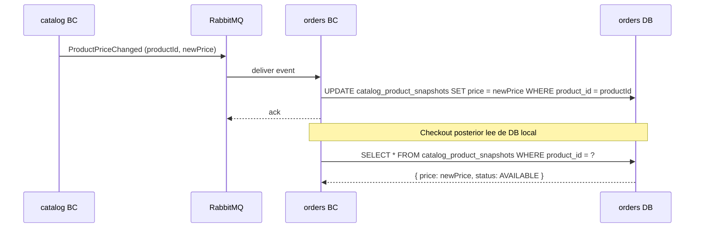

# Local Read Model — Patrón de Integración entre Bounded Contexts

## ¿Qué es?

Un **Local Read Model** (también llamado *local projection* o *query-side projection*) es un
agregado de solo-lectura que vive en el schema del BC consumidor y contiene una copia
proyectada de los datos que ese BC necesita de otro BC. La copia se mantiene actualizada
mediante eventos publicados por el BC fuente — el BC consumidor nunca llama al BC fuente
en tiempo de ejecución.

**El mecanismo en dos tiempos:**

```
TIEMPO 1 — Sincronización continua (asíncrona, background):

  BC Fuente emite evento ──► RabbitMQ ──► BC Consumidor event handler
                                                    │
                                                    ▼
                                         BC Consumidor actualiza su
                                         propia tabla de proyección:
                                         catalog_product_snapshots
                                         ┌──────────────────────────┐
                                         │ product_id: abc-123      │
                                         │ name: "Arroz Diana 1kg"  │
                                         │ price: 4800.00           │
                                         │ status: AVAILABLE        │
                                         └──────────────────────────┘

TIEMPO 2 — Operación de escritura (síncrona, sin llamada HTTP):

  Cliente hace checkout
         │
         ▼
  BC Consumidor lee de SU PROPIA tabla:
  SELECT * FROM catalog_product_snapshots WHERE product_id = 'abc-123'
         │
         ▼
  Obtiene precio = 4800.00 → lo congela en OrderLine
  Cero dependencia en tiempo real con el BC fuente.
```

La tabla de proyección **vive en el schema del BC consumidor**, no en el del fuente.
Es una copia de confianza, actualizada por eventos, de propiedad exclusiva del consumidor.
Para datos monetarios, esta confianza elimina el riesgo de aceptar precios desde el cliente,
pero no elimina la ventana de consistencia eventual: el diseñador debe aceptar y documentar
ese riesgo antes de reemplazar HTTP por LRM.

---

## Tabla de Trade-offs

| Criterio | HTTP Síncrono | Local Read Model |
|---|---|---|
| **Consistencia** | Inmediata — dato siempre fresco | Eventual — lag de mensajería (~200ms típico) |
| **Disponibilidad** | Baja — el flujo falla si el BC fuente cae | Alta — el flujo funciona aunque el BC fuente esté caído |
| **Acoplamiento en tiempo real** | Alto | Ninguno |
| **Latencia de la operación** | +N ms por llamada HTTP + timeout | Cero — lectura local |
| **Complejidad operativa** | Baja | Media — requiere event handler + tabla de proyección |
| **Riesgo OWASP A04** | Mitigado — precio viene del BC autoritativo en tiempo real | Mitigado contra manipulación del cliente — precio viene de proyección de confianza, pero existe ventana de consistencia eventual que debe aceptarse y documentarse para datos monetarios |
| **Reproducibilidad ante fallo** | Retry → nueva llamada HTTP fresca | Retry → misma proyección local (idempotente) |

---

## Tabla de Decisión

Usar **Local Read Model** cuando se cumplen TODAS estas condiciones:

| Condición | Por qué importa |
|---|---|
| El BC consumidor solo NECESITA LEER datos del BC fuente (no modificarlos) | El patrón no aplica si necesita escribir en el BC fuente |
| La consistencia eventual con lag < 2s es aceptable para el negocio | Si el negocio requiere dato en tiempo real estricto → usar HTTP |
| Los datos del BC fuente cambian con baja o media frecuencia | Alta frecuencia de cambio presiona el broker |
| El BC fuente ya publica (o puede publicar) eventos cuando sus datos cambian | El patrón requiere que el BC fuente sea productor de eventos |
| La disponibilidad del flujo que usa los datos es crítica | Si el flujo puede fallar sin impacto → HTTP sync es aceptable |

Usar **HTTP Síncrono** cuando:
- El BC consumidor necesita el dato más reciente con garantía estricta (ej: límite de crédito en tiempo real)
- El BC fuente es un sistema externo o legado sin capacidad de publicar eventos
- La operación es transaccional y requiere consistencia fuerte entre BCs

---

## Cómo Usar Este Patrón en el Diseño (Opción Activa)

Cuando el skill detecta una integración `outbound.http` de un BC interno hacia otro BC
interno, **interrumpe el flujo de diseño** y presenta la decisión al usuario usando
`vscode_askQuestions`. Ver instrucción en SKILL.md §Etapa A, Paso 0.

---

## Impacto en `system.yaml` (Nivel Estratégico)

Cuando se adopta el patrón, la integración HTTP síncrona desaparece del `system.yaml`
y es reemplazada por integraciones de eventos desde el BC fuente hacia el BC consumidor.

**Antes — HTTP síncrono:**
```yaml
- from: orders
  to: catalog
  pattern: customer-supplier
  channel: http
  contracts:
    - getProductDetails
```

**Después — Local Read Model (integración event-based):**
```yaml
# La entrada HTTP orders→catalog desaparece.
# Se agrega (o extiende) la integración catalog→orders vía eventos:
- from: catalog
  to: orders
  pattern: event
  channel: message-broker
  contracts:
    - name: ProductActivated
      channel: catalog.product.activated
    - name: ProductPriceChanged
      channel: catalog.product.price.changed
    - name: ProductDiscontinued
      channel: catalog.product.discontinued
  notes: >
    orders maintains a CatalogProductSnapshot (local read model) fed by catalog
    events. Price integrity (OWASP A04) is preserved: OrderLine.unitPrice is read
    from the trusted local projection, never accepted from the client request.
    Eventual consistency is acceptable; expected lag < 1s.
```

> **Nota de fusión:** Si el BC fuente ya tiene una integración event-based hacia el
> BC consumidor (ej: `ProductActivated` ya existía para `inventory`), agregar los
> nuevos eventos a la entrada existente — no crear una entrada duplicada con el mismo
> par `from/to`.

---

## Impacto en el BC Fuente

El BC fuente debe publicar nuevos eventos que antes no necesitaba emitir.

### Nuevos eventos en `{bc-fuente}.yaml`

Por cada tipo de cambio de datos que el BC consumidor necesita rastrear:

```yaml
# En catalog.yaml:
domainEvents:
  published:
    - name: ProductPriceChanged
      description: >
        Emitted when an active product's price is updated. Consumed by orders
        to keep CatalogProductSnapshot in sync.
      payload:
        - name: productId
          type: Uuid
          required: true
        - name: newPrice
          type: Money
          required: true
        - name: previousPrice
          type: Money
          required: true

domainRules:
  - id: CAT-RULE-010
    type: sideEffect
    description: >
      When Product.price is updated and Product.status is ACTIVE,
      ProductPriceChanged must be emitted automatically.
```

### Nuevo canal `publish` en `{bc-fuente}-async-api.yaml`

```yaml
channels:
  catalog.product.price-changed:
    publish:
      operationId: publishProductPriceChanged
      message:
        $ref: '#/components/messages/ProductPriceChangedMessage'
```

---

## Impacto en el BC Consumidor

> **Anti-patrón: fusión de `id` con el ID espejado del BC fuente.**
> Nunca usar `id` directamente como campo espejo (sin `defaultValue: generated`).
> Hacerlo crea una contradicción irresoluble: el generador espera que `readOnly: true`
> sin `defaultValue` signifique que el campo **sí** aparece en el constructor, pero la
> convención de `id` lo excluye. El patrón correcto es **siempre dos campos separados**:
> `id` (generated, PK interno) + `{sourceEntity}Id` (unique, ID del BC fuente).

### 1. `{bc-consumidor}.yaml` — Nuevo agregado con `readModel: true`

```yaml
aggregates:
  - name: CatalogProductSnapshot
    root: CatalogProductSnapshot
    auditable: true
    readModel: true
    sourceBC: catalog
    sourceEvents:
      - ProductActivated
      - ProductPriceChanged
      - ProductDiscontinued
    description: >
      Local read model projection of catalog Product data needed at checkout time.
      Fed by catalog domain events. Not modifiable by users — only updated by
      event handlers. Eliminates real-time HTTP dependency on catalog during checkout.
    properties:
      - name: id
        type: Uuid
        required: true
        readOnly: true
        defaultValue: generated
        description: Internal identifier of this snapshot record.
      - name: productId             # ← ID espejado del BC fuente: campo SEPARADO de id
        type: Uuid
        required: true
        unique: true                 # genera findByProductId() para upsert idempotente
        description: The catalog Product ID this snapshot represents.
      - name: name
        type: String(200)
        required: true
        description: Product name at the time of last received event.
      - name: price
        type: Money
        required: true
        description: Authoritative product price. Updated on ProductPriceChanged.
      - name: status
        type: ProductSnapshotStatus
        required: true
        readOnly: true
        defaultValue: AVAILABLE
        description: Availability status derived from catalog events.
    domainRules: []
```

> **Sobre el enum `ProductSnapshotStatus`:** Es un enum simple (no ciclo de vida propio)
> con dos valores: `AVAILABLE` (producto activo en catalog) y `UNAVAILABLE` (discontinuado).
> El checkout rechaza ítems con status `UNAVAILABLE`.

### 2. `{bc-consumidor}.yaml` — Eliminar la integración outbound HTTP

```yaml
integrations:
  outbound:
    # ELIMINAR esta entrada:
    # - name: catalog
    #   type: internalBc
    #   pattern: customerSupplier
    #   protocol: http
    #   ...
    # La dependencia con catalog ahora es implícita vía domainEvents.consumed[].
```

### 3. `{bc-consumidor}-spec.md` — Nuevos UCs de sistema

Agregar un caso de uso `actor: system` por cada evento fuente:

```markdown
### UC-ORD-0XX: Handle ProductActivated

**Actor principal**: System (event handler)

**Precondiciones**:
- El evento `ProductActivated` llega desde el canal `catalog.product.activated`.

**Flujo principal**:
1. El sistema recibe el evento `ProductActivated`.
2. Si no existe snapshot para `productId` → crear nuevo `CatalogProductSnapshot`
   con status `AVAILABLE`.
3. Si ya existe (reactivacion de producto) → actualizar nombre, precio y status
   a `AVAILABLE`.
4. Persistir el snapshot.

**Postcondiciones**:
- Existe un `CatalogProductSnapshot` para el producto con status `AVAILABLE`.

**Reglas de negocio**: ninguna
**Eventos emitidos**: ninguno
```

```markdown
### UC-ORD-0XX: Handle ProductPriceChanged

**Actor principal**: System (event handler)

**Flujo principal**:
1. Localizar el `CatalogProductSnapshot` por `productId`.
2. Actualizar `price` con el nuevo valor del evento.
3. Persistir.

**Postcondiciones**:
- El snapshot refleja el nuevo precio para futuros checkouts.
```

```markdown
### UC-ORD-0XX: Handle ProductDiscontinued

**Actor principal**: System (event handler)

**Flujo principal**:
1. Localizar el `CatalogProductSnapshot` por `productId`.
2. Actualizar status a `UNAVAILABLE`.
3. Persistir.

**Postcondiciones**:
- El snapshot tiene status `UNAVAILABLE`. El checkout rechazara este producto.
```

### 4. `{bc-consumidor}-flows.md` — Flujos de proyeccion

```markdown
### FL-ORD-0XX: Sincronizacion de snapshot al activar producto

**Given**:
- No existe CatalogProductSnapshot para productId: "abc-123"

**When**:
- Llega evento ProductActivated { productId: "abc-123", name: "Arroz Diana 1kg",
  price: { amount: "4500.00", currency: "COP" } }

**Then**:
- Se crea CatalogProductSnapshot { productId: "abc-123", name: "Arroz Diana 1kg",
  price: { amount: "4500.00", currency: "COP" }, status: AVAILABLE }

**Casos borde**:
- El snapshot ya existe (reactivacion) → se actualiza en lugar de crear duplicado
- El evento llega con payload incompleto → se descarta con log de error; no se
  propaga excepcion al broker (idempotencia — el evento no se reintenta)
```

```markdown
### FL-ORD-0XX: Checkout lee de proyeccion local

**Given**:
- Existe CatalogProductSnapshot { productId: "abc-123", price: "4800.00", status: AVAILABLE }
- No existe snapshot para productId: "xyz-999"

**When**:
- Cliente hace checkout con [{ productId: "abc-123", quantity: 2 },
  { productId: "xyz-999", quantity: 1 }]

**Then**:
- Para "abc-123": unitPrice congelado en 4800.00 desde el snapshot local (no hay
  llamada HTTP a catalog)
- Para "xyz-999": error 422 PRODUCT_NOT_IN_CATALOG (snapshot no existe)

**Casos borde**:
- El snapshot existe pero status es UNAVAILABLE → error 422 PRODUCT_NOT_AVAILABLE
```

### 5. `{bc-consumidor}-async-api.yaml` — Nuevos canales subscribe

```yaml
channels:
  catalog.product.activated:
    subscribe:
      operationId: onProductActivated
      message:
        $ref: '#/components/messages/ProductActivatedMessage'

  catalog.product.price-changed:
    subscribe:
      operationId: onProductPriceChanged
      message:
        $ref: '#/components/messages/ProductPriceChangedMessage'

  catalog.product.discontinued:
    subscribe:
      operationId: onProductDiscontinued
      message:
        $ref: '#/components/messages/ProductDiscontinuedMessage'
```

### 6. `{bc-consumidor}-internal-api.yaml`

Si el único motivo de existencia del archivo era la llamada HTTP al BC fuente →
**eliminar el archivo** o remover los endpoints que correspondían a esa integración.

### 7. `diagrams/{bc-consumidor}-diagram-{readmodel-kebab}-sync-seq.mmd`

Un sequence diagram que muestra el flujo de sincronización del read model:

```
{bc-name}-diagram-catalog-product-snapshot-sync-seq.mmd
```

Ejemplo de contenido:



---

## Preservación de OWASP A04 — Integridad del Precio

Con **HTTP síncrono**, `OrderLine.unitPrice` se obtiene llamando a catalog en el momento
del checkout — el cliente nunca lo proporciona.

Con **Local Read Model**, `OrderLine.unitPrice` se lee de `CatalogProductSnapshot` en el
momento del checkout — también desde el servidor, también sin aceptarlo del cliente.

**El invariante de seguridad se preserva en ambos casos.** El cliente solo envía
`productId` y `quantity` — nunca precios.

> **Regla de oro:** La fuente del precio puede cambiar (llamada HTTP vs proyección local),
> pero NUNCA puede ser el request del cliente. Esta regla debe verificarse en el diseño
> táctico del BC `orders` independientemente del patrón elegido.

---

## Ejemplo Completo: `orders → catalog` (Canasta Digital)

### system.yaml — antes vs después

| | Antes | Después |
|---|---|---|
| Integración | `orders→catalog, http, getProductDetails` | Eliminada |
| Nueva integración | — | `catalog→orders, event, ProductActivated + ProductPriceChanged + ProductDiscontinued` |
| Nota | — | "orders maintains CatalogProductSnapshot..." |

### Artefactos del BC `orders` afectados

| Artefacto | Cambio |
|---|---|
| `orders.yaml` | + agregado `CatalogProductSnapshot` (`readModel: true`); - integración outbound HTTP a catalog |
| `orders-spec.md` | + 3 UCs: `HandleProductActivated`, `HandleProductPriceChanged`, `HandleProductDiscontinued` |
| `orders-flows.md` | + 3 flujos de proyección + 1 flujo de checkout leyendo del snapshot |
| `orders-async-api.yaml` | + 3 canales `subscribe` (`catalog.product.*`) |
| `orders-internal-api.yaml` | Eliminar si su única razón era la llamada a catalog |
| `diagrams/` | + `orders-diagram-catalog-product-snapshot-sync-seq.mmd` |

### Artefactos del BC `catalog` afectados

| Artefacto | Cambio |
|---|---|
| `catalog.yaml` | + evento `ProductPriceChanged` en `domainEvents.published[]`; + domainRule `sideEffect` |
| `catalog-async-api.yaml` | + canal `publish` para `catalog.product.price-changed` |

---

## Dos Mecanismos para Local Read Models

El generador soporta **dos formas** de implementar un Local Read Model. Elegir según el
nivel de control necesario sobre la lógica de proyección.

### Mecanismo A — `readModel: true` en `aggregates[]` (manual)

El patrón descrito en las secciones anteriores. El diseñador declara un agregado con
`readModel: true` y escribe explícitamente:
- Los use cases de tipo `trigger.kind: event` que manejan cada evento fuente.
- Los métodos de dominio (`upsert`, `delete`) sobre el agregado, declarados en `domainMethods[]`.
- Los flows Given/When/Then para cada caso de sincronización.

**Cuándo usarlo:**
- La lógica de proyección es no trivial (transformaciones, enriquecimiento, lógica
  condicional al actualizar campos).
- Se necesita control explícito sobre el flujo de manejo de errores del event handler.
- Los casos de uso necesitan documentación en `spec.md` y `flows.md` para la Fase 3.

#### Regla obligatoria: todo UC con `method ≠ create` debe tener `domainMethods[]`

> **⚠️ Error de diseño frecuente:** Declarar un UC con `method: upsert` (o cualquier
> método que no sea `create`) sin el correspondiente `domainMethods[]` en el agregado.
> Esto produce código que no compila: el generador intenta llamar `.upsert()` sobre una
> variable nunca declarada y un método que no existe en la clase de dominio.

La regla es: **por cada valor de `uc.method` distinto de `create` que aparece en un UC**,
debe existir una entrada en `aggregates[].domainMethods[]` con el mismo nombre.

**Ejemplo correcto — UC `upsert` con `domainMethods` declarado:**

```yaml
aggregates:
  - name: CustomerAddressSnapshot
    root: CustomerAddressSnapshot
    readModel: true
    sourceBC: customers
    sourceEvents:
      - AddressUpdated
    properties:
      - name: id
        type: Uuid
        readOnly: true
        defaultValue: generated
      - name: addressId        # campo clave para upsert — único, no el PK interno
        type: Uuid
        required: true
        unique: true
        indexed: true
      - name: customerId
        type: Uuid
        required: true
      - name: street
        type: String(255)
        required: true
      # ... resto de campos mútables ...
    domainMethods:             # ← OBLIGATORIO: declarar el método upsert aquí
      - name: upsert
        description: >
          Updates all mutable fields from the incoming AddressUpdated event.
          The addressId is the idempotency key — never updated.
        params:
          - name: customerId
            type: Uuid
          - name: street
            type: String
          - name: city
            type: String
          - name: state
            type: String
          - name: postalCode
            type: String
          - name: country
            type: String
          - name: isDefault
            type: Boolean

useCases:
  - id: UC-ADDR-001
    name: UpsertCustomerAddressSnapshot
    type: command
    actor: system
    trigger:
      kind: event
      consumes: AddressUpdated
      fromBc: customers
    aggregate: CustomerAddressSnapshot
    method: upsert              # ← debe tener domainMethods.upsert declarado arriba
    implementation: scaffold    # ← siempre scaffold para upsert de read model:
                                #   el generador NO puede inferir el patrón find-or-create
    input:
      - name: addressId
        type: Uuid
        source: body
        required: true
      - name: customerId
        type: Uuid
        source: body
        required: true
      # ... resto de inputs ...
```

> **¿Por qué `implementation: scaffold` y no `full` para upsert de read model?**
>
> El patrón upsert requiere:
> 1. Buscar la entidad existente por clave única (ej. `findByAddressId`)
> 2. Si no existe → crear nueva instancia con todos los campos
> 3. Si existe → llamar al método de dominio con los campos mutables
> 4. Persistir
>
> El generador no puede auto-derivar este patrón porque no sabe cuál campo usar como
> clave de búsqueda ni cómo distinguir entre creación y actualización. El uso de
> `implementation: scaffold` produce un cuerpo con `// TODO` que la Fase 3 completa
> con la lógica explícita de find-or-create.

### Mecanismo B — `persistent: true` en `projections[]` (automático)

El diseñador declara la proyección en `projections[]` con `persistent: true`. El generador
produce automáticamente, **sin necesidad de use cases explícitos**:
- Entidad JPA (`{Name}Jpa.java`) con su tabla `{tableName}`.
- Spring Data JPA repository (`{Name}JpaRepository.java`).
- Broker listener (`{Name}ProjectionUpdater.java`) con lógica de upsert por `keyBy`.
- Listener adicional por cada entrada en `additionalSources[]`.

**Cuándo usarlo:**
- La proyección es un mapeo 1:1 directo de campos del evento fuente sin transformaciones.
- Consistencia eventual simple con upsert por clave es suficiente.
- Se quiere minimizar el número de artefactos de diseño explícitos.

---

## Mecanismo B — Schema Completo de `persistent: true`

```yaml
projections:
  - name: CatalogProductSnapshot        # PascalCase, sin sufijos Dto/Response/Request
    description: >
      Local read model of catalog products for checkout. Fed by ProductActivated,
      ProductPriceChanged, and ProductDiscontinued events.
    persistent: true                    # activa la generación automática
    source:
      kind: event                       # único valor soportado
      event: ProductActivated           # evento que inserta/actualiza la fila completa
      from: catalog                     # BC fuente (debe existir en arch/catalog/)
    keyBy: productId                    # campo clave para upsert — NO el PK interno
    tableName: proj_catalog_product_snapshots  # opcional; default: proj_{snake(name)}
    upsertStrategy: lastWriteWins       # lastWriteWins | versionGuarded
    # eventVersionField: version        # solo con versionGuarded; default: campo 'version'
    properties:
      - name: productId
        type: Uuid
        required: true
      - name: name
        type: String(200)
        required: true
      # ⚠️ Money NO soportado en persistent projections — aplana los campos como escalares:
      - name: priceAmount
        type: Decimal
        precision: 19
        scale: 4
        required: true
      - name: priceCurrency
        type: String(3)
        required: true
      # ⚠️ Enums NO soportados en persistent projections — usar String(n):
      - name: status
        type: String(50)                # guarda el name() del enum: "AVAILABLE", "DISCONTINUED"
        required: true
    # additionalSources: eventos que actualizan solo un subconjunto de campos
    # OBLIGATORIO: cada evento aquí debe incluir el campo keyBy (productId) en su payload[]
    # en el BC productor. Sin él, el partial updater descarta el evento silenciosamente en runtime.
    additionalSources:
      - kind: event
        event: ProductPriceChanged      # solo actualiza priceAmount y priceCurrency
        from: catalog
        updatesFields:
          - priceAmount
          - priceCurrency
          # payload de ProductPriceChanged DEBE incluir: productId (keyBy) + priceAmount + priceCurrency
      - kind: event
        event: ProductDiscontinued      # solo actualiza status
        from: catalog
        updatesFields:
          - status
          # payload de ProductDiscontinued DEBE incluir: productId (keyBy) + status (updatesFields)
```

### Campos del schema

| Campo | Requerido | Descripción |
|---|---|---|
| `persistent` | Sí | `true` activa la generación automática |
| `source.kind` | Sí | Siempre `event` |
| `source.event` | Sí | Evento que controla el upsert completo de la fila |
| `source.from` | Sí | BC fuente — debe existir en `arch/` |
| `keyBy` | Sí | Nombre del campo en `properties[]` que se usa como clave de upsert |
| `tableName` | No | Nombre de la tabla SQL. Default: `proj_{snake_case_de_name}` |
| `upsertStrategy` | Sí | `lastWriteWins` o `versionGuarded` |
| `eventVersionField` | Condicional | Solo con `versionGuarded`. Nombre del campo versión en `properties[]`. Default: campo llamado `version`. |
| `additionalSources[]` | No | Eventos adicionales que actualizan solo `updatesFields`. Nunca insertan. |
| `additionalSources[].kind` | Sí | Siempre `event` |
| `additionalSources[].event` | Sí | Nombre del evento — debe estar en `domainEvents.published[]` del BC `from` |
| `additionalSources[].from` | Sí | BC fuente del evento adicional |
| `additionalSources[].updatesFields` | Sí | Campos a actualizar — ninguno puede ser `keyBy` |

> **Obligación en el BC productor para cada `additionalSources` entry:** el evento declarado
> debe incluir **el campo `keyBy` en su `payload[]`** además de los campos en `updatesFields`.
> El partial updater usa `keyBy` para localizar la fila con `findById`. Si el campo falta en
> el payload, el updater descarta el mensaje en runtime con un log `WARN` — la actualización
> se pierde silenciosamente sin error de build ni de compilación.

### Restricciones obligatorias

1. `keyBy` debe existir en `properties[]`.
2. `keyBy` **nunca** puede aparecer en `updatesFields[]` de ningún `additionalSources` entry.
3. Todos los campos en `updatesFields[]` deben estar en `properties[]`.
4. El evento en `source.event` y en cada `additionalSources[].event` debe estar publicado
   por el BC `from` correspondiente (INT-010 / INT-012 lo verifican como error).
5. `properties[]` solo puede contener **tipos escalares canónicos** (ver §Tipos soportados).
   **Prohibido:** VOs (incluyendo `Money`), enums del dominio, `List[T]`, y referencias a agregados.
   - Para `Money`: aplanar en `priceAmount: Decimal` + `priceCurrency: String(3)`.
   - Para enums: usar `String(n)` y guardar el `name()` del enum. La conversión, si se necesita, va en Fase 3.
   - Para `List[T]`: serializar como `String` (JSON plano) si es estrictamente necesario; no está soportado nativamente.
6. **El evento de cada `additionalSources` entry debe incluir el campo `keyBy` en su `payload[]`
   en el BC productor.** El partial updater lo necesita para localizar la fila con `findById`.
   Si el campo está ausente del payload, el updater descarta el evento en runtime con un
   log `WARN` — la actualización se pierde silenciosamente sin ningún error de build ni de compilación.

---

## Tipos Soportados en `properties[]` de Persistent Projections

Solo tipos escalares canónicos — los mismos que mapean a una sola columna SQL.

| Tipo DSL | Java | SQL |
|---|---|---|
| `Uuid` | `UUID` | `UUID` |
| `String` | `String` | `TEXT` |
| `String(n)` | `String` | `VARCHAR(n)` |
| `Text` | `String` | `TEXT` |
| `Email` | `String` | `VARCHAR(254)` |
| `Url` | `String` | `TEXT` |
| `Integer` | `Integer` | `INTEGER` |
| `Long` | `Long` | `BIGINT` |
| `Decimal` | `BigDecimal` | `NUMERIC(precision, scale)` |
| `Boolean` | `Boolean` | `BOOLEAN` |
| `Date` | `LocalDate` | `DATE` |
| `DateTime` | `Instant` | `TIMESTAMP` |

### Tipos NO soportados — error de build inmediato

| Tipo | Error del generador | Solución |
|---|---|---|
| `Money` | `is a domain type. Persistent projections only accept canonical scalar types` | Aplanar: `priceAmount: Decimal` + `priceCurrency: String(3)` |
| Cualquier VO del dominio | Idem | Aplanar sus campos como escalares |
| Enum del dominio | Idem | Usar `String(n)` y guardar `nombre.name()` del enum |
| `List[T]` | `List<T> requires a join table — out of scope for Phase 3` | Serializar como `String` (JSON) si es estrictamente necesario |
| Referencia a agregado | Idem que VO | Usar `Uuid` del ID del agregado |

> **¿Cómo documentar el enum original?** Declarar en `{bc-name}-flows.md` el mapeo de
> valores (ej: `"AVAILABLE"` → producto activo, `"DISCONTINUED"` → discontinuado).
> La lógica de conversión de String a enum va en la capa de aplicación en Fase 3.

---

## `upsertStrategy: versionGuarded` — Precondición en el Productor

Cuando `upsertStrategy: versionGuarded`, el generador lee `data.get("<versionField>")`
del payload del mensaje y lo compara con la versión almacenada. Si el payload no incluye
el campo, `data.get(...)` retorna `null` y el guard **silenciosamente degenerará a
`lastWriteWins`** — el código compila y corre sin error, pero la protección de orden
no está activa (INT-027 emitirá un `warn` durante el build del generador).

### Verificación obligatoria antes de declarar `versionGuarded`

**En el BC productor (`source.from`):**

1. El agregado fuente tiene el campo versión declarado en sus `properties[]`:
   ```yaml
   # En catalog.yaml → aggregates[Product].properties[]
   - name: version
     type: Long
     readOnly: true
     internal: true
     description: Monotonically increasing version counter. Incremented on every state change.
   ```

2. El evento fuente incluye ese campo en su `payload[]`:
   ```yaml
   # En catalog.yaml → domainEvents.published[ProductActivated].payload[]
   - name: version
     type: Long
     source: aggregate
     field: version
   ```

3. Lo mismo aplica a cada evento en `additionalSources[]`: si `versionGuarded` está
   activo en la proyección padre, el guard se aplica también en los partial updaters.
   Cada evento adicional debe incluir el campo versión en su payload.

### Ejemplo completo con `versionGuarded`

```yaml
# En orders.yaml
projections:
  - name: CatalogProductSnapshot
    persistent: true
    source:
      kind: event
      event: ProductActivated
      from: catalog
    keyBy: productId
    upsertStrategy: versionGuarded
    eventVersionField: version        # usa el campo 'version' de properties[]
    properties:
      - name: productId
        type: Uuid
        required: true
      - name: name
        type: String(200)
        required: true
      # ⚠️ Money NO soportado — aplanar como escalares:
      - name: priceAmount
        type: Decimal
        precision: 19
        scale: 4
        required: true
      - name: priceCurrency
        type: String(3)
        required: true
      - name: version
        type: Long                    # debe existir; eventVersionField lo referencia
        required: true
    additionalSources:
      - kind: event
        event: ProductPriceChanged
        from: catalog
        updatesFields:
          - priceAmount
          - priceCurrency
          - version                   # versión DEBE estar en updatesFields también
                                      # para que el partial updater pueda guardarla
```

---

## Artefactos Generados por el Mecanismo B (sin intervención del diseñador)

El diseñador **no necesita** escribir use cases, spec.md entries ni flows.md entries
para las proyecciones persistentes. El generador produce automáticamente:

| Artefacto generado | Ubicación |
|---|---|
| `{Name}Jpa.java` | `infrastructure/persistence/projections/` |
| `{Name}JpaRepository.java` | `infrastructure/persistence/projections/` |
| `{Name}ProjectionUpdater.java` | `infrastructure/projectionUpdaters/` |
| `{Name}On{EventName}ProjectionUpdater.java` | `infrastructure/projectionUpdaters/` (1 por additionalSources entry) |
| Migración SQL `V2__projections.sql` | `resources/db/migration/` |

Los archivos de diseño **que sí requiere** el Mecanismo B:
- `{bc-consumidor}-async-api.yaml`: canales `subscribe` para cada evento fuente (igual que
  en el Mecanismo A — el broker topology lo requiere).
- No se necesitan entradas en `spec.md`, `flows.md` ni use cases en `.yaml`.

---

## Cuándo Usar Cada Mecanismo

| Situación | Mecanismo A (`readModel: true`) | Mecanismo B (`persistent: true`) |
|---|---|---|
| Mapeo 1:1 directo de campos del evento | ❌ Verbose | ✅ Recomendado |
| Lógica de transformación o enriquecimiento | ✅ Control total | ❌ No soportado |
| Múltiples eventos con lógica diferente por evento | ✅ Un UC por evento | ✅ `additionalSources[]` (solo updates simples) |
| Necesita flujos Given/When/Then documentados | ✅ | ❌ No aplica |
| Mínimo artefactos de diseño | ❌ | ✅ |
| Versión de consistencia de orden | A través de métodos del dominio | `versionGuarded` declarativo |
