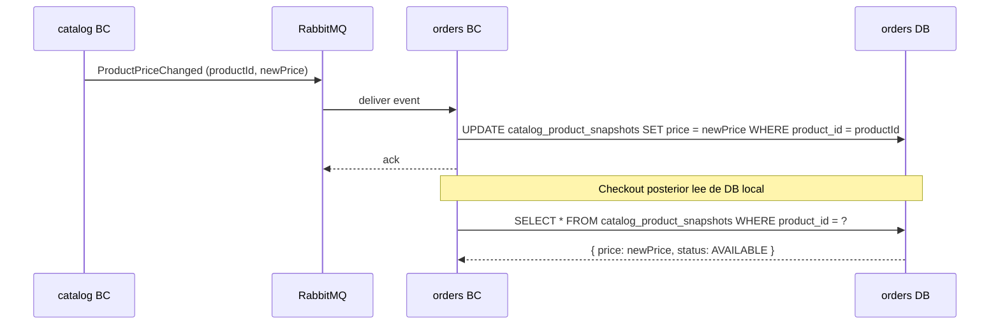

# Local Read Model — Patrón de Integración entre Bounded Contexts

## ¿Qué es?

Un **Local Read Model** (también llamado *local projection* o *query-side projection*) es un
agregado de solo-lectura que vive en el schema del BC consumidor y contiene una copia
proyectada de los datos que ese BC necesita de otro BC. La copia se mantiene actualizada
mediante eventos publicados por el BC fuente — el BC consumidor nunca llama al BC fuente
en tiempo de ejecución.

**El mecanismo en dos tiempos:**

```
TIEMPO 1 — Sincronización continua (asíncrona, background):

  BC Fuente emite evento ──► RabbitMQ ──► BC Consumidor event handler
                                                    │
                                                    ▼
                                         BC Consumidor actualiza su
                                         propia tabla de proyección:
                                         catalog_product_snapshots
                                         ┌──────────────────────────┐
                                         │ product_id: abc-123      │
                                         │ name: "Arroz Diana 1kg"  │
                                         │ price: 4800.00           │
                                         │ status: AVAILABLE        │
                                         └──────────────────────────┘

TIEMPO 2 — Operación de escritura (síncrona, sin llamada HTTP):

  Cliente hace checkout
         │
         ▼
  BC Consumidor lee de SU PROPIA tabla:
  SELECT * FROM catalog_product_snapshots WHERE product_id = 'abc-123'
         │
         ▼
  Obtiene precio = 4800.00 → lo congela en OrderLine
  Cero dependencia en tiempo real con el BC fuente.
```

La tabla de proyección **vive en el schema del BC consumidor**, no en el del fuente.
Es una copia de confianza, actualizada por eventos, de propiedad exclusiva del consumidor.

---

## Tabla de Trade-offs

| Criterio | HTTP Síncrono | Local Read Model |
|---|---|---|
| **Consistencia** | Inmediata — dato siempre fresco | Eventual — lag de mensajería (~200ms típico) |
| **Disponibilidad** | Baja — el flujo falla si el BC fuente cae | Alta — el flujo funciona aunque el BC fuente esté caído |
| **Acoplamiento en tiempo real** | Alto | Ninguno |
| **Latencia de la operación** | +N ms por llamada HTTP + timeout | Cero — lectura local |
| **Complejidad operativa** | Baja | Media — requiere event handler + tabla de proyección |
| **Riesgo OWASP A04** | Mitigado — precio viene del BC autoritativo | Mitigado — precio viene de proyección de confianza (nunca del cliente) |
| **Reproducibilidad ante fallo** | Retry → nueva llamada HTTP fresca | Retry → misma proyección local (idempotente) |

---

## Tabla de Decisión

Usar **Local Read Model** cuando se cumplen TODAS estas condiciones:

| Condición | Por qué importa |
|---|---|
| El BC consumidor solo NECESITA LEER datos del BC fuente (no modificarlos) | El patrón no aplica si necesita escribir en el BC fuente |
| La consistencia eventual con lag < 2s es aceptable para el negocio | Si el negocio requiere dato en tiempo real estricto → usar HTTP |
| Los datos del BC fuente cambian con baja o media frecuencia | Alta frecuencia de cambio presiona el broker |
| El BC fuente ya publica (o puede publicar) eventos cuando sus datos cambian | El patrón requiere que el BC fuente sea productor de eventos |
| La disponibilidad del flujo que usa los datos es crítica | Si el flujo puede fallar sin impacto → HTTP sync es aceptable |

Usar **HTTP Síncrono** cuando:
- El BC consumidor necesita el dato más reciente con garantía estricta (ej: límite de crédito en tiempo real)
- El BC fuente es un sistema externo o legado sin capacidad de publicar eventos
- La operación es transaccional y requiere consistencia fuerte entre BCs

---

## Cómo Usar Este Patrón en el Diseño (Opción Activa)

Cuando el skill detecta una integración `outbound.http` de un BC interno hacia otro BC
interno, **interrumpe el flujo de diseño** y presenta la decisión al usuario usando
`vscode_askQuestions`. Ver instrucción en SKILL.md §Etapa A, Paso 0.

---

## Impacto en `system.yaml` (Nivel Estratégico)

Cuando se adopta el patrón, la integración HTTP síncrona desaparece del `system.yaml`
y es reemplazada por integraciones de eventos desde el BC fuente hacia el BC consumidor.

**Antes — HTTP síncrono:**
```yaml
- from: orders
  to: catalog
  pattern: customer-supplier
  channel: http
  contracts:
    - getProductDetails
```

**Después — Local Read Model (integración event-based):**
```yaml
# La entrada HTTP orders→catalog desaparece.
# Se agrega (o extiende) la integración catalog→orders vía eventos:
- from: catalog
  to: orders
  pattern: event
  channel: message-broker
  contracts:
    - name: ProductActivated
      channel: catalog.product.activated
    - name: ProductPriceChanged
      channel: catalog.product.price-changed
    - name: ProductDiscontinued
      channel: catalog.product.discontinued
  notes: >
    orders maintains a CatalogProductSnapshot (local read model) fed by catalog
    events. Price integrity (OWASP A04) is preserved: OrderLine.unitPrice is read
    from the trusted local projection, never accepted from the client request.
    Eventual consistency is acceptable; expected lag < 1s.
```

> **Nota de fusión:** Si el BC fuente ya tiene una integración event-based hacia el
> BC consumidor (ej: `ProductActivated` ya existía para `inventory`), agregar los
> nuevos eventos a la entrada existente — no crear una entrada duplicada con el mismo
> par `from/to`.

---

## Impacto en el BC Fuente

El BC fuente debe publicar nuevos eventos que antes no necesitaba emitir.

### Nuevos eventos en `{bc-fuente}.yaml`

Por cada tipo de cambio de datos que el BC consumidor necesita rastrear:

```yaml
# En catalog.yaml:
domainEvents:
  published:
    - name: ProductPriceChanged
      description: >
        Emitted when an active product's price is updated. Consumed by orders
        to keep CatalogProductSnapshot in sync.
      payload:
        - name: productId
          type: Uuid
          required: true
        - name: newPrice
          type: Money
          required: true
        - name: previousPrice
          type: Money
          required: true

domainRules:
  - id: CAT-RULE-010
    type: sideEffect
    description: >
      When Product.price is updated and Product.status is ACTIVE,
      ProductPriceChanged must be emitted automatically.
```

### Nuevo canal `publish` en `{bc-fuente}-async-api.yaml`

```yaml
channels:
  catalog.product.price-changed:
    publish:
      operationId: publishProductPriceChanged
      message:
        $ref: '#/components/messages/ProductPriceChangedMessage'
```

---

## Impacto en el BC Consumidor

### 1. `{bc-consumidor}.yaml` — Nuevo agregado con `readModel: true`

```yaml
aggregates:
  - name: CatalogProductSnapshot
    root: CatalogProductSnapshot
    auditable: true
    readModel: true
    sourceBC: catalog
    sourceEvents:
      - ProductActivated
      - ProductPriceChanged
      - ProductDiscontinued
    description: >
      Local read model projection of catalog Product data needed at checkout time.
      Fed by catalog domain events. Not modifiable by users — only updated by
      event handlers. Eliminates real-time HTTP dependency on catalog during checkout.
    properties:
      - name: id
        type: Uuid
        required: true
        readOnly: true
        defaultValue: generated
        description: Internal identifier of this snapshot record.
      - name: productId
        type: Uuid
        required: true
        unique: true
        description: The catalog Product ID this snapshot represents.
      - name: name
        type: String(200)
        required: true
        description: Product name at the time of last received event.
      - name: price
        type: Money
        required: true
        description: Authoritative product price. Updated on ProductPriceChanged.
      - name: status
        type: ProductSnapshotStatus
        required: true
        readOnly: true
        defaultValue: AVAILABLE
        description: Availability status derived from catalog events.
    domainRules: []
```

> **Sobre el enum `ProductSnapshotStatus`:** Es un enum simple (no ciclo de vida propio)
> con dos valores: `AVAILABLE` (producto activo en catalog) y `UNAVAILABLE` (discontinuado).
> El checkout rechaza ítems con status `UNAVAILABLE`.

### 2. `{bc-consumidor}.yaml` — Eliminar la integración outbound HTTP

```yaml
integrations:
  outbound:
    # ELIMINAR esta entrada:
    # - name: catalog
    #   type: internalBc
    #   pattern: customerSupplier
    #   protocol: http
    #   ...
    # La dependencia con catalog ahora es implícita vía domainEvents.consumed[].
```

### 3. `{bc-consumidor}-spec.md` — Nuevos UCs de sistema

Agregar un caso de uso `actor: system` por cada evento fuente:

```markdown
### UC-ORD-0XX: Handle ProductActivated

**Actor principal**: System (event handler)

**Precondiciones**:
- El evento `ProductActivated` llega desde el canal `catalog.product.activated`.

**Flujo principal**:
1. El sistema recibe el evento `ProductActivated`.
2. Si no existe snapshot para `productId` → crear nuevo `CatalogProductSnapshot`
   con status `AVAILABLE`.
3. Si ya existe (reactivacion de producto) → actualizar nombre, precio y status
   a `AVAILABLE`.
4. Persistir el snapshot.

**Postcondiciones**:
- Existe un `CatalogProductSnapshot` para el producto con status `AVAILABLE`.

**Reglas de negocio**: ninguna
**Eventos emitidos**: ninguno
```

```markdown
### UC-ORD-0XX: Handle ProductPriceChanged

**Actor principal**: System (event handler)

**Flujo principal**:
1. Localizar el `CatalogProductSnapshot` por `productId`.
2. Actualizar `price` con el nuevo valor del evento.
3. Persistir.

**Postcondiciones**:
- El snapshot refleja el nuevo precio para futuros checkouts.
```

```markdown
### UC-ORD-0XX: Handle ProductDiscontinued

**Actor principal**: System (event handler)

**Flujo principal**:
1. Localizar el `CatalogProductSnapshot` por `productId`.
2. Actualizar status a `UNAVAILABLE`.
3. Persistir.

**Postcondiciones**:
- El snapshot tiene status `UNAVAILABLE`. El checkout rechazara este producto.
```

### 4. `{bc-consumidor}-flows.md` — Flujos de proyeccion

```markdown
### FL-ORD-0XX: Sincronizacion de snapshot al activar producto

**Given**:
- No existe CatalogProductSnapshot para productId: "abc-123"

**When**:
- Llega evento ProductActivated { productId: "abc-123", name: "Arroz Diana 1kg",
  price: { amount: "4500.00", currency: "COP" } }

**Then**:
- Se crea CatalogProductSnapshot { productId: "abc-123", name: "Arroz Diana 1kg",
  price: { amount: "4500.00", currency: "COP" }, status: AVAILABLE }

**Casos borde**:
- El snapshot ya existe (reactivacion) → se actualiza en lugar de crear duplicado
- El evento llega con payload incompleto → se descarta con log de error; no se
  propaga excepcion al broker (idempotencia — el evento no se reintenta)
```

```markdown
### FL-ORD-0XX: Checkout lee de proyeccion local

**Given**:
- Existe CatalogProductSnapshot { productId: "abc-123", price: "4800.00", status: AVAILABLE }
- No existe snapshot para productId: "xyz-999"

**When**:
- Cliente hace checkout con [{ productId: "abc-123", quantity: 2 },
  { productId: "xyz-999", quantity: 1 }]

**Then**:
- Para "abc-123": unitPrice congelado en 4800.00 desde el snapshot local (no hay
  llamada HTTP a catalog)
- Para "xyz-999": error 422 PRODUCT_NOT_IN_CATALOG (snapshot no existe)

**Casos borde**:
- El snapshot existe pero status es UNAVAILABLE → error 422 PRODUCT_NOT_AVAILABLE
```

### 5. `{bc-consumidor}-async-api.yaml` — Nuevos canales subscribe

```yaml
channels:
  catalog.product.activated:
    subscribe:
      operationId: onProductActivated
      message:
        $ref: '#/components/messages/ProductActivatedMessage'

  catalog.product.price-changed:
    subscribe:
      operationId: onProductPriceChanged
      message:
        $ref: '#/components/messages/ProductPriceChangedMessage'

  catalog.product.discontinued:
    subscribe:
      operationId: onProductDiscontinued
      message:
        $ref: '#/components/messages/ProductDiscontinuedMessage'
```

### 6. `{bc-consumidor}-internal-api.yaml`

Si el único motivo de existencia del archivo era la llamada HTTP al BC fuente →
**eliminar el archivo** o remover los endpoints que correspondían a esa integración.

### 7. `diagrams/{bc-consumidor}-diagram-{readmodel-kebab}-sync-seq.mmd`

Un sequence diagram que muestra el flujo de sincronización del read model:

```
{bc-name}-diagram-catalog-product-snapshot-sync-seq.mmd
```

Ejemplo de contenido:



---

## Preservación de OWASP A04 — Integridad del Precio

Con **HTTP síncrono**, `OrderLine.unitPrice` se obtiene llamando a catalog en el momento
del checkout — el cliente nunca lo proporciona.

Con **Local Read Model**, `OrderLine.unitPrice` se lee de `CatalogProductSnapshot` en el
momento del checkout — también desde el servidor, también sin aceptarlo del cliente.

**El invariante de seguridad se preserva en ambos casos.** El cliente solo envía
`productId` y `quantity` — nunca precios.

> **Regla de oro:** La fuente del precio puede cambiar (llamada HTTP vs proyección local),
> pero NUNCA puede ser el request del cliente. Esta regla debe verificarse en el diseño
> táctico del BC `orders` independientemente del patrón elegido.

---

## Ejemplo Completo: `orders → catalog` (Canasta Digital)

### system.yaml — antes vs después

| | Antes | Después |
|---|---|---|
| Integración | `orders→catalog, http, getProductDetails` | Eliminada |
| Nueva integración | — | `catalog→orders, event, ProductActivated + ProductPriceChanged + ProductDiscontinued` |
| Nota | — | "orders maintains CatalogProductSnapshot..." |

### Artefactos del BC `orders` afectados

| Artefacto | Cambio |
|---|---|
| `orders.yaml` | + agregado `CatalogProductSnapshot` (`readModel: true`); - integración outbound HTTP a catalog |
| `orders-spec.md` | + 3 UCs: `HandleProductActivated`, `HandleProductPriceChanged`, `HandleProductDiscontinued` |
| `orders-flows.md` | + 3 flujos de proyección + 1 flujo de checkout leyendo del snapshot |
| `orders-async-api.yaml` | + 3 canales `subscribe` (`catalog.product.*`) |
| `orders-internal-api.yaml` | Eliminar si su única razón era la llamada a catalog |
| `diagrams/` | + `orders-diagram-catalog-product-snapshot-sync-seq.mmd` |

### Artefactos del BC `catalog` afectados

| Artefacto | Cambio |
|---|---|
| `catalog.yaml` | + evento `ProductPriceChanged` en `domainEvents.published[]`; + domainRule `sideEffect` |
| `catalog-async-api.yaml` | + canal `publish` para `catalog.product.price-changed` |
